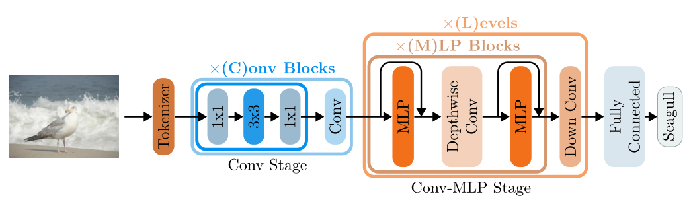
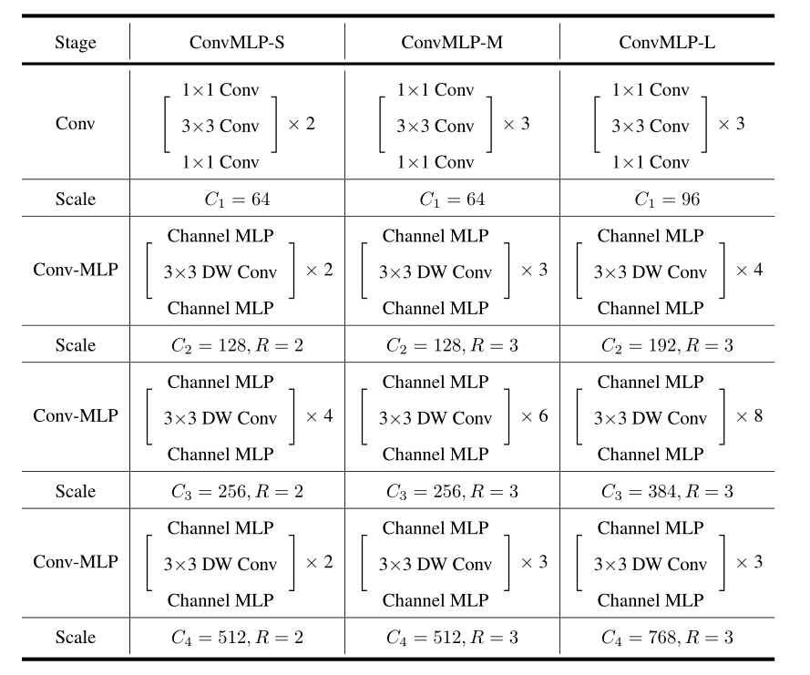

# 2022-ConvMLP

> 论文题目：ConvMLP: Hierarchical Convolutional MLPs for Vision
>
> 论文链接: [https://arxiv.org/abs/2109.04454](https://arxiv.org/abs/2109.04454)
>
> 代码链接：[https://github.com/SHI-Labs/Convolutional-MLPs](https://github.com/SHI-Labs/Convolutional-MLPs)
>
> 发表时间：2021年9月
>
> 引用：Li J, Hassani A, Walton S, et al. Convmlp: Hierarchical convolutional mlps for vision[J]. arXiv preprint arXiv:2109.04454, 2021.
>
> 引用数：16
>
> 

## 1. 简介

**你见过长得像CNN的MLP吗？UO&UIUC提出了用于视觉任务的层次卷积MLP**

### 1.1 摘要

最近发现，由一系列连续的多层感知机块（MLP Block）组成的基于MLP的架构，可以达到与基于卷积和Transformer的方法相当的结果。然而，大多数方法都采用了固定维度输入的空间MLP，因此很难将其应用于下游任务，如目标检测和语义分割 。此外，单阶段设计进一步限制了其他计算机视觉任务的性能，且全连接层具有较大的计算量。

为了解决这些问题，作者提出了ConvMLP：一个用于视觉识别的层次卷积MLP，这是一个轻量级、阶段级、具备卷积层和MLP的设计。ConvMLP在ImageNet-1k、2.4G MACs和9M参数量上达到了76.8% 的Top-1精度。目标检测和语义分割的实验进一步表明，ConvMLP学习的视觉表示可以无缝迁移，并在较少的参数下获得有竞争力的结果。

## 2. 网络

### 2.1 整体架构

ConvMLP的整体框架如上图所示。与其他基于MLP的模型不同，作者使用卷积tokenizer来提取初始特征图()。为了减少计算和改善空间连接，作者采用纯卷积阶段进行tokenization，生成特征图()。然后，作者设置3个Conv-MLP阶段，生成2个特征图和(分别为和)。每个Conv-MLP阶段包括多个Conv-MLP块，每个Conv-MLP块有一个通道MLP，然后是一个深度卷积层，然后是另一个通道MLP。

与之前的工作类似，作者在这些块中应用了残差连接和层归一化。每个通道MLP由两个全连接层组成，带有一个GeLU激活函数和dropout。然后，作者将全局平均池化应用到输出特征上，并通过分类head进行分类。当将ConvMLP应用于下游任务时，可以使用特征映射、、、来生成没有输入大小约束的特征金字塔。

下面是每一个具体配置

### 2.2 Convolutional Tokenizer

作者用卷积Tokenizer替换原来的Patch Tokenizer。它包括三个卷积块，每个块由一个3x3的卷积、BatchNorm和ReLU激活函数组成。该Tokenizer还附加了一个最大池化层。

~~~python
class ConvTokenizer(nn.Module):
    def __init__(self, embedding_dim=64):
        super(ConvTokenizer, self).__init__()
        self.block = nn.Sequential(
            nn.Conv2d(3,
                      embedding_dim // 2,
                      kernel_size=(3, 3),
                      stride=(2, 2),
                      padding=(1, 1),
                      bias=False),
            nn.BatchNorm2d(embedding_dim // 2),
            nn.ReLU(inplace=True),
            nn.Conv2d(embedding_dim // 2,
                      embedding_dim // 2,
                      kernel_size=(3, 3),
                      stride=(1, 1),
                      padding=(1, 1),
                      bias=False),
            nn.BatchNorm2d(embedding_dim // 2),
            nn.ReLU(inplace=True),
            nn.Conv2d(embedding_dim // 2,
                      embedding_dim,
                      kernel_size=(3, 3),
                      stride=(1, 1),
                      padding=(1, 1),
                      bias=False),
            nn.BatchNorm2d(embedding_dim),
            nn.ReLU(inplace=True),
            nn.MaxPool2d(kernel_size=(3, 3),
                         stride=(2, 2),
                         padding=(1, 1),
                         dilation=(1, 1))
        )

    def forward(self, x):
        return self.block(x)
~~~

### 2.3 Convolution Stage

为了增加空间连接，作者采用了完全卷积的阶段。它由多个块组成，其中每个块由两个1x1卷积层组成，中间有一个3x3卷积层。（蓝色框所示）

~~~python
class ConvStage(Module):
    def __init__(self,
                 num_blocks=2,
                 embedding_dim_in=64,
                 hidden_dim=128,
                 embedding_dim_out=128):
        super(ConvStage, self).__init__()
        self.conv_blocks = ModuleList()
        for i in range(num_blocks):
            block = Sequential(
                Conv2d(embedding_dim_in,
                       hidden_dim,
                       kernel_size=(1, 1),
                       stride=(1, 1),
                       padding=(0, 0),
                       bias=False),
                BatchNorm2d(hidden_dim),
                ReLU(inplace=True),
                Conv2d(hidden_dim, hidden_dim, kernel_size=(3, 3), stride=(1, 1), padding=(1, 1), bias=False),
                BatchNorm2d(hidden_dim),
                ReLU(inplace=True),
                Conv2d(hidden_dim, embedding_dim_in, kernel_size=(1, 1), stride=(1, 1), padding=(0, 0), bias=False),
                BatchNorm2d(embedding_dim_in),
                ReLU(inplace=True)
            )
            self.conv_blocks.append(block)
        self.downsample = Conv2d(embedding_dim_in,
                                 embedding_dim_out,
                                 kernel_size=(3, 3),
                                 stride=(2, 2),
                                 padding=(1, 1))

    def forward(self, x):
        for block in self.conv_blocks:
            x = x + block(x)
        return self.downsample(x)
~~~

### 2.4 Conv-MLP阶段

~~~python
class Mlp(Module):
    def __init__(self,
                 embedding_dim_in,
                 hidden_dim=None,
                 embedding_dim_out=None,
                 activation=GELU):
        super().__init__()
        hidden_dim = hidden_dim or embedding_dim_in
        embedding_dim_out = embedding_dim_out or embedding_dim_in
        self.fc1 = Linear(embedding_dim_in, hidden_dim)
        self.act = activation()
        self.fc2 = Linear(hidden_dim, embedding_dim_out)

    def forward(self, x):
        return self.fc2(self.act(self.fc1(x)))

class ConvMLPStage(Module):
    def __init__(self,
                 embedding_dim,
                 dim_feedforward=2048,
                 stochastic_depth_rate=0.1):
        super(ConvMLPStage, self).__init__()
        self.norm1 = LayerNorm(embedding_dim)
        self.channel_mlp1 = Mlp(embedding_dim_in=embedding_dim, hidden_dim=dim_feedforward)
        self.norm2 = LayerNorm(embedding_dim)
        self.connect = Conv2d(embedding_dim,
                              embedding_dim,
                              kernel_size=(3, 3),
                              stride=(1, 1),
                              padding=(1, 1),
                              groups=embedding_dim,
                              bias=False)
        self.connect_norm = LayerNorm(embedding_dim)
        self.channel_mlp2 = Mlp(embedding_dim_in=embedding_dim, hidden_dim=dim_feedforward)
        self.drop_path = DropPath(stochastic_depth_rate) if stochastic_depth_rate > 0 else Identity()

    def forward(self, src):
        src = src + self.drop_path(self.channel_mlp1(self.norm1(src)))
        src = self.connect(self.connect_norm(src).permute(0, 3, 1, 2)).permute(0, 2, 3, 1)
        src = src + self.drop_path(self.channel_mlp2(self.norm2(src)))
        return src
~~~

### 2.5 Convolutional Downsampling

~~~python
class ConvDownsample(Module):
    def __init__(self, embedding_dim_in, embedding_dim_out):
        super().__init__()
        self.downsample = Conv2d(embedding_dim_in, embedding_dim_out, kernel_size=(3, 3), stride=(2, 2),
                                 padding=(1, 1))

    def forward(self, x):
        x = x.permute(0, 3, 1, 2)
        x = self.downsample(x)
        return x.permute(0, 2, 3, 1)
~~~

### 2.6 总结

本文分析了当前基于MLP的模型对视觉表示学习的约束条件：**1.空间mlp只接受固定分辨率的输入，使得难以转移到下游任务，如目标检测和分割 。2.由于增加的复杂度，单阶段设计和全连接层进一步限制了MLP结构的使用 。**

为了解决这些问题，作者提出了ConvMLP：一个层次卷积MLP，通过结合卷积层和mlp来进行视觉表示的学习。ConvMLP架构可以无缝迁移到其他CV任务的网络中，如RetinaNet、MaskR-CNN和Semantic FPN。与其他方法相比，在不同基准数据集上，ConvMLP在参数较少的情况下，达到了不错的结果。

随着Transformer的兴起，目前大多数的工作是将CNN的设计理念结合到Transformer中。而本文重新revisit的MLP的不足（参数量大、过拟合等），并利用CNN的设计理念来缓解这些问题 。由于借鉴了CNN中的层次结构，因此，本文的方法在比较少的计算量下，也能达到比较好的效果。

## 3. 代码

~~~python
import torch
from torch.hub import load_state_dict_from_url
import torch.nn as nn
from torch.nn import Module, ModuleList, Sequential, Linear, LayerNorm, Conv2d, BatchNorm2d, ReLU, GELU, Identity
from timm.models.layers import DropPath

__all__ = ['ConvMLP', 'convmlp_s', 'convmlp_m', 'convmlp_l']

model_urls = {
    'convmlp_s': 'http://ix.cs.uoregon.edu/~alih/conv-mlp/checkpoints/convmlp_s_imagenet.pth',
    'convmlp_m': 'http://ix.cs.uoregon.edu/~alih/conv-mlp/checkpoints/convmlp_m_imagenet.pth',
    'convmlp_l': 'http://ix.cs.uoregon.edu/~alih/conv-mlp/checkpoints/convmlp_l_imagenet.pth',
}

class ConvTokenizer(nn.Module):
    def __init__(self, embedding_dim=64):
        super(ConvTokenizer, self).__init__()
        self.block = nn.Sequential(
            nn.Conv2d(3,
                      embedding_dim // 2,
                      kernel_size=(3, 3),
                      stride=(2, 2),
                      padding=(1, 1),
                      bias=False),
            nn.BatchNorm2d(embedding_dim // 2),
            nn.ReLU(inplace=True),
            nn.Conv2d(embedding_dim // 2,
                      embedding_dim // 2,
                      kernel_size=(3, 3),
                      stride=(1, 1),
                      padding=(1, 1),
                      bias=False),
            nn.BatchNorm2d(embedding_dim // 2),
            nn.ReLU(inplace=True),
            nn.Conv2d(embedding_dim // 2,
                      embedding_dim,
                      kernel_size=(3, 3),
                      stride=(1, 1),
                      padding=(1, 1),
                      bias=False),
            nn.BatchNorm2d(embedding_dim),
            nn.ReLU(inplace=True),
            nn.MaxPool2d(kernel_size=(3, 3),
                         stride=(2, 2),
                         padding=(1, 1),
                         dilation=(1, 1))
        )

    def forward(self, x):
        return self.block(x)

class ConvStage(Module):
    def __init__(self,
                 num_blocks=2,
                 embedding_dim_in=64,
                 hidden_dim=128,
                 embedding_dim_out=128):
        super(ConvStage, self).__init__()
        self.conv_blocks = ModuleList()
        for i in range(num_blocks):
            block = Sequential(
                Conv2d(embedding_dim_in,
                       hidden_dim,
                       kernel_size=(1, 1),
                       stride=(1, 1),
                       padding=(0, 0),
                       bias=False),
                BatchNorm2d(hidden_dim),
                ReLU(inplace=True),
                Conv2d(hidden_dim, hidden_dim, kernel_size=(3, 3), stride=(1, 1), padding=(1, 1), bias=False),
                BatchNorm2d(hidden_dim),
                ReLU(inplace=True),
                Conv2d(hidden_dim, embedding_dim_in, kernel_size=(1, 1), stride=(1, 1), padding=(0, 0), bias=False),
                BatchNorm2d(embedding_dim_in),
                ReLU(inplace=True)
            )
            self.conv_blocks.append(block)
        self.downsample = Conv2d(embedding_dim_in,
                                 embedding_dim_out,
                                 kernel_size=(3, 3),
                                 stride=(2, 2),
                                 padding=(1, 1))

    def forward(self, x):
        for block in self.conv_blocks:
            x = x + block(x)
        return self.downsample(x)

class Mlp(Module):
    def __init__(self,
                 embedding_dim_in,
                 hidden_dim=None,
                 embedding_dim_out=None,
                 activation=GELU):
        super().__init__()
        hidden_dim = hidden_dim or embedding_dim_in
        embedding_dim_out = embedding_dim_out or embedding_dim_in
        self.fc1 = Linear(embedding_dim_in, hidden_dim)
        self.act = activation()
        self.fc2 = Linear(hidden_dim, embedding_dim_out)

    def forward(self, x):
        return self.fc2(self.act(self.fc1(x)))

class ConvMLPStage(Module):
    def __init__(self,
                 embedding_dim,
                 dim_feedforward=2048,
                 stochastic_depth_rate=0.1):
        super(ConvMLPStage, self).__init__()
        self.norm1 = LayerNorm(embedding_dim)
        self.channel_mlp1 = Mlp(embedding_dim_in=embedding_dim, hidden_dim=dim_feedforward)
        self.norm2 = LayerNorm(embedding_dim)
        self.connect = Conv2d(embedding_dim,
                              embedding_dim,
                              kernel_size=(3, 3),
                              stride=(1, 1),
                              padding=(1, 1),
                              groups=embedding_dim,
                              bias=False)
        self.connect_norm = LayerNorm(embedding_dim)
        self.channel_mlp2 = Mlp(embedding_dim_in=embedding_dim, hidden_dim=dim_feedforward)
        self.drop_path = DropPath(stochastic_depth_rate) if stochastic_depth_rate > 0 else Identity()

    def forward(self, src):

        src = src + self.drop_path(self.channel_mlp1(self.norm1(src)))
        src = self.connect(self.connect_norm(src).permute(0, 3, 1, 2)).permute(0, 2, 3, 1)
        src = src + self.drop_path(self.channel_mlp2(self.norm2(src)))
        return src

class ConvDownsample(Module):
    def __init__(self, embedding_dim_in, embedding_dim_out):
        super().__init__()
        self.downsample = Conv2d(embedding_dim_in, embedding_dim_out, kernel_size=(3, 3), stride=(2, 2),
                                 padding=(1, 1))

    def forward(self, x):
        x = x.permute(0, 3, 1, 2)
        x = self.downsample(x)
        return x.permute(0, 2, 3, 1)

class BasicStage(Module):
    def __init__(self,
                 num_blocks,
                 embedding_dims,
                 mlp_ratio=1,
                 stochastic_depth_rate=0.1,
                 downsample=True):
        super(BasicStage, self).__init__()
        self.blocks = ModuleList()
        dpr = [x.item() for x in torch.linspace(0, stochastic_depth_rate, num_blocks)]
        for i in range(num_blocks):
            block = ConvMLPStage(embedding_dim=embedding_dims[0],
                                 dim_feedforward=int(embedding_dims[0] * mlp_ratio),
                                 stochastic_depth_rate=dpr[i],
                                 )
            self.blocks.append(block)

        self.downsample_mlp = ConvDownsample(embedding_dims[0], embedding_dims[1]) if downsample else Identity()

    def forward(self, x):
        for blk in self.blocks:
            x = blk(x)
        x = self.downsample_mlp(x)
        return x

class ConvMLP(nn.Module):
    def __init__(self,
                 blocks,
                 dims,
                 mlp_ratios,
                 channels=64,
                 n_conv_blocks=3,
                 classifier_head=True,
                 num_classes=1000,
                 *args, **kwargs):
        super(ConvMLP, self).__init__()
        assert len(blocks) == len(dims) == len(mlp_ratios), \
            f"blocks, dims and mlp_ratios must agree in size, {len(blocks)}, {len(dims)} and {len(mlp_ratios)} passed."

        self.tokenizer = ConvTokenizer(embedding_dim=channels)
        self.conv_stages = ConvStage(n_conv_blocks,
                                     embedding_dim_in=channels,
                                     hidden_dim=dims[0],
                                     embedding_dim_out=dims[0])

        self.stages = nn.ModuleList()
        for i in range(0, len(blocks)):
            stage = BasicStage(num_blocks=blocks[i],
                               embedding_dims=dims[i:i + 2],
                               mlp_ratio=mlp_ratios[i],
                               stochastic_depth_rate=0.1,
                               downsample=(i + 1 < len(blocks)))
            self.stages.append(stage)
        if classifier_head:
            self.norm = nn.LayerNorm(dims[-1])
            self.head = nn.Linear(dims[-1], num_classes)
        else:
            self.head = None
        self.apply(self.init_weight)

    def forward(self, x):
        x = self.tokenizer(x)
        x = self.conv_stages(x)
        x = x.permute(0, 2, 3, 1)
        for stage in self.stages:
            x = stage(x)
        if self.head is None:
            return x
        B, _, _, C = x.shape
        x = x.reshape(B, -1, C)
        x = self.norm(x)
        x = x.mean(dim=1)
        x = self.head(x)
        return x

    @staticmethod
    def init_weight(m):
        if isinstance(m, (nn.Linear, nn.Conv1d)):
            nn.init.trunc_normal_(m.weight, std=.02)
            if isinstance(m, (nn.Linear, nn.Conv1d)) and m.bias is not None:
                nn.init.constant_(m.bias, 0)
        elif isinstance(m, nn.LayerNorm):
            nn.init.constant_(m.bias, 0)
            nn.init.constant_(m.weight, 1.0)
        elif isinstance(m, nn.Conv2d):
            nn.init.kaiming_normal_(m.weight, mode='fan_out', nonlinearity='relu')
        elif isinstance(m, nn.BatchNorm2d):
            nn.init.constant_(m.weight, 1.)
            nn.init.constant_(m.bias, 0.)

def _convmlp(arch, pretrained, progress, classifier_head, blocks, dims, mlp_ratios, *args, **kwargs):
    model = ConvMLP(blocks=blocks, dims=dims, mlp_ratios=mlp_ratios,
                    classifier_head=classifier_head, *args, **kwargs)
    if pretrained and arch in model_urls:
        state_dict = load_state_dict_from_url(model_urls[arch],
                                              progress=progress)
        model.load_state_dict(state_dict)
    return model

def convmlp_s(pretrained=False, progress=False, classifier_head=True, *args, **kwargs):
    return _convmlp('convmlp_s', pretrained=pretrained, progress=progress,
                    blocks=[2, 4, 2], mlp_ratios=[2, 2, 2], dims=[128, 256, 512],
                    channels=64, n_conv_blocks=2, classifier_head=classifier_head,
                    *args, **kwargs)

def convmlp_m(pretrained=False, progress=False, classifier_head=True, *args, **kwargs):
    return _convmlp('convmlp_m', pretrained=pretrained, progress=progress,
                    blocks=[3, 6, 3], mlp_ratios=[3, 3, 3], dims=[128, 256, 512],
                    channels=64, n_conv_blocks=3, classifier_head=classifier_head,
                    *args, **kwargs)

def convmlp_l(pretrained=False, progress=False, classifier_head=True, *args, **kwargs):
    return _convmlp('convmlp_l', pretrained=pretrained, progress=progress,
                    blocks=[4, 8, 3], mlp_ratios=[3, 3, 3], dims=[192, 384, 768],
                    channels=96, n_conv_blocks=3, classifier_head=classifier_head,
                    *args, **kwargs)

if __name__ == '__main__':
    from thop import profile
    model = convmlp_s(num_classes=1000)
    input = torch.randn(2, 3, 224,224)
    flops, params = profile(model, inputs=(input,))
    print("flops:{:.3f}G".format(flops / 1e9))
    print("params:{:.3f}M".format(params / 1e6))
~~~

