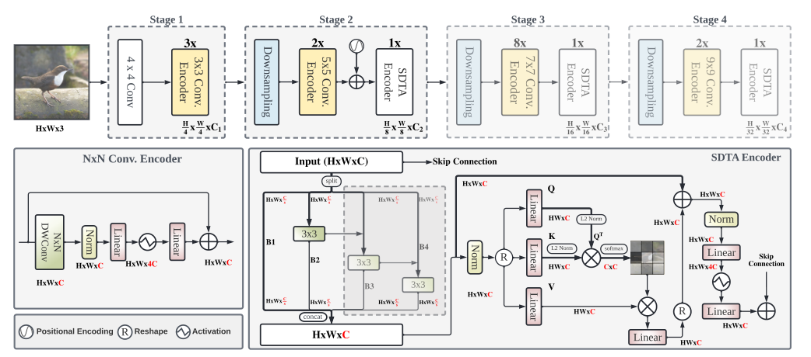
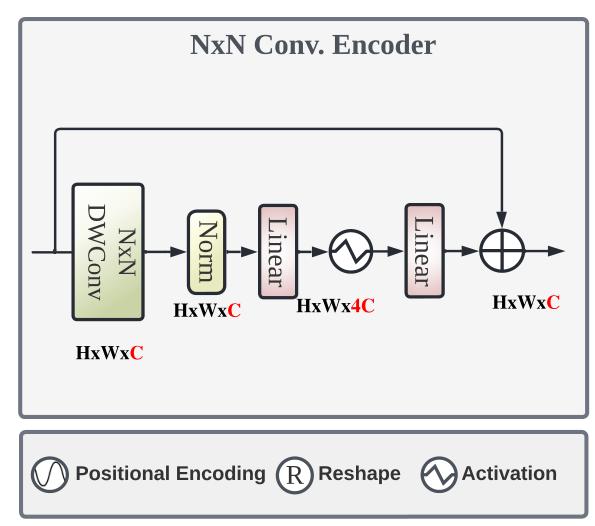

# 【图像分类】2022-EdgeNeXt ECCVW

> 论文题目：EdgeNeXt: Efficiently Amalgamated CNN-Transformer Architecture for Mobile Vision Applications
>
> 论文链接：[https://arxiv.org/abs/2206.10589](https://arxiv.org/abs/2206.10589)
>
> 论文代码：[https://github.com/mmaaz60/EdgeNeXt](https://github.com/mmaaz60/EdgeNeXt)
>
> 发表时间：2022年6月
>
> 引用：Maaz M, Shaker A, Cholakkal H, et al. EdgeNeXt: Efficiently Amalgamated CNN-Transformer Architecture for Mobile Vision Applications[J]. arXiv preprint arXiv:2206.10589, 2022.
>
> 引用数：暂无

## 1. 介绍

### 1.1 摘要

为了追求不断增加的精度，越来越复杂和巨大的模型被研究出来。它们虽然精度很高，但是对于计算资源有要求，难以应用到边缘设备。因此，我们努力将CNN和ViT的长处结合，提出了一个新的高效混合结构EdgeNeXt。

我们引入了一个split depth-wise transpose attention (SDTA) encoder，此模块分为卷积+transformer部分，卷积模块时，将输入tensor split成多份，分别使用深度可分离卷积提取特征，transformer模块时，做通道维度的self-attention，而不是空间维度的，将复杂度从基于图像的二次方变成线性的。

我们以1.3M 参数的EdgeNeXt-XXS模型在ImageNet-1K 上实现了 71.2% 的 top-1 准确度，比MobileViT-XXS更好，精度提升了2.2%，FLOP 减少了 28%。此外，我们的具有 5.6M 参数的 EdgeNeXt-S模型在 ImageNet-1K 上实现了 79.4% 的 top-1 准确率。

### 1.2 介绍

随着CNN和ViT的发展，模型越来越繁杂。一个通常的趋势是将模型变得更深更复杂去提高精度。但是在许多真实世界的应用，如机器人、自动驾驶，识别需要同时精确并且在资源限制的移动平台上有较低的推理延迟。

目前已经存在的方法有，一种是通过特殊设计的卷积如Shufflenet、Mobilenet、Squeezenet等，另外有通过NAS搜索得到高效的模型。然而，CNN虽然容易训练，但是缺乏像素间的全局交互，因此需要使用到transformer获得全局信息。ViT虽然可以得到全局信息，但是需要的计算量较大，设计轻量化的ViT模型十分重要。

现有的轻量化网络一般是基于CNN的，但是CNN网络有两个缺点，一是它只有局部感受野因此难以建模全局信息，二是在推理时权重是不变的难以灵活应用。因此，使用transformer进行缓解这两个缺点，最近有研究在将CNN与ViT结合，然而它们聚焦在于优化参数，而导致更高的MADDS，这对移动设备的推理不利。本文将参数量、FLOPs和Madds一起纳入考虑，构建了一个新的轻量化模型EdgeNeXt。

贡献总结：

- 提出了一个新的轻量化CNN-ViT混合网络，称作EdgeNeXt，它是一个高效的考虑了模型大小、参数量和MAdds的模型。
- 具体地，提出了一个SDTA模型，即**深度可分离转置注意力模块**，能够高效地融合局部和全局信息表征。我们的模型，使用5.6M和1.3G的MAdds，在ImageNet-1k上获得了79.4%的top1准确率。

## 2. 网络

### 2.1 整体架构

在方法上，主要有两点创新，一是本文将Self-attention应用在通道维度而不是空间维度，以此来获得线性复杂度；二是采用了动态的卷积核尺寸，因为大卷积核可以获得大的感受野但是计算效率低，因此本文使用动态的卷积核尺寸，在不同stage使用不同大小的卷积核，来获得大的感受野同时减少计算量。

EdgeNeXt的总体结构如图1所示，对于一张输入图像，分为四个stage，通过不同的stage后，特征层的分辨率分布变成原来的四分之一、八分之一、十六分之一和三十二分之一，这种分层结构可以很方便地嵌入到图像分割和目标检测模型上面。

每一个stage主要有两个模块组成，卷积编码器和STDA。

### 2.2 N ×N卷积编码器

这个block由动态卷积核大小的深度可分离卷积组成。首先是$N*N$的深度可分离卷积，N的大小由stage动态决定，在stage=1、2、3、4时，N=3、5、7、9。特征层经过DW卷积后，使用LN层进行归一化，然后使用两个1*1投影卷积进行增强局部表征和通道维度变换，第一个投影卷积后接上GELU非线性激活函数。最后，进行残差连接操作。

假设输入特征层为$X_i$,输出特征层为$X_{i+1}$,那么这个encoder的公式为
$$
\boldsymbol{x}_{i+1}=\boldsymbol{x}_{i}+\operatorname{Linear}_{G}\left(\operatorname{Linear}\left(\operatorname{LN}\left(\operatorname{Dw}\left(\boldsymbol{x}_{i}\right)\right)\right)\right)
$$

### 2.3 STDA模块

在split depth-wise transpose attention(STDA)模块中，由两个主要组成部分。第一个是动态多尺度特征融合部分，第二部分是全局信息编码部分。

## 3. 代码

参考资料

> [EdgeNeXt：结合CNN和Transformer的轻量化ViT模型 - 知乎 (zhihu.com)](https://zhuanlan.zhihu.com/p/547685921)

