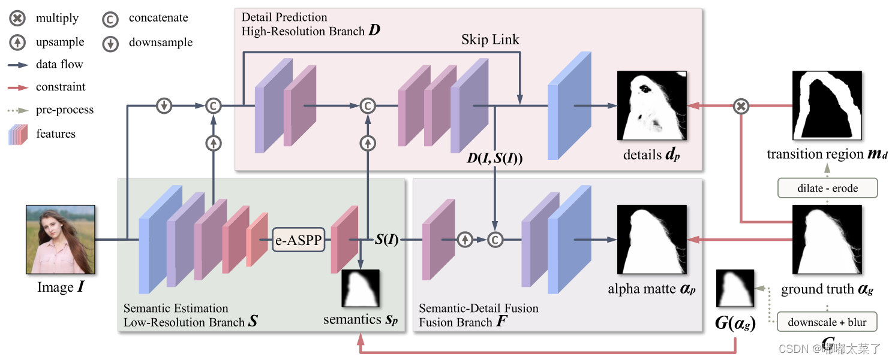
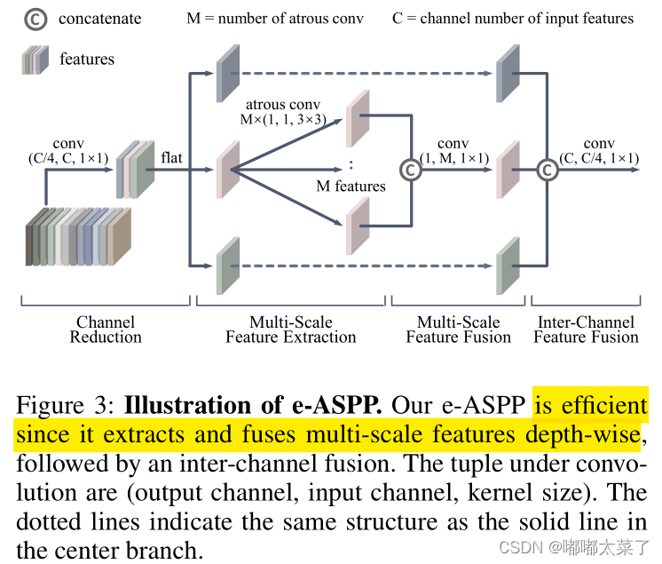

# 2020 MODNet AAAI

> 论文地址: [https://arxiv.org/abs/2011.11961](https://arxiv.org/abs/2011.11961)
>
> 代码地址: [https://github.com/ZHKKKe/MODNet](https://github.com/ZHKKKe/MODNet)
>
> 项目演示:[https://sight-x.cn/portrait_matting](https://sight-x.cn/portrait_matting/)

## 1. 简介

### 1.1 简介

MODNet由香港城市大学和商汤科技于2020年11月首次提出，用于实时抠图任务s 

现有的Matting方法常常需要辅助的输入如tripmap才能获得好的效果，但是tripmap获取成本较高。MODNet是一个不需要Trimap的实时抠图算法。MODNet包含2种新颖的方法来提升模型效率和鲁棒性：

**特性**

* 轻量级（light-weight ）
* 实时性高（real-time）
* 预测时不需要额外的背景输入（trimap-free）
* 准确度高（hight performance）
* 单模型（single model instead of a complex pipeline）
* 泛化能力强（better generalization ability）

### 1.2 结果

## 2. 网络

MODNet网络结构如图所示，主要包含3个部分：semantic estimation（S分支）、detail prediction（D分支）、semantic-detail fusion（F分支）。

Semantic Estimation用来定位肖像的位置，这里仅使用了encoder来提取高级语义信息，这里的encoder可以是任意backbone网络，论文中使用mobilenetv2。这么做有2个好处：

### 2.1 Semantic Estimation

Semantic Estimation用来`定位肖像的位置`，这里`仅使用了encoder`来提取高级语义信息，这里的encoder可以是`任意backbone网络`，论文中使用`mobilenetv2`。这么做有2个好处：

1. Semantic Estimation效率更高，因为没有decoder，参数减少了；
2. 得到的高级语义表示S(I)对后续分支有利；

将`S(I)`送入通道为1的卷积层，输出经过sigmoid得到Sp,与$G(\alpha_g)$计算损失，$G(\alpha_g)$,由GT进行16倍下采样经过高斯模糊得到。使用L2损失，损失函数如下：
$$
L_s=\frac{1}{2}||S_p-G(\alpha_g)||_2
$$

### 2.2 e-ASPP

DeepLab提出的ASPP已被证明可以显著提升语义分割效果，它利用多个不同空洞率的卷积来得到不同感受野的特征图，然后将多个特征图融合

为了减少计算量，对ASPP进行以下修改：

1. 将每个空洞卷积改为depth-wise conv+point-wise conv；
2. 交换通道融合和多尺度特征图融合的顺序，`ASPP`是各个通道先计算，得到不同尺度特征图然后用conv融合，e-ASPP是`每个通道不同空洞率的卷积`，concat后融合（这里是参考论文理解的，源码没找到这部分）；
3. 输入e-ASPP的特征图通道数减少为`原来的1/4`。

### 2.3 Detail Prediction

Detail Prediction是高分辨率分支，它的输入由I、S(I)、S分支输出的低分辨率特征组成。D分支额外做了简化：

1. 与S分支相比，D的卷积层更少；
2. D分支的卷积层通道数较少；
3. 分支D的所有特征图分辨率在前向传播时会降低以减少计算量；

分支D的输出是$d_p$,它的目标是学习到肖像的边缘细节，它的损失函数是L1损失，如下式，其中$m_d$是二值图，它的计算公式为$m_d=dilate(\alpha_g)-erode(\alpha_g)$
$$
L-d=m_d||d_p-\alpha_g||_1
$$

### 2.4 sub-objectives consistency

发丝级的Matting数据标注成本非常高，常用的数据增强方法是替换背景，但是这样生成的图像和生活中的图像相差甚远，因此现有的trimap-free模型常常过拟合训练集，在真实场景下表现较差。

论文提出了一种自监督方法，不需要标注数据即可训练网络，使其适应真实世界的数据。

MODNet分支$S$的输出为$S(I)$，F的输出为$F(S(I), D(S(I)))$。$S(I)$是$F(S(I), D(S(I)))$的先验，可以利用这种关系实现自监督训练（有了预测结果$F(S(I), D(S(I)))$，将其下采样然后模糊当作$S(I)$的标签）。

假设模型为M，有：
$$
\hat{s}_p,\hat{d}_p,\hat{\alpha}_p=M(\hat{I})
$$
设计损失函数（和有监督的损失类似，不过这里用$\hat{\alpha}_p$来代替$\alpha_p$
$$
L_{cons}=\frac{1}{2}||G(\hat{\alpha}_p)-\hat{s}_p||_2+\hat{m}_d||\hat{\alpha}_p-\hat{d}_p||_1
$$
上面的损失函数后半部分如下，它存在一个问题：只需要模型不预测任何细节就可以使损失最小。
$$
\hat{m}_d||\hat{\alpha}_p-\hat{d}_p||_1
$$
 改进方法也比较简单，在自监督训练时，创建模型M的副本$M^\prime$,使用$M^\prime$预测的$\hat{\alpha}_p^\prime$作为目标值(用$\hat{\alpha}_p^\prime$替换上面的公式的$\hat{\alpha}_p$).因为$M^\prime$也输出$\hat{d}_p^\prime$,在给细节分支加上正则化损失Ldd：
$$
L_{dd}=\hat{m}_d||\hat{d^\prime}_p-\hat{d}_p||_1
$$
SOC优化过程中，使用Lcons+Ldd作为损失。

## 3. 代码

~~~python

~~~

## 4. 部署-python

官方给出了基于torch和onnx推理代码,这里用的是关于onnx模型的推理代码.

~~~python

import os
import cv2
import argparse
import numpy as np
from PIL import Image

import onnx
import onnxruntime

if __name__ == '__main__':
    # define cmd arguments
    parser = argparse.ArgumentParser()
    parser.add_argument('--image-path', default= 'test.jpeg',type=str, help='path of the input image (a file)')
    parser.add_argument('--output-path',default= 'result.png', type=str, help='paht for saving the predicted alpha matte (a file)')
    parser.add_argument('--model-path', default='hrnet.onnx', type=str, help='path of the ONNX model')
    args = parser.parse_args()

    # check input arguments
    if not os.path.exists(args.image_path):
        print('Cannot find the input image: {0}'.format(args.image_path))
        exit()
    if not os.path.exists(args.model_path):
        print('Cannot find the ONXX model: {0}'.format(args.model_path))
        exit()

    ref_size = 512

    # Get x_scale_factor & y_scale_factor to resize image
    def get_scale_factor(im_h, im_w, ref_size):

        if max(im_h, im_w) < ref_size or min(im_h, im_w) > ref_size:
            if im_w >= im_h:
                im_rh = ref_size
                im_rw = int(im_w / im_h * ref_size)
            elif im_w < im_h:
                im_rw = ref_size
                im_rh = int(im_h / im_w * ref_size)
        else:
            im_rh = im_h
            im_rw = im_w

        im_rw = im_rw - im_rw % 32
        im_rh = im_rh - im_rh % 32

        x_scale_factor = im_rw / im_w
        y_scale_factor = im_rh / im_h

        return x_scale_factor, y_scale_factor

    ##############################################
    #  Main Inference part
    ##############################################

    # read image
    im = cv2.imread(args.image_path)
    img = im.copy()
    im = cv2.cvtColor(im, cv2.COLOR_BGR2RGB)

    # unify image channels to 3
    if len(im.shape) == 2:
        im = im[:, :, None]
    if im.shape[2] == 1:
        im = np.repeat(im, 3, axis=2)
    elif im.shape[2] == 4:
        im = im[:, :, 0:3]

    # normalize values to scale it between -1 to 1
    im = (im - 127.5) / 127.5   

    im_h, im_w, im_c = im.shape
    x, y = get_scale_factor(im_h, im_w, ref_size) 

    # resize image
    im = cv2.resize(im, None, fx = x, fy = y, interpolation = cv2.INTER_AREA)

    # prepare input shape
    im = np.transpose(im)
    im = np.swapaxes(im, 1, 2)
    im = np.expand_dims(im, axis = 0).astype('float32')

    # Initialize session and get prediction
    session = onnxruntime.InferenceSession(args.model_path, None)
    input_name = session.get_inputs()[0].name
    output_name = session.get_outputs()[0].name
    result = session.run([output_name], {input_name: im})

    # refine matte
    matte = (np.squeeze(result[0]) * 255).astype('uint8')
    matte = cv2.resize(matte, dsize=(im_w, im_h), interpolation = cv2.INTER_AREA)

    cv2.imwrite(args.output_path, matte)

    # 保存彩色图片
    # b,g,r = cv2.split(img)
    # rbga_img = cv2.merge((b, g, r, matte))
    rbga_img = cv2.merge((img, matte))
    cv2.imwrite('rbga_result.png',rbga_img)

~~~

