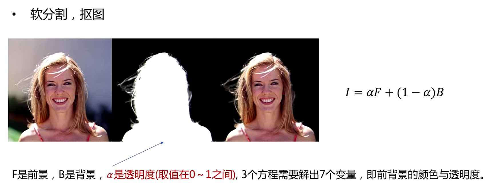

# 第3章 Image Matting

## 1. 简介

### 1.1 简介

图像抠图(Image Matting)是对图像和视频中的前景对象进行精确估计的过程。它是一种非常重要的技术在图像和视频编辑应用，特别是在电影制作创造视觉效果。对于图像分割，我们通过标记像素将图像分割为前景和背景。图像分割产生一个二值图像，其中一个像素属于前景或背景。但图像抠图不同于图像分割，图像分割中有些像素既属于前景又属于背景，这种像素称为部分像素或混合像素。为了将图像中的前景与背景完全分离，需要对部分像素或混合像素的alpha值进行准确的估计。

## 2. 数据集介绍

## 3. 模型简介

