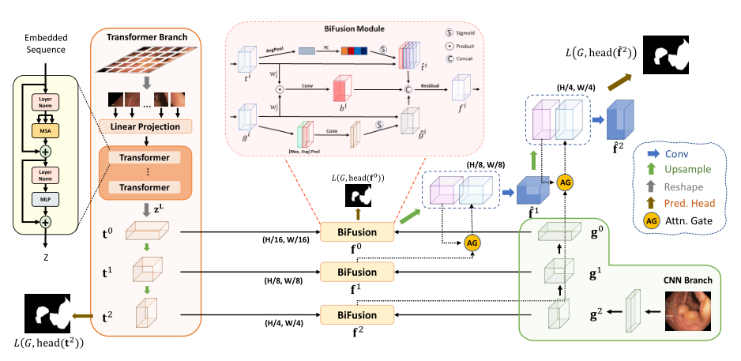
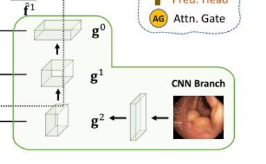
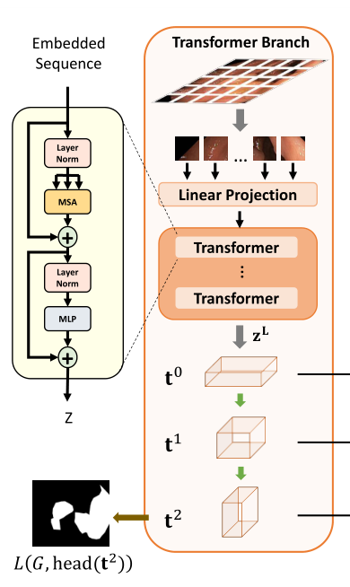
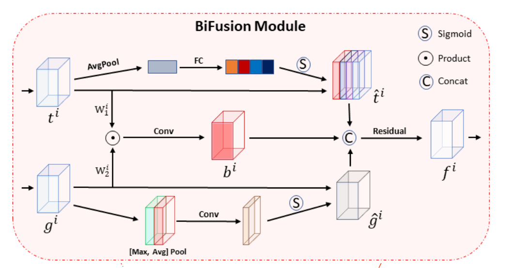

# 2021-Transfuse MICCAI

> 论文题目：TransFuse: Fusing Transformers and CNNs for Medical Image Segmentation
>
> 论文链接：[https://arxiv.org/abs/2102.08005](https://arxiv.org/abs/2102.08005)
>
> 代码链接：[https://github.com/Rayicer/TransFuse](https://github.com/Rayicer/TransFuse)
>
> 发表时间：2021年2月
>
> 引用：Zhang Y, Liu H, Hu Q. Transfuse: Fusing transformers and cnns for medical image segmentation[C]//International Conference on Medical Image Computing and Computer-Assisted Intervention. Springer, Cham, 2021: 14-24.
>
> 引用数：125

## 1. 简介

### 1.1 摘要

医学图像分割，这一众多临床需求的先决条件–已经被卷积神经网络(CNN)的最新进展大大促进了。然而，它在建模明确的长距离关系方面表现出普遍的局限性，而现有的解决方法，诉诸于建立更深的编码器和积极的下采样操作，导致了冗余的深度网络和局部细节的丢失。因此，分割任务等待着一个更好的解决方案，以提高全局上下文建模的效率，同时保持对低层次细节的有力把握。在本文中，我们提出了一个新的并行分支架构TransFuse，以解决这一挑战。TransFuse将Transformer和CNN以并行的方式结合在一起，全局依赖性和低层空间细节都能以更浅显的方式被有效捕捉。此外，还创建了一种新的融合技术–BiFusion模块，以有效地融合来自两个分支的多层次特征。广泛的实验表明，TransFuse在二维和三维医学图像集上取得了SOTA，包括息肉、皮肤病变、髋关节和前列腺的分割，参数明显减少，推理速度明显提高。

**TransFuse 具有以下几个优点**：
（1) 可以有效捕获低级空间特征和高级语义上下文；
（2）它不需要很深的网络，这缓解了梯度消失和特征减少的重用问题；
（3）它大大提高了模型大小和推理速度的效率，不仅可以在云端部署，还可以在边缘部署。

据我们所知，TransFuse 是第一个合成 CNN 和 Transformer 的并行分支模型。实验证明了与其他竞争 SOTA 作品相比的优越性能。

## 2. 网络

### 2.1 整体架构

### 2.2 CNN

在CNN网络中通过逐渐进行下采样操作获得不同尺度的特征图，这样十分耗费资源，也会使得网络层次很深。为了更好的发挥Transformer的特长，本文将CNN流水线的下采样操作替换为Transformer，使用Transformer来提取全局上下文信息。

这样一方面可以减少网络深度一方面也可以保留更丰富的低层细节信息。比如搭建5层特征提取模块，可以保留前四层的提取结果，可以只保留前4层的输出，然后将他们与Transformer的结果融合获得融合后的特征提取。


本文的CNN分支设计十分灵活，可以用于任何现成的CNN网络。

### 2.3 Transformer Branch

Transformer分支的设计遵循其编码-解码结构，对于$H\times W\times 3$的输入首先会切成patch（patch number= 16）;随后patch经过线性映射并展平，在送入Transformer之前还会嵌入可训练的位置信息。
Transformer中包含L层MSA和MLP，SA的计算表示为：

$$
\mathrm{SA}\left(\mathbf{z}_{i}\right)=\operatorname{softmax}\left(\frac{\mathbf{q}_{\mathbf{i}} \mathbf{k}^{T}}{\sqrt{D_{h}}}\right) \mathbf{v}
$$

然后将块展平并传递到输出维度为 D0 的线性嵌入层，得到原始嵌入序列 e ∈ RN×D0。为了利用空间先验，将相同维度的可学习位置嵌入添加到 e。生成的嵌入 z0 ∈ RN×D0 是 Transformer 编码器的输入，它包含 L 层多头自注意力 (MSA) 和多层感知器 (MLP)。我们强调作为 Transformer 的核心原理的自我注意 (SA) 机制通过在每一层全局聚合信息来更新每个嵌入补丁的状态

### 2.2 **BiFusion Module**


BiFusion模块用于融合来自CNN和Transformer编码后的特征。包含的操作有：
通道注意力、空间注意力、3x3卷积、残差连接。

$$
\begin{aligned}
\hat{\mathbf{t}}^{i} &=\text { ChannelAttn }\left(\mathbf{t}^{i}\right) & & \hat{\mathbf{g}}^{i}=\text { SpatialAttn }\left(\mathbf{g}^{i}\right) \\
\hat{\mathbf{b}}^{i} &=\operatorname{Conv}\left(\mathbf{t}^{i} \mathbf{W}_{1}^{i} \odot \mathbf{g}^{i} \mathbf{W}_{2}^{i}\right) & \mathbf{f}^{i} &=\operatorname{Residual}\left(\left[\hat{\mathbf{b}}^{i}, \hat{\mathbf{t}}^{i}, \hat{\mathbf{g}}^{i}\right]\right)
\end{aligned}
$$

## 3. 代码

~~~python

~~~

