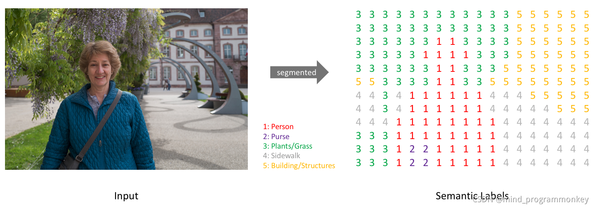
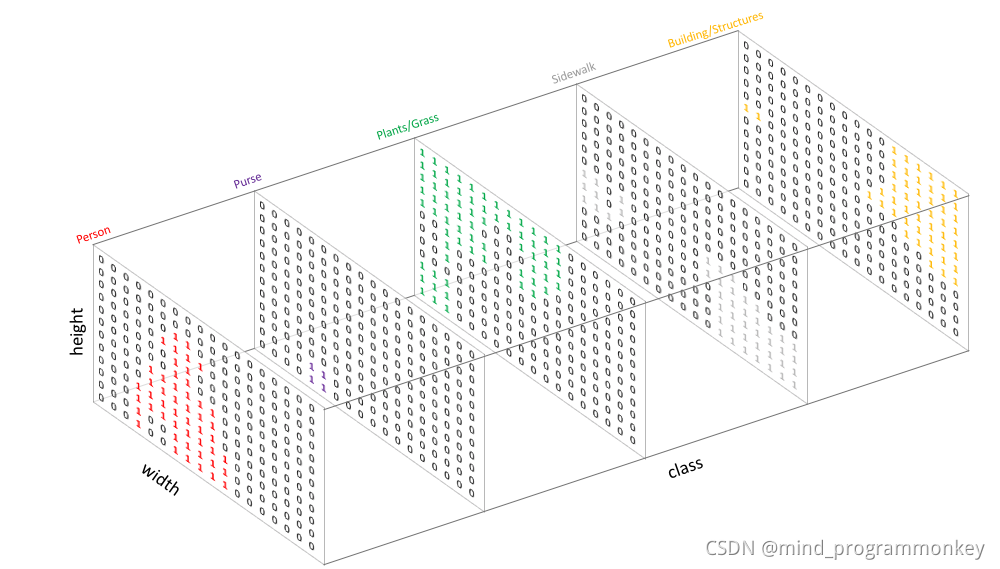
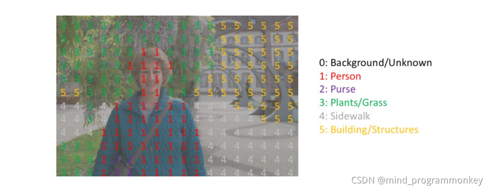

@[TOC]

我做的方向是图像领域，所以今天所讲的

# 【图像分割 之 开山之作】 2015-FCN CVPR

**首个端对端的针对像素级预测的全卷积网络**

FCN是一个`end-to-end`的网络，实现`像素`级别（pixel-wise）的分类，即对每一个像素点都可以进行分类，在语义分割任务上取得了很不错的效果！

> 论文标题：Fully Convolutional Networks for Semantic Segmentation
>
> 论文链接：[https://arxiv.org/abs/1411.4038](https://arxiv.org/abs/1411.4038)
>
> 论文代码：[https://github.com/shelhamer/fcn.berkeleyvision.org](https://github.com/shelhamer/fcn.berkeleyvision.org)
>
> 发表时间：2014年11月
>
> 引用：Long J, Shelhamer E, Darrell T. Fully convolutional networks for semantic segmentation[C]//Proceedings of the IEEE conference on computer vision and pattern recognition. 2015: 3431-3440.
>
> 引用数：32774

论文共分为6个部分

* 介绍
* 相关工作
* 全卷积网络
* 分割网络
* 结果
* 结论

本次讲解具体讲`介绍`，`全卷积网络`，`分割网络`3个部分

[本文链接](https://gitee.com/fakerlove/cv)

## 1. 简介

首先介绍一下FCN的背景和工作成果

### 1.1 什么是语义分割？？？

语义分割作为计算机视觉三大任务（图像分类、目标检测、图像分割）之一，图像分割已经在近些年里有了长足的发展。这项技术也被广泛地应用于无人驾驶领域中，比如用来识别可通行区域、车道线等。

全卷积网络（Fully Convolutional Networks，FCN）是UC Berkeley的Jonathan Long等人于2015年在Fully Convolutional Networks for Semantic Segmentation一文中提出的用于图像语义分割的一种框架。

**看一下语义分割具体的效果**

图像语义分割的意思就是机器自动分割并识别出图像中的内容，比如给出一个人骑摩托车的照片，机器判断后应当能够生成右侧图，红色标注为人，绿色是车（黑色表示back ground）。

简而言之，我们给定一幅RGB彩色图像或一幅灰度图像，会输出一个分割图谱，其中包括每个像素的类别标注。具体如下图所示:

与图像分类的做法相似，这里也是创建一个one-hot编码的类别标注–本质上即为每个类别创建一个输出通道。

之后，预测的结果可以通过对每个像素在深度上求`argmax`的方式被整合到一张分割图上，从而，我们就可以很轻松的观察看每个目标

### 1.2 FCN 结果

接下来，我们直接看一下FCN的结果

FCN虽然是一个简单的框架，但是结果已经十分接近真实值。效果十分的不错

> 这个是在数据集上的一些成功。比当时的其他框架普遍高出10%，这是非常恐怖的事情

**相关工作就不看，直接看第3章**

## 2. 全卷积网络(3个创新点)

* 全卷积网络,使用了卷积模块替换了全连接模块
* 上采样模块
* 跳跃链接
* 任意的input size，输出相应size的output

首先讲一下之间`传统CNN存在的问题`

### 2.0 传统的CNN在做语义分割存在的问题

* CNN做图像分类甚至做目标检测的效果已经被证明并广泛应用，图像语义分割本质上也可以认为是稠密的目标识别（需要预测每个像素点的类别）。

  对于一般的分类CNN网络，如VGG和Resnet，都会在网络的最后加入一些全连接层，经过softmax后就可以获得类别概率信息。但是这个概率信息是1维的，即只能标识整个图片的类别，不能标识每个像素点的类别，所以这种全连接方法不适用于图像分割。

* 传统的基于CNN的语义分割方法是：将像素周围一个小区域（如25*25）作为CNN输入，做训练和预测。这样做有3个问题

  这种方法有几个缺点：

  + 一是存储开销很大。例如对每个像素使用的图像块的大小为25x25，然后不断滑动窗口，每次滑动的窗口给CNN进行判别分类，因此则所需的存储空间根据滑动窗口的次数和大小急剧上升。
  + 二是计算效率低下。相邻的像素块基本上是重复的，针对每个像素块逐个计算卷积，这种计算也有很大程度上的重复。
  + 三是像素块大小的限制了感知区域的大小。通常像素块的大小比整幅图像的大小小很多，只能提取一些局部的特征，从而导致分类的性能受到限制。

  > 总结一下就是以下几点
  >
  > - 像素区域的大小如何确定 
  >
  > - 存储及计算量非常大 
  >
  > - 像素区域的大小限制了感受野的大小，从而只能提取一些局部特征

针对上面的问题，文章做出了`3个方面的创新`

### 2.1 全卷积网络

第一步我们大致看一下 FCN的模型架构图

> 一张猫和狗的图片，经过普通的卷积网络进行下采样，然后通道转置卷积进行上采样。最后输出分割图片

#### 2.1.1 FCN结构

首先看一下普通的CNN图像分类网络

在CNN中, 猫的图片输入到AlexNet, 得到一个长为1000的输出向量, 表示输入图像属于每一类的概率, 其中在“tabby cat”这一类统计概率最高, 用来做分类任务。

换句话讲为什么需要FCN？

>我们分类使用的网络通常会在最后连接几层全连接层，它会将原来二维的矩阵（图片）压扁成一维的，从而**丢失了空间信息**，最后训练输出一个标量，这就是我们的分类标签。
>
>而图像语义分割的输出需要是个分割图，且不论尺寸大小，但是至少是二维的。所以，我们需要丢弃全连接层，换上全卷积层，而这就是全卷积网络了。

总结以下,全连接层丢失了空间信息，所以得使用卷积层代替了全连接层

总结以下就是以下这幅图

#### 2.1.2 全卷积怎么替换全连接

让我们来看一下怎么替换。上面是为$7\times 7\times512$的feature map 。通过平铺成25088的一维向量。然后和全连接进行运算。

卷积是如何替换的呢？我们可以通过卷积核为$7\times 7$，步长为1,卷积核数目为$4096$，实现全连接层的效果。

我们可以看到参数量是一样的。卷积完成后的数据也是一样的

                          

### 2.2 上采样Upsampling

**什么叫做上采样**

上采样即扩充图像的h和w。如下图所示，我们可以看到第一章图片的宽高为`200*200`。通过上采样图片的宽高变成`250*250`。通过上采样，图片维度变大，但是呢，图片和原来视觉上差不多。

#### 2.2.1 常见的上采样

现在我们知道上采样操作，有几种

* 转置卷积

  feature maps补0，然后做卷积操作

* 线性差值

  插值法不需要学习任何的参数，只是根据已知的像素点对未知的点进行预测估计，从而可以扩大图像的尺寸，达到上采样的效果

* 反池化unpooling

  在空隙中填充 0

* unsampling 

  在空隙中填充同样的值

#### 2.2.2 转置卷积

这里解释一下转置卷积的内容，它是如何对图片进行上采样的.两张图解释一下

**nn.ConvTranspose2d**

~~~python
nn.ConvTranspose2d(in_channels, 
                   out_channels, 
                   kernel_size, 
                   stride=1, 
                   padding=0,
                   output_padding=0, 
                   groups=1, 
                   bias=True, 
                   dilation=1)
~~~

参数详解

> * `padding`(int or tuple, optional) - 输入的每一条边补充0的层数，高宽都增加2*padding
> * `output_padding`(int or tuple, optional) - 输出边补充0的层数，高宽都增加padding
> * `strides`:步长。每次窗口滑动距离

### 2.3 跳跃连接(原文在第4章)

VGG,GoogleNet,LeNet

采用的是VGG16的架构

>   **作用**：连接底层信息到高层信息，从而提升精度。

#### 使用VGG16作为backbone

**看完VGG16这个模型，才能理解这个跳跃链接的效果。因为VGG16中对应的池化**

1. image经过多个conv和+一个max pooling变为pool1 feature，宽高变为1/2
2. pool1 feature再经过多个conv+一个max pooling变为pool2 feature，宽高变为1/4
3. pool2 feature再经过多个conv+一个max pooling变为pool3 feature，宽高变为1/8
4. ......
5. 直到pool5 feature，宽高变为1/32。

对于FCN-32s，直接对pool5 feature进行32倍上采样获得32x upsampled feature，再对32x upsampled feature每个点做softmax prediction获得32x upsampled feature prediction（即分割图）。

#### FCN-16s

对于FCN-16s，首先对pool5 feature进行2倍上采样获得2x upsampled feature，再把pool4 feature和2x upsampled feature**逐点相加**，然后对相加的feature进行16倍上采样，并softmax prediction，获得16x upsampled feature prediction。

#### FCN-8S

对于FCN-8s，首先进行pool4+2x upsampled feature**逐点相加**，然后又进行pool3+2x upsampled**逐点相加**，即进行更多次特征融合。具体过程与16s类似，不再赘述。

作者在原文种给出3种网络结果对比，明显可以看出效果：FCN-32s < FCN-16s < FCN-8s，即**使用多层feature融合有利于提高分割准确性**。

## 3. 分割网络

### 3.1 训练过程

下面这个为模型的全部架构图

训练过程分为四个阶段，也体现了作者的设计思路，值得研究。

第1阶段

以经典的分类网络为初始化。最后两级是全连接（红色），参数弃去不用

第2阶段

从特征小图（$16*16*4096$）预测分割小图（$16*16*21$），之后直接升采样为大图。

反卷积（橙色）的步长为32，这个网络称为FCN-32s。 

这一阶段使用单GPU训练约需3天。

1/32的图进行上采样->1/16 +maxpool4 (1/16)  -> 上采样

 第3阶段

 升采样分为两次完成（橙色×2）。 
 在第二次升采样前，把第4个pooling层（绿色）的预测结果（蓝色）融合进来。使用跳级结构提升精确性。 
 第二次反卷积步长为16，这个网络称为FCN-16s。 
 这一阶段使用单GPU训练约需1天。

第4阶段
 升采样分为三次完成（橙色×3）。 
 进一步融合了第3个pooling层的预测结果。 
 第三次反卷积步长为8，记为FCN-8s。 
 这一阶段使用单GPU训练约需1天。

### 3.2 评价指标和损失

fcn网络的输入batchsize是1，因为分割loss的计算在每一个像素点都一个真值（标签），相当于每一个像素点的都是一个分类任务，一个图像就有对应像素点个样本。所以分割任务的batch是一个图片，将一个图片最后在所有像素点上的分类loss加起来计算一次梯度的更新。

评价指标使用了miou

### 3.3 实验尝试

 作者还做了很多实验来尝试提升网络性能，很多都没有效果。这部分挺有意思的。

- 作者尝试了减少最后一层的池化层的步长到1，可是这导致池化层后面的卷积层卷积核感受野很大。这样增大了计算量，这么大感受野的卷积核很难学习。作者也试过了用更小的过滤器来调整池化层上面的层，可是效果也不好。

- 作者也尝试了 shift and stitch trick，但是代价太大，性价比还不如层融合。得不偿失。

- 添加了一些训练数据，提升了mIOU

- 尝试了patch sampling，块抽样，发现相比于全图训练并没有带来更快地收敛。

  

- 尝试通过修改损失值的权重或者采样loss来实现平衡训练集（class balance），发现虽然数据集的类很不平衡，其中四分之三都是背景，但是类平衡并不能带来性能的提升。

- 作者还尝试了数据增强，也并没有带来显著地提升。

 

## 4. 优缺点

传统 CNN 有几个缺点：

1. 存储开销大，滑动窗口较大，每个窗口都需要存储空间来保存特征和判别类别，而且使用全连接结构，最后几层将近指数级存储递增
2. 计算效率低，大量重复计算
3. 滑动窗口大小是相对独立的，末端使用全连接只能约束局部特征。

为了解决上面的部分问题，FCN 将传统 CNN 中的全连接层转化成卷积层，对应 CNN 网络 FCN 把最后三层全连接层转换成为三层卷积层（4096，4096，1000）。

**FCN 的缺点**：

1. 分割的结果不够精细。图像过于模糊或平滑，没有分割出目标图像的细节
2. 因为模型是基于CNN改进而来，即便是用卷积替换了全连接，但是依然是独立像素进行分类，没有充分考虑像素与像素之间的关系
3. 也是因为每个模型都有自己的不足，所以才会出现各式各样的模型来解决它们的问题。大家如果能分析出每个模型的缺点，那我们也可以构建新的模型去完善他们的模型，这其实就是创新的过程

## 5. 代码

[FCN实现VOC数据集训练 | Kaggle](https://www.kaggle.com/code/jokerak/fcn-voc)

* 准备数据集
* 加载数据集
* 实现网络
* 进行训练

## 6. 常见问题简述

### 什么是上采样？

说了半天，到底什么是上采样？

**实际上，上采样（upsampling）一般包括2种方式：**

1. **Resize，如双线性插值直接缩放，类似于图像缩放（这种方法在原文中提到）**
2. **Deconvolution，也叫Transposed Convolution**

什么是Resize就不多说了，这里解释一下Deconvolution。

对于一般卷积，输入蓝色4x4矩阵，卷积核大小3x3。当设置卷积参数pad=0，stride=1时，卷积输出绿色2x2矩阵，如图6。

而对于反卷积，相当于把普通卷积反过来，输入蓝色2x2矩阵（周围填0变成6x6），卷积核大小还是3x3。当设置反卷积参数pad=0，stride=1时输出绿色4x4矩阵，如图7，这相当于完全将图4倒过来（[其他更多卷积示意图点这里](https://link.zhihu.com/?target=https%3A//github.com/vdumoulin/conv_arithmetic)）。

图7 Deconvolution forward示意图

传统的网络是subsampling的，对应的输出尺寸会降低；**upsampling的意义在于将小尺寸的高维度feature map恢复回去**，以便做pixelwise prediction，获得每个点的分类信息。

上采样在FCN网络中的作用如图8，明显可以看到经过上采样后恢复了较大的pixelwise feature map（其中最后一个层21-dim是因为PACSAL数据集有20个类别+Background）。这其实相当于一个Encode-Decode的过程。

**具体的FCN网络结构，可以在[fcn caffe prototext](https://github.com/shelhamer/fcn.berkeleyvision.org/blob/master/pascalcontext-fcn8s/train.prototxt)中查到，建议使用[Netscope]([Netscope (ethereon.github.io)](http://ethereon.github.io/netscope/#/editor))查看网络结构。这里解释里面的难点：**

为了解决图像过小后 1/32 下采样后输出feature map太小情况，FCN原作者在第一个卷积层conv1_1加入pad=100。

~~~json
layer {
  name: "conv1_1"
  type: "Convolution"
  bottom: "data"
  top: "conv1_1"
  param {
    lr_mult: 1
    decay_mult: 1
  }
  param {
    lr_mult: 2
    decay_mult: 0
  }
  convolution_param {
    num_output: 64
    pad: 100             # pad=100
    kernel_size: 3
    stride: 1
  }
}
~~~

考虑如果不在conv1_1加入pad=100，会发生什么？

假设输入图像高度为h。由于VGG中缩小输出feature map只在pooling层，经过每个pooling后输出高度变为：

## 7. 不重要部分讲解

### 7.1 patchwise(原本第3章)

简单翻译：由于一副需要语义分割的图片中有很多我们不关注的区域，因此直接输入全卷积网络会有很多的多余计算，避免冗余的一个标准方法是只输入给网络图像中的随机小块（围绕感兴趣目标的小图像区域）而不是整图像，这样的“patchwise sampling”保证输入有足够的方差和训练集的有效表示。 可以从训练集中进行小块采样，或者直接对整图的损失进行采样，所以有这个说法“Patchwise training is loss sampling”，本文[fcn]后来实验发现patchwise training 比起直接训练整幅图 并没有大的提升，但是训练花费的时间更多了，因此本文是整幅图训练。

### 7.2 shift and stitch

参考链接[Shift and stitch理解 - 知乎 (zhihu.com)](https://zhuanlan.zhihu.com/p/56035377)

在Semantic Segmentation中，由于CNN网络的下采样，使得输出是coarse的，要想得到 pixel级别的dense prediction，其中一种方法是shift and stitch，介绍如下。

> 网上的关于shift-and-stitch的解释：
>
> 设原图与FCN所得输出图之间的降采样因子是f，那么对于原图的每个fxf 的区域（不重叠），“
>
> shift the input x pixels to the right and y pixels down for every (x,y) ,0 < x,y < f." 
>
> 把这个f x f区域对应的output作为此时区域中心点像素对应的output，
>
> 这样就对每个 fxf 的区域得到了 f2 个output，也就是每个像素都能对应一个output，所以成为了dense prediction

假设降采样因子为`s`，那么output map（这里为了简单起见，仅考虑二维）的spatial size则是 input的 `1/s`， 平移 input map， 向左或向上（向右向下情况一样），偏移量为`(x,y)`， 其中，

参考链接

> [图像语义分割入门+FCN/U-Net网络解析 - 知乎 (zhihu.com)](https://zhuanlan.zhihu.com/p/31428783)
>
> https://blog.csdn.net/m0_37935211/article/details/83098997
>
> [FCN的学习及理解（Fully Convolutional Networks for Semantic Segmentation）_moonuke的博客-CSDN博客_fcn](https://blog.csdn.net/qq_36269513/article/details/80420363)
>
> [深度学习语义分割(一)FCN论文解读_su扬帆启航的博客-CSDN博客_fcn论文解读](https://blog.csdn.net/orange_littlegirl/article/details/80732058)

