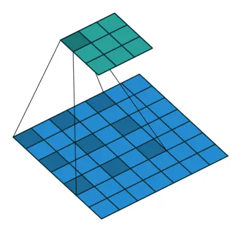

# DeepLabV1

deeplabv1

论文地址 https://arxiv.org/abs/1412.7062

论文pdf https://arxiv.org/pdf/1412.7062.pdf

[参考的代码](https://github.com/TheLegendAli/DeepLab-Context)

# 1. 简介

## 1.1 简介

在论文《Semantic image segmentation with deep convolutional nets and fully connected CRFs》中提出，发表在 ICLR 2015 。

## 1.2 存在的问题

* **对于空间不敏感**，CNN的一个特性是invariance（不变性），这个特性使得它在high-level的计算机视觉任务比如classification中，取得很好的效果。但是在semantic segmentation任务中，这个特性反而是个障碍。

  毕竟语义分割是像素级别的分类，高度抽象的空间特征对如此low-level并不适用。所以，用CNN来做分割，就需要考虑feature map的尺寸，以及空间位置不变性问题。

* 对于第一个问题**信号下采样**，作者说主要是采用Maxpooling导致的，为了解决这个问题作者引入了`'atrous'(with holes) algorithm`（空洞卷积 / 膨胀卷积 / 扩张卷积）

换句话讲

- 重复池化和下采样导致分辨率大幅下降，位置信息丢失难以恢复
- 空间不变性导致细节信息丢失

## 1.3 解决方案(亮点)

### 1.3.1 空洞卷积

Input stride 也就是`空洞因子`或者`膨胀因子`，在`同样的卷积核大小`下，通过增加Input stride可以增大卷积核的`感受野`。更好的示意图：

可以发现感受野从`3`变成 了`5`，近似的扩大了`2`倍，卷积核大小仍为`3x3`，Input stride为`2`，现在都叫`dilate rate`。

普通卷积代码

~~~python
~~~

空洞卷积代码

~~~python
~~~

### 1.3.2 CRF

Fully-connected Conditional Random Field (CRF)

通常网络中分类准确率和位置准确性是一对矛盾的存在，有一些工作尝试在保证分类准确率的条件下解决位置问题：

- 利用卷积网络中多个层次的信息
- 利用超像素，把位置问题交给底层次的分割处理（此处低层次分割是无语义分割）

一般利用到条件随机场`（CRFs）`来处理分割中不光滑问题，它只考虑到目标像素点的附近点，是一个短距离的CRFs。由于网络中得到的结果已经比较光滑了，更希望的是修复一些小的结构，所以用到了`全连接`的CRF模型。它的能量函数：

# 2. 网络结构

## 优缺点

相比之前的一些网络，本文提出的网络具有以下优势：

- 速度更快，论文中说是因为采用了膨胀卷积的原因，但fully-connected CRF很耗时
- 准确率更高，相比之前最好的网络提升了7.2个点
- 模型很简单，主要由DCNN和CRF联级构成

# 3. 代码

# 4. 常见问题

