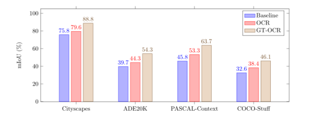
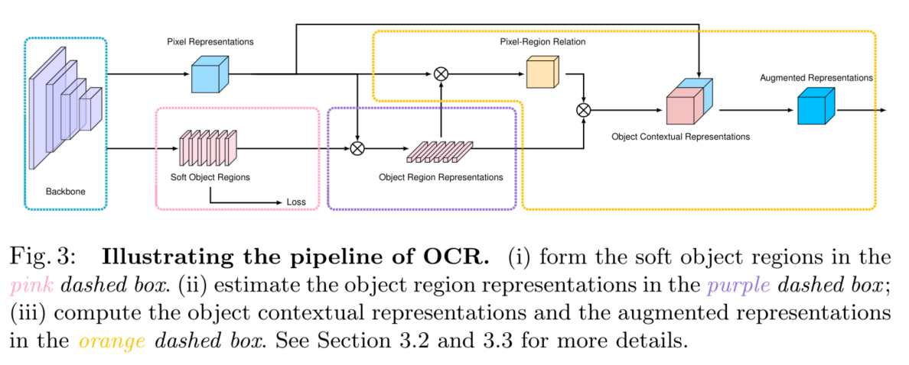

#  OCRNet 论文翻译

> 摘要本文研究了语义切分中的上下文聚合问题。由于像素的标签是像素所属对象的类别，我们提出了一种简单而有效的方法，即对象上下文表示，通过利用对应对象类的表示来表征像素。首先，我们在地真分割的监督下学习目标区域。其次，我们通过聚集对象区域内像素的表示来计算对象区域表示。最后，我们计算每个像素与每个对象区域之间的关系，并使用对象上下文表示来增强每个像素的表示，该表示是所有对象区域表示的加权集合。我们通过经验证明，我们的方法在各种基准上实现了具有竞争力的性能:cityscape、ADE20K、LIP、PASCAL-Context和COCO-Stuff。我们提交的“HRNet  + OCR + SegFix”在ECCV  2020提交截止日期前获得了城市景观排行榜的第一名。代码可以在https://git.io/openseg和https://git.io/HRNet.OCR获得。
>
> 我们使用Transformer编码器-解码器框架来重新描述对象上下文表示方案。前两个步骤,计算对象区域学习和对象区域表示,作为cross-attention模块集成在译码器:用于分类像素的线性预测,例如,生成对象区域,分类查询,对象地区表示crossattention输出。最后一步是我们添加到编码器的交叉注意模块，其中键和值是解码器输出，查询是每个位置的表示。详情见第3.3节。
>
> 

Abstract. In this paper, we study the context aggregation problem in semantic  segmentation. Motivated by that the label of a pixel is the category of the  object that the pixel belongs to, we present a simple yet effective approach,  object-contextual representations, characterizing a pixel by exploiting the  representation of the corresponding object class. First, we learn object regions  under the supervision of the ground-truth segmentation. Second, we compute the  object region representation by aggregating the representations of the pixels  lying in the object region. Last, we compute the relation between each pixel and  each object region, and augment the representation of each pixel with the  object-contextual representation which is a weighted aggregation of all the  object region representations. We empirically demonstrate our method achieves  competitive performance on various benchmarks: Cityscapes, ADE20K, LIP,  PASCAL-Context and COCO-Stuff. Our submission “HRNet + OCR + SegFix” achieves  the 1st place on the Cityscapes leaderboard by the ECCV 2020 submission  deadline. Code is available at: https://git.io/openseg and  https://git.io/HRNet.OCR.

We rephrase the object-contextual representation scheme using the Transformer  encoder-decoder framework. The first two steps, object region learning and  object region representation computation, are integrated as the cross-attention  module in the decoder: the linear projections used to classify the pixels, i.e.,  generate the object regions, are category queries, and the object region  representations are the crossattention outputs. The last step is the  cross-attention module we add to the encoder, where the keys and values are the  decoder output and the queries are the representations at each position. The  details are presented in Section 3.3.

## 1. 介绍

语义分割是一个为图像的每个像素分配一个类标签的问题。它是计算机视觉领域的一个基本课题，对于自动驾驶等各种实际任务至关重要。深度卷积网络自FCN以来一直是主流解决方案。已经进行了各种研究，包括高分辨率表征学习，上下文聚合，这是本文的兴趣，等等。一个位置的上下文通常指一组位置，例如，周围的像素。早期的研究主要是关于语境的空间尺度，即空间范围。代表性的工作，如ASPP和PPM，利用了多尺度上下文。近年来，DANet、CFNet、OCNet等多部著作考虑了位置与其上下文位置之间的关系，并将权重较高的上下文位置表示集合起来进行相似表示。

Semantic segmentation is a problem of assigning a class label to each pixel for  an image. It is a fundamental topic in computer vision and is critical for  various practical tasks such as autonomous driving. Deep convolutional networks  since FCN have been the dominant solutions. Various studies have been conducted,  including high-resolution representation learning, contextual aggregation that  is the interest of this paper, and so on. The context of one position typically  refers to a set of positions, e.g., the surrounding pixels. The early study is  mainly about the spatial scale of contexts, i.e., the spatial scope.  Representative works, such as ASPP and PPM , exploit multi-scale contexts.  Recently, several works, such as DANet, CFNet and OCNet, consider the relations  between a position and its contextual positions, and aggregate the  representations of the contextual positions with higher weights for similar  representations.

> 图1:说明我们的OCR方案的有效性。GT-OCR通过利用地面真值来估计理想的对象上下文表示，这是我们的方法的上限。OCR报告我们提出的对象上下文表示的性能。三种方法，基线，OCR和GT-OCR，使用扩展的ResNet-101输出stride  8作为骨干。我们分别用Cityscapes val、ADE20K  val、PASCAL-Context检验和COCO-Stuff检验对其(单尺度)分割结果进行评估。

我们建议按照探索位置与其上下文之间的关系的思路来研究上下文表示方案。其动机是，分配给一个像素的类标签是该像素所属的对象4的类别。我们的目标是通过利用对应类的对象区域的表示来增强一个像素的表示。实证研究表明，如图1所示，在ground  truth object region给定的情况下，这种表示增强方案显著提高了分割质量

我们的方法包括三个主要步骤。首先，我们将上下文像素划分为一组软对象区域，每个区域对应一个类，即从深度网络(如ResNet或HRNet)计算的粗软分割。这种划分是在ground  truth  segmentation的监督下学习的。其次，我们估计每个对象区域的表示，通过聚集像素在相应的对象区域的表示。最后，我们使用对象上下文表示(OCR)增强每个像素的表示。OCR是所有对象区域表示的加权集合，根据像素和对象区域之间的关系计算出权重

本文提出的OCR方法不同于传统的多尺度上下文方案。我们的OCR区分了相同对象类的上下文像素和不同对象类的上下文像素，而多尺度的上下文方案，如ASPP[6]和PPM[80]，不能，而且只能区分具有不同空间位置的像素。图2提供了一个示例来说明我们的OCR上下文与多尺度上下文之间的差异。另一方面，我们的OCR方法也不同于以前的关系上下文方案。我们的方法将上下文像素结构成对象区域，并利用像素和对象区域之间的关系。相比之下，以往的关系上下文方案单独考虑上下文像素，仅利用像素与上下文像素之间的关系或仅从像素预测关系而不考虑区域。我们在各种具有挑战性的语义分割基准上评估我们的方法。我们的方法优于多尺度上下文方案，如PSPNet、DeepLabv3和最近的关系上下文方案，如DANet，效率也得到了提高。我们的方法在五个基准上实现了具有竞争力的性能:城市景观测试84.5%，ADE20K  val 45.66%， LIP val 56.65%，  PASCAL-Context测试56.2%和COCOStuff测试40.5%。此外，我们将我们的方法扩展到panoptic -  fpn，并验证了我们的OCR在COCO全景分割任务上的有效性，例如，panoptic - fpn + OCR在COCO val上达到44.2%。

We propose to investigate the contextual representation scheme along the line of  exploring the relation between a position and its context. The motivation is  that the class label assigned to one pixel is the category of the object 4 that  the pixel belongs to. We aim to augment the representation of one pixel by  exploiting the representation of the object region of the corresponding class.  The empirical study, shown in Fig. 1, verifies that such a representation  augmentation scheme, when the ground-truth object region is given, dramatically  improves the segmentation quality

Our approach consists of three main steps. First, we divide the contextual  pixels into a set of soft object regions with each corresponding to a class,  i.e., a coarse soft segmentation computed from a deep network (e.g., ResNet or  HRNet ). Such division is learned under the supervision of the ground-truth  segmentation. Second, we estimate the representation for each object region by  aggregating the representations of the pixels in the corresponding object  region. Last, we augment the representation of each pixel with the  object-contextual representation (OCR). The OCR is the weighted aggregation of  all the object region representations with the weights calculated according to  the relations between pixels and object regions

context schemes. Our OCR differentiates the same-object-class contextual pixels  from the different-object-class contextual pixels, while the multi-scale context  schemes, such as ASPP [6] and PPM [80], do not, and only differentiate the  pixels with different spatial positions. Fig. 2 provides an example to  illustrate the differences between our OCR context and the multi-scale context.  On the other hand, our OCR approach is also different from the previous  relational context schemes . Our approach structures the contextual pixels into  object regions and exploits the relations between pixels and object regions. In  contrast, the previous relational context schemes consider the contextual pixels  separately and only exploit the relations between pixels and contextual pixels  or predict the relations only from pixels without considering the regions. We  evaluate our approach on various challenging semantic segmentation benchmarks.  Our approach outperforms the multi-scale context schemes, e.g., PSPNet,  DeepLabv3, and the recent relational context schemes, e.g., DANet, and the  efficiency is also improved. Our approach achieves competitive performance on  five benchmarks: 84.5% on Cityscapes test, 45.66% on ADE20K val, 56.65% on LIP  val, 56.2% on PASCAL-Context test and 40.5% on COCOStuff test. Besides, we  extend our approach to Panoptic-FPN and verify the effectiveness of our OCR on  the COCO panoptic segmentation task, e.g., Panoptic-FPN + OCR achieves 44.2% on  COCO val.

## 2. 相关工作

多尺度上下文。PSPNet对金字塔池表示执行规则卷积，以捕获多尺度上下文。DeepLab系列采用不同扩张速率的平行扩张卷积(每个速率捕捉不同尺度的环境)。最近的工作提出了各种扩展，例如，DenseASPP使膨胀速率致密化，以覆盖更大的范围。还有一些研究构建了编码器-解码器结构，利用多分辨率特征作为多尺度上下文。

关系背景。DANet、CFNet和OCNet通过聚集上下文像素的表示来增强每个像素的表示，其中上下文包含所有像素。与全球不同在背景下，这些作品考虑像素之间的关系(或相似度)，基于自我注意方案，并以相似度为权值进行加权聚集。

Double  Attention及其相关工作和ACFNet将像素点分组成一组区域，然后考虑到利用像素表示预测其上下文关系，通过聚集区域表示来增强像素表示。我们的方法是一种关系上下文方法，与Double  Attention和ACFNet相关。不同之处在于区域的形成和像素-区域关系的计算。

我们的方法在ground  truth分割的监督下学习区域。相比之下，以往的方法中除ACFNet以外的区域都是无监督形成的。另一方面，像素和区域之间的关系是通过同时考虑像素和区域的表示来计算的，而在之前的工作中，像素和区域之间的关系是通过像素表示来计算的。

**Coarse-to-fine segmentation**。各种从粗到细的分割方案被开发出来，逐步细化分割映射。例如，将粗分割地图作为附加表示，与原始图像或其他表示相结合，计算出细分割地图。我们的方法在某种意义上也可以看作是一个从粗到细的方案。区别在于我们使用粗分割映射来生成上下文表示，而不是直接用作额外表示。我们比较了我们的方法与传统的粗到细方案在补充材料。

**Coarse-to-fine segmentation** 目前有许多基于区域的分割方法，将像素点组织成一组区域(通常是超像素)，然后对每个区域进行分类，得到图像分割结果。我们的方法不分类每个区域进行分割，而是使用该区域学习对像素进行更好的表示，从而实现更好的像素标注。

Multi-scale context. PSPNet performs regular convolutions on pyramid pooling  representations to capture the multi-scale context. The DeepLab series adopt  parallel dilated convolutions with different dilation rates (each rate captures  the context of a different scale). The recent works propose various extensions,  e.g., DenseASPP densifies the dilated rates to cover larger scale ranges. Some  other studies construct the encoder-decoder structures to exploit the  multi-resolution features as the multi-scale context.

Relational context. DANet , CFNet and OCNet augment the representation for each  pixel by aggregating the representations of the contextual pixels, where the  context consists of all the pixels. Different from the global context , these works consider the relation (or similarity) between the pixels,  which is based on the self-attention scheme , and perform a weighted aggregation  with the similarities as the weights. Double Attention and its related work and  ACFNet group the pixels into a set of regions, and then augment the pixel  representations by aggregating the region representations with the consideration  of their context relations predicted by using the pixel representation. Our  approach is a relational context approach and is related to Double Attention and  ACFNet. The differences lie in the region formation and the pixel-region  relation computation. Our approach learns the regions with the supervision of  the ground-truth segmentation. In contrast, the regions in previous approaches  except ACFNet are formed unsupervisedly. On the other hand, the relation between  a pixel and a region is computed by considering both the pixel and region  representations, while the relation in previous works is only computed from the  pixel representation. Coarse-to-fine segmentation. Various coarse-to-fine  segmentation schemes have been developed to gradually refine the segmentation  maps from coarse to fine. For example, regards the coarse segmentation map as an  additional representation and combines it with the original image or other  representations for computing a fine segmentation map. Our approach in some  sense can also be regarded as a coarse-to-fine scheme. The difference lies in  that we use the coarse segmentation map for generating a contextual  representation instead of directly used as an extra representation. We compare  our approach with the conventional coarse-to-fine schemes in the supplementary  material.

There exist many region-wise segmentation methods that organize the pixels into  a set of regions (usually super-pixels), and then classify each region to get  the image segmentation result. Our approach does not classify each region for  segmentation and instead uses the region to learn a better representation for the pixel, which leads to better  pixel labeling.

## 3. 方法

语义分割是给图像I的每个像素$p_i$分配一个标签$l_i$的问题，其中$l_i$是$K$个不同类别中的一个。

### 3.1 背景

Multi-scale context 。ASPP[5]模块通过以不同的扩张速率执行多个并行的扩张卷积来获取多尺度上下文信息
$$
y_i^d=\sum_{p_s=p_t+d\Delta t}K^d_tx_s
$$

这里，$p_s=p_t+d\Delta t$是在pi位置上与膨胀速率d(例如，d =  12、24、36，在DeepLabv3[6]中)进行膨胀卷积的采样位置。$T$是一个卷积的位置指数，例如，对于一个3 × 3的卷积，$\{∆T =(∆w，∆h)|∆w  =−1,0,1，∆h  =−1,0,1\}$。$x_s$是在$p_s$处的表示，$y^d_i$是$dth$扩张卷积在$p_i$处的输出表示。$K^d_t$是第$d$个扩张卷积在$t$位置的核参数。输出的多尺度上下文表示是由并行扩展卷积输出的表示的串联。

基于扩张卷积的多尺度上下文方案在不失去分辨率的情况下捕捉了多个尺度的上下文。PSPNet中的金字塔池模块对不同尺度的表示执行规则卷积，也捕获多个尺度的上下文，但失去了大尺度上下文的分辨率。

关系背景。关系上下文方案通过考虑以下关系来计算每个像素的上下文:
$$
y_i=\rho(\sum_{s\in I}w_{is}\delta(x_s))
$$
其中，$I$为图像中的像素集合，$w_{is}$为$x_i$与$x_s$之间的关系，只能由$x_i$预测或由$x_i$与$xs$计算。δ(·)和ρ(·)是两个不同的变换函数。全局上下文方案是关系型上下文的一种特殊情况，其中$w_{is}=\frac{1}{|I|}$。

### 3.2 Formulation思想

像素$p_i$的类标签$l_i$本质上是像素$p_i$所在对象的标签。受此启发，我们提出了一种对象上下文表示方法，通过利用相应的对象表示来表征每个像素。

提出的对象-上下文表示方案

(1)将图像I中的所有像素结构化为$K$个软对象区域，

(2)将第$K$个对象区域中所有像素的表示集合为$f_k$表示每个对象区域，

(3)考虑到与所有对象区域的关系，将$K$个对象区域表示集合起来，对每个像素的表示进行增强:

$$
y_i=\rho(\sum_{k=1}^Kw_{ik}\delta(f_k))
$$
其中$f_k$是$kth$对象区域的表示，$w_{ik}$是第$i$个像素与$kth$对象区域的关系。$δ(·)$和$ρ(·)$是变换函数。软对象区域。我们将图像I划分为K个软目标区域$\{M1,  M2,\cdots ,M_k\}$。每个对象区域$M_k$对应于类$k$，并由一个2D地图(或粗分割地图)表示，其中每个条目表示对应像素属于类$k$的程度。

我们从骨干网(如ResNet或HRNet)的中间表示输出中计算$K$个对象区域。在训练过程中，我们利用交叉熵损失从地面真值分割中学习目标区域生成器。

对象表示。我们将属于第$k$个对象区域的所有像素按其等级加权的表示集合起来，形成第$k$个对象区域表示:
$$
f_k=\sum_{i\in I}\hat{m}_{ki}x_i
$$
这里$x_i$是像素$p_i$的表示。$\hat{m}_{ki}$是属于$kth$对象区域的像素$p_i$的归一化程度。我们使用空间softmax对每个对象区域$M_k$进行规范化。

Semantic segmentation is a problem of assigning one label li to each pixel pi of  an image I, where li is one of K different classes.

Here, ps = pi +d∆t is the sth sampled position for the dilation convolution with  the dilation rate d (e.g., d = 12, 24, 36 in DeepLabv3 [6]) at the position pi.  t is the position index for a convolution, e.g., {∆t = (∆w, ∆h)|∆w = −1, 0, 1,  ∆h = −1, 0, 1} for a 3 × 3 convolution. xs is the representation at ps. ydi is  the output representation at pi for the dth dilated convolution. Kdt is the  kernel parameter at position t for for the dth dilated convolution. The output  multi-scale contextual representation is the concatenation of the  representations output by the parallel dilated convolutions.

The multi-scale context scheme based on dilated convolutions captures the  contexts of multiple scales without losing the resolution. The pyramid pooling  module in PSPNet performs regular convolutions on representations of different  scales, and also captures the contexts of multiple scales but loses the  resolution for large scale contexts.

Relational context. The relational context scheme computes the context for each  pixel by considering the relations:

where I refers to the set of pixels in the image, wis is the relation between xi  and xs, and may be predicted only from xi or computed from xi and xs. δ(·) and  ρ(·) are two different transform functions as done in self-attention [61]. The  global context scheme [46] is a special case of relational context with wis = 1  |I|

We compute the K object regions from an intermediate representation output from  a backbone (e.g., ResNet or HRNet). During training, we learn the object region  generator under the supervision from the ground-truth segmentation using the  cross-entropy loss..

Object region representations. We aggregate the representations of all the  pixels weighted by their degrees belonging to the kth object region, forming the  kth object region representation:

Here, xi is the representation of pixel pi. ˜mki is the normalized degree for  pixel pi belonging to the kth object region. We use spatial softmax to normalize  each object region Mk.