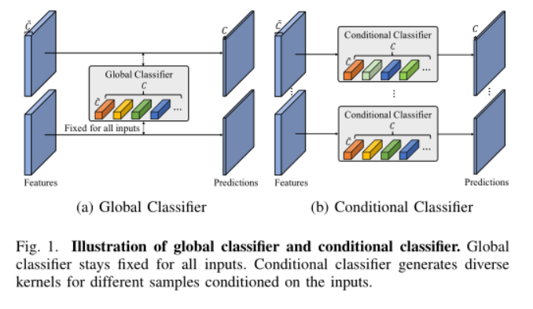
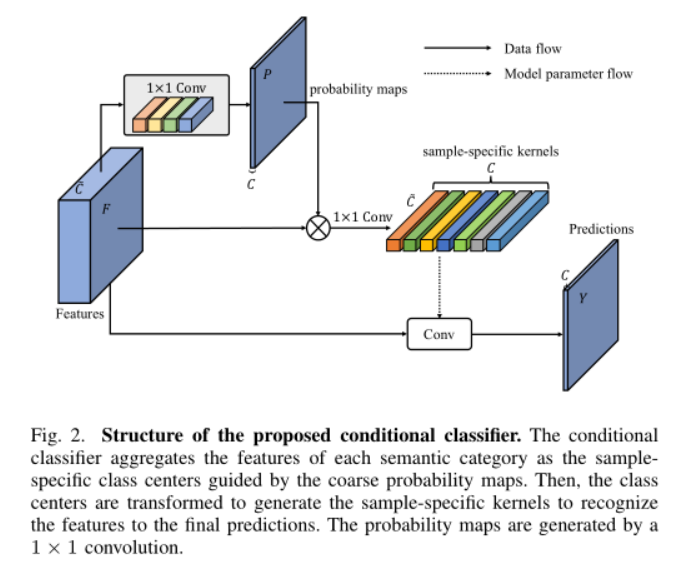

# CondNet: Conditional Classifier for Scene Segmentation

IEEE SPL 2021

> 摘要:全卷积网络(FCN)在场景分割等密集视觉识别任务中取得了巨大的成功。FCN的最后一层通常是一个全局分类器(`1×1`  convolution)，用于将每个像素识别为`一个语义标签`。我们的经验表明，这种全局分类器，忽略类内的区别，可能导致次优结果。在这项工作中，我们提出了一个条件分类器来取代传统的全局分类器，其中分类器的核是根据输入动态生成的。
>
> 新分类器的`主要优点`是:
>
> (1)它`参与类内区分，具有更强的密集识别能力`;
>
> (ii)条件分类器`简单灵活`，可以集成到几乎任意的FCN架构中，以提高预测。
>
> 大量实验表明，该分类器在FCN结构上优于传统分类器。配备了条件分类器(称为CondNet)的框架在两个数据集上实现了最先进的性能。代码和模型可以在https://git.io/CondNet上找到。

Abstract—The fully convolutional network (FCN) has achieved tremendous success  in dense visual recognition tasks, such as scene segmentation. The last layer of  FCN is typically a global classifier (1×1 convolution) to recognize each pixel  to a semantic label. We empirically show that this global classifier, ignoring  the intra-class distinction, may lead to sub-optimal results. In this work, we  present a conditional classifier to replace the traditional global classifier,  where the kernels of the classifier are generated dynamically conditioned on the  input. The main advantages of the new classifier consist of: (i) it attends on  the intra-class distinction, leading to stronger dense recognition capability;  (ii) the conditional classifier is simple and flexible to be integrated into  almost arbitrary FCN architectures to improve the prediction. Extensive  experiments demonstrate that the proposed classifier performs favourably against  the traditional classifier on the FCN architecture. The framework equipped with  the conditional classifier (called CondNet) achieves new state-ofthe-art  performances on two datasets. The code and models are available at  https://git.io/CondNet

## 1. 介绍

场景分割是视觉识别中的一个基础和具有挑战性的任务，旨在将每个像素识别为一个语义类别，提供全面的场景理解。它具有广泛的下游应用，如自动驾驶、人机交互、增强现实等。近年来，随着深度神经网络的发展，全卷积网络(fully  convolutional network,  FCN)取得了巨大的成功，成为场景分割任务中的主导解决方案。在原始FCNs中，整个架构由特征提取器和分类器(最后一层用于预测)组成。特征提取器在嵌入强大的特征表示方面得到了广泛的研究。各种设计已经被提出来提取有效的鉴别特征:

(i)更大的接受域，例如，膨胀/变形卷积，

(ii)通过金字塔方法的多尺度表示

(iii)通过注意机制的自适应聚集，如自我注意和渠道注意机制;相比之下，对分类器的研究却相对较少。

传统分类器对特征图的每个位置进行核相关，以获得所需的像素级预测。在训练阶段，通过整个训练样本学习核函数。在评估阶段，学习到的内核保持固定，并应用于特征映射来预测语义映射。我们称这种类型的分类器为全局分类器，它试图寻找一个全局类中心来识别不同样本的所有变异，如图1  (a)所示。

全局分类器的缺点是处理类内区别的能力有限。在一些复杂的场景中，同一语义类别的不同样本可能具有非常不同的外观(我们称之为类内区别/变异)。传统的分类器对同一类别的大部分像素都是全局的，容易将这些不同外观的像素错误识别为不同类别。在这项工作中，我们提出了一个条件分类器像素识别，取代了广泛使用的全局分类器在以前的工作。我们工作背后的主要思想是生成特定于样本的内核，其参数适应于输入样本中的特定模式，可以处理类内的区别，如图1  (b)所示。

我们的条件分类器由两部分组成:类特征聚合模块和内核生成模块。类-特征聚合模块倾向于通过加权平均对每个语义类别的特征进行聚合。期望加权平均方式可以捕获一个样本内同一类别的区别作为样本特定的类中心(而不是全局类) 中心)。内核生成模块根据特定于样本的类中心动态生成特定于样本的内核。将生成的特定于样本的内核应用于输入样本以预测语义掩码。

所提出的条件分类器有以下几个优点:

(1)条件分类器关注每个类别的特定样本区别，从而学习到一个更具区别性的分类器。

(ii)条件分类器可以无缝地集成到几乎任意的FCN架构中，取代全局分类器(1×1卷积)。

对场景分割任务的大量评估表明，条件分类器的性能优于传统分类器。该框架配备了条件分类器(称为CondNet)，在两个具有挑战性的数据集上实现了最新的性能。

scene segmentation is a fundamental and challenging task in visual recognition,  aiming to recognize each pixel into a semantic category, providing comprehensive  scene understanding. It has extensive downstream applications, e.g., autonomous  driving, human-machine interaction, and augmented reality. In recent years, with  the development of deep neural networks, the fully convolutional network (FCN)  has achieved tremendous success and been the dominant solution in the scene  segmentation task. In the original FCNs, the whole architecture composes of a  feature extractor and a classifier (the last layer for prediction). Feature  extractors have been widely studied for embedding powerful feature  representation. V arious designs have been proposed to extract effective  discriminative features: (i) larger receptive field, e.g., dilation/deformable  convolutions, (ii) multi-scale representation via pyramid methods e.g., PPM , ASPP and MDCCNet , (iii) adaptive aggregation via attention  mechanism, e.g., self-attention and channel attention mechanism. In contrast,  the classifier has been studied in relatively few works. The traditional  classifier performs the kernel correlation on each position of the feature map  to obtain the desired pixelwise prediction. In the training phase, the kernel is  learned thorough the whole training samples. In the evaluation phase, the  learned kernels stay fixed and are applied to the feature maps to predict the  semantic maps. We call this type of classifier as the global classifier, which  attempts to seek a global class center to recognize all the variation of  different samples, as shown in Figure 1 (a).

The drawback of the global classifier is its limited capability to handle the  intra-class distinction. In some complex scene, the diverse samples of the same  semantic category may have very different appearances (which we call intra-class  distinction/variation). It is common that the traditional classifier is easy to  mis-recognize these pixels of the same category but different appearances into  different categories since it is global for the majority of pixels of one  category. In this work, we present a conditional classifier for pixelwise  recognition, replacing the global classifier used extensively in previous works.  The main idea behind our work is to generate the sample-specific kernels with  parameters adapted to the particular patterns within an input sample, which can  handle the intra-class distinction, as shown in Figure 1 (b).

Our conditional classifier consists of two parts: the classfeature aggregation  module and the kernel generation module. The class-feature aggregation module  tends to aggregate the features of each semantic category via weighted average.  It is expected that the weighted average manner can capture the distinction of  the same category within one sample as the sample-specific class center (instead  of the global class center). The kernel generation module dynamically generates the sample-specific kernels conditioned on the sample-specific class center. The generated sample-specific kernels are applied to the input sample to predict the semantic masks.

There are several merits of the proposed conditional classifier: (i) The  conditional classifier attends on the samplespecific distinction of each  category to learn a more discriminative classifier. (ii) The conditional  classifier can be seamlessly incorporated into almost arbitrary FCN  architectures, replacing the global classifier (1 × 1 convolution). Extensive  evaluations on the scene segmentation task demonstrate that the conditional  classifier performs favourably against the traditional classifier. The framework  equipped with the conditional classifier (called CondNet) achieves new  stateof-the-art performances on two challenging datasets.

## 2. 相关工作

> 在本节中，我们首先回顾在以前的工作中广泛使用的全局分类器。接下来，我们制定提出的条件分类器。最后，我们用我们提出的条件分类器和相应的损失函数描述了整个体系结构。

### Revisiting Global Classifier

一个典型的全球分类器是一个1×1卷积作为最后一层分割的体系结构,如图1所示(一个)。

考虑输入特性$F\in R^{\hat{C}\times H\times W}$(特征提取器的最终输出),和所需的预测$Y\in R^{\hat{C}\times H\times W}$, $H,W,\hat{C},C$表示高度,宽度,通道尺寸,以及语义类别的数量。

全局分类器对F:  Y的每个位置进行矩阵向量乘法
$$
Y=H(F,W)
$$
其中 $H$就是全局分类器$1\times 1$卷积，$Y$就是预测地图，$\otimes$就是卷积操作。对于每个语义类别，分类器有一个核$W^s\in R^{1\times \hat{C}}$，其中$s\in \{1,2,\cdots,C\}$。经过训练后，核保持固定，并应用于识别所有不同的样本(这就是我们称之为全局分类器的原因)。因此，学习到的kernel需要捕获同一类别不同样本之间的所有变异，以输出正确的预测。然而，同一类别的不同样本可能有着截然不同的外观，特别是在一些复杂的场景中。我们认为全局分类器很难捕捉所有的变化，从而导致次优结果。事实上，对于一幅输入图像，同一类别的像素由于属于同一个场景，具有更多的相似模式。换句话说，同一场景中同一类别的像素有一个特定于样本的类中心，直观地说，这比全局类中心更容易识别这些像素。这促使我们提出条件分类器，它生成特定于样本的核，以特定于样本的类中心为条件。

II. PROPOSED METHOD In this section, we first revisit the global classifier used  extensively in previous works. Next, we formulate the proposed conditional  classifier. Finally, we describe the overall architecture with our proposed  conditional classifier and the corresponding loss functions.

A typical global classifier is a 1 × 1 convolution used as the last layer of the  segmentation architecture, as shown in Figure 1 (a). Consider an input feature F  ∈ R ˜C×H×W (the final output of the feature extractor), and the desired  prediction Y ∈ RC×H×W , where H, W , ˜C, C denote the height, width, channel  dimensions, and the number of semantic categories, respectively.

The global classifier performs a matrix-vector multiplication on each position  of F:

Y=H(F,W)

where H is the global classifier (1 × 1 convolution) with the kernels W ∈ RC×  ˜C, Y is the prediction maps, and ⊗ indicates the convolutional operation. For each semantic category, the classifier has a  kernel ws ∈ R1× ˜C, where s ∈ {1, 2, . . . , C}. After training, the kernel  stays fixed and is applied to recognize all different samples (that is why we  call it global classifier). Therefore, the learned kernel is required to capture  all the variation between different samples of the same category to output the  correct prediction. However, the different samples of the same category may have  far different appearances, especially in some complex scene. We argue that the  global classifier is hard to capture all variation, thus leading to suboptimal  results. In fact, for an input image, the pixels of the same category have more  similar patterns due to belonging to the same scene. In other words, the pixels  of the same category in the same scene have a sample-specific class center,  which, intuitively, is easier to recognize these pixels than the global class  center. This motivates us to propose the conditional classifier, which generates  the sample-specific kernels conditioned on the sample-specific class centers.

### Conditional Classifier

条件分类器的整体结构如图2所示。它主要由两部分组成:类特征聚合模块和内核生成模块。

a)**类特征聚合**:类特征聚合模块的目标是嵌入特定于样本的类中心。对于一个输入示例，它需要聚合同一类别的所有特性作为类中心嵌入。嵌入$E^s\in R^{\hat{C}}$被定义为属于类别s的特征的加权平均值，表述如下:
$$
E^s=\frac{\sum_{j=0}^NP_j^sF_j}{N}
$$
其中$N = H×W,p^s\in R^{H×W}$表示属于类别$s$的概率映射。这里，我们使用分割网络的粗预测掩码作为概率映射$P\in R^{C\times H\times W}$，通过$1\times 1$卷积生成。特定于样本的类中心嵌入捕获一个输入样本中不同像素的变化。处理特定样本的特定模式比处理全局类中心更容易。

b) **核生成**:我们使用带有核$W_\theta$的投影$H_\theta$将样本特定的类中心嵌入转化为样本特定的核，如下:
$$
W_\phi=H_\theta(E,W_\theta)
$$
其中$W_\phi$是特定于样本的核，条件是对应的类中心嵌入。我们用$1\times 1$群卷积作为投影。生成的滤波器最后应用于输入特征$F$的每个位置，如下所示:
$$
Y=H_\phi(F,W_\phi)=H_\phi(F,H_\theta(\frac{P\times F^T}{N},W_\theta))
$$
式中H(·)为卷积，×为矩阵乘法，N = H × W, H, W为高度，换句话说，每个生成的权重/核在feature map上相互关联，以突出显示与预测map属于同一类别的像素

c)**与其他条件架构的关系**:与普通网络不同，条件架构可以实现动态内核。动态滤波器网络根据输入产生卷积滤波器。PAC卷积通过自适应的内核动态地修改内核。CondINS将此设计应用于实例分割任务，为每个实例生成掩码子网的参数。SVCNet学习依赖于形状变化上下文的语义相关性。CondConv和Dynamic  Convolution学习一系列权值来混合每个样本对应的卷积核，增加了模型容量。与这些方法不同的是，我们采用了对条件生成过程的显式监督。

The overall structure of the conditional classifier is shown in Figure 2. It  mainly consists of two parts: class-feature aggregation module and kernel  generation module. a) Class-feature aggregation: The goal of the classfeature  aggregation module is to embed the sample-specific class center. For one input  sample, it requires to aggregate all the features of the same category as the  class center embedding. The embedding Es ∈ R ˜C is defined as the weighted  average of the features belonging to the category s, as formulated as follows:

where N = H ×W , ps ∈ RH×W denotes the probability map belonging to category s.  Here, we use the coarse prediction masks of the segmentation network as the  probability maps P ∈ RC×H×W , which are generated by a 1 × 1 convolution. The  sample-specific class center embeddings capture the variation of different  pixels within one input sample. It is easier to handle the particular patterns  of one certain sample than the global class center.

b) Kernel generation: We use the projection Hθ with kernels Wθ to transform the  sample-specific class center embeddings to the sample-specific kernels as:

Wφ = Hθ(E, Wθ),

where H(·) indicates the convolution, while × is the matrix multiplication, N =  H × W , H and W is the height and width of the F. In other words, each generated weight/kernel correlates on the  feature maps to highlight the pixels belong to the same category as the  prediction map

c) Relation to other conditional architectures: Different from normal networks,  conditional architectures can achieve dynamic kernels. Dynamic filter networks  generates the convolution filters conditioned on the input. PAC convolution  dynamically modifies the kernel with an adapting kernel. CondINS applys this  design to the instance segmentation task, generating the parameters of the mask  subnetwork for each instance. SVCNet learns a semantic correlation dependent  shape-variant context. CondConv and Dynamic Convolution learn a series of  weights to mix the corresponding convolution kernels for each sample, increasing  the model capacity. Different from these methods, we employ the explicit  supervision on the conditional generation process.

### Overall Architecture

所提出的条件分类器可以灵活地集成到几乎任意的FCN架构中。该体系结构可以直接用提出的条件分类器替换原有的分类器(体系结构的最后一层)。特征提取器输出嵌入特征，然后对粗概率图进行预测。通过概率映射，我们可以将类特征聚合为特定于样本的类中心嵌入，然后生成特定于样本的内核来输出最终的预测。配备条件分类器的框架的整体损失函数可以表示为:
$$
L_{overall}=\lambda L_{prob}+L_{seg}
$$
其中，$L_{prob}$和$L_{seg}$分别表示粗概率映射的损失和条件分类器的损失。在这项工作中，我们将$\lambda$设为0.2以平衡这两种损失。我们将在实验部分进行进一步的比较，讨论λ的影响。$L_{seg}$是交叉熵损失，而$L_{prob}$是软骰子损失[34]，因为它的有效性和稳定性训练的阶级不平衡的问题。软骰子损失的定义为:
$$
L_{Dice}=1-\frac{2\sum_{i}^Np_iq_i}{\sum_{i}^Np_i^2+\sum_i^Nq_i^2+\epsilon}
$$
其中$p_i\in R^C$是概率映射的概率向量，而$q_i\in R^C$是对应ground truth mask的一热编码向量，$N=H\times W,\epsilon$防止被零除。

The proposed conditional classifier is flexible to be integrated into almost  arbitrary FCN architectures. The architecture can replace the original  classifier (the last layer of the architecture) with the proposed conditional  classifier directly. The feature extractor outputs the embedding features, then  the coarse probability maps are predicted. With the probability maps, we can  aggregate class features as the sample-specific class center embeddings, then  generate the sample-specific kernels to output the final predictions. The  overall loss function of the framework equipped with the conditional classifier  can be formulated as:
$$
L_{overall}=\lambda L_{prob}+L_{seg}
$$

where $L_{prob}$ and $L_{seg}$ denote the loss of the coarse probability maps and the loss  of the conditional classifier, respectively. We set λ to 0.2 in this work to  balance these two losses. We will give further comparisons to discuss the  influence of λ at the experimental section. Lseg is the Cross Entropy Loss,  while Lprob is the Soft Dice Loss [34] due to its effectiveness and

where pi ∈ RC is the probability vector of the probability maps, while while qi  ∈ RC is a one-hot encoding vector of the corresponding ground truth masks, N =  H×W , ? prevents division by zero.

## 3. 实验

我们在两个场景分割数据集上评估我们的方法，即，ADE20K和PASCAL-Context。我们对ADE20K数据集进行了全面的消融，并在ADE20K和PASCALContext数据集上报告了与其他方法的比较。

We evaluate our approach on two scene segmentation datasets, i.e., ADE20K and  PASCAL-Context. We perform a comprehensive ablation on ADE20K dataset, and  report the comparisons with other methods on ADE20K and PASCALContext datasets.

## 4 结论

在这篇文章中，我们提出了一种条件分类器来取代FCN架构中传统的全局分类器($1×1$卷积用于预测)。对于每个输入样本，该分类器聚合每个类别的特征作为样本特定的类中心，并动态生成相应的核。核参与类内区分，识别能力更强。该条件分类器易于灵活地集成到几乎任意的FCN架构中，以提高预测结果。最后，装备这个分类器的框架(称为CondNet)在两个具有挑战性的数据集上取得了最新的结果。

In this letter, we propose a conditional classifier to replace the traditional  global classifier (1 × 1 convolution for prediction) in the FCN architecture.  For each input sample, this novel classifier aggregates the features of each  category as the sample-specific class centers, and dynamically generates the  corresponding kernels. The kernels attend on the intraclass distinction, leading  to stronger recognition capability. The conditional classifier is easy and  flexible to be integrated into almost arbitrary FCN architectures to improve the  prediction results. Finally, the framework equipped this classifier (called  CondNet) achieves new state-of-the-art results on two challenging datasets.