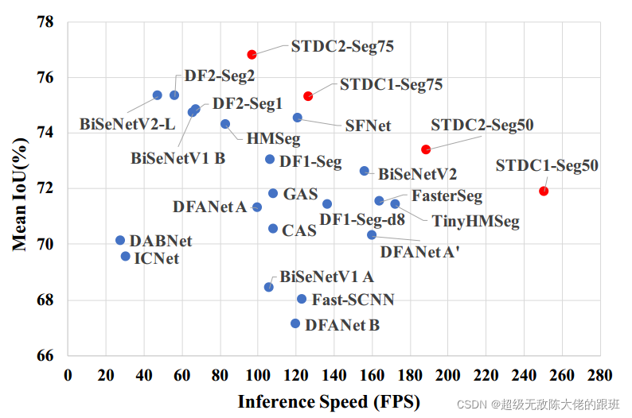
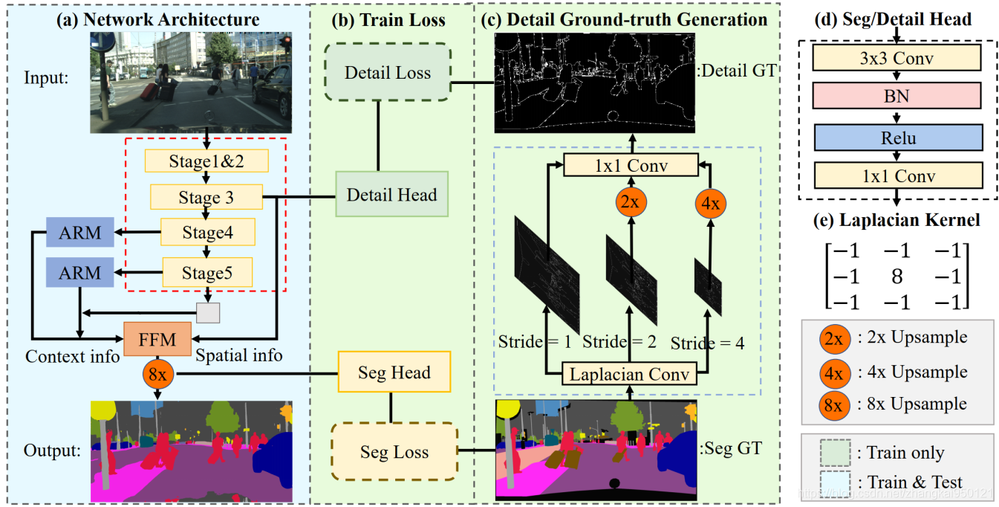
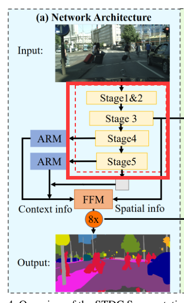
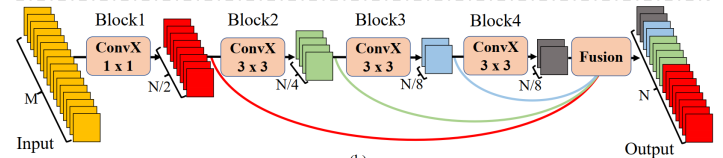
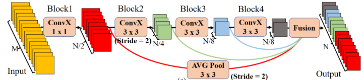
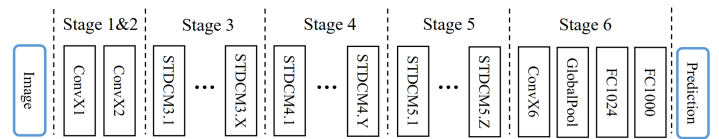
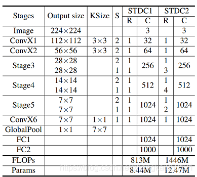

# 【语义分割 BiSeNet加强版】2021-STDC CVPR

> 论文题目：Rethinking BiSeNet For Real-time Semantic Segmentation
>
> 论文下载地址：[https://arxiv.org/abs/2104.13188](https://arxiv.org/abs/2104.13188)
>
> 代码即将开源：[https://github.com/MichaelFan01/STDC-Seg](https://github.com/MichaelFan01/STDC-Seg)
>
> 发表时间：2021年4月
>
> 引用：Fan M, Lai S, Huang J, et al. Rethinking BiSeNet for real-time semantic segmentation[C]//Proceedings of the IEEE/CVF conference on computer vision and pattern recognition. 2021: 9716-9725.
>
> 引用数：74

## 1. 简介

### 1.1 动机

* 为了减少算法的耗时，一些诸如DFANet、BiSeNetV1的语义分割算法使用了轻量化backbone，但是它们都是直接使用为分类任务设计的backbone，作者认为，专为分类任务设计的backbone不能在语义分割领域中充分发挥它们的性能。
* BiSeNet使用了multi-path结构的网络融合低层次特征和高层次特征，然而额外增加分支会增加网络的运行时间作者提出了STDC模块，能够使用较少的参数量提取多尺度特征，且能够很方便地集成到U-Net类型的语义分割网络中；对BiSeNet中的multi-path结构做出改进，在提取底层细节特征的同时减少网络计算量。
* STDC对BiSeNet结构做出了改变，移除了spatial分支，同时采用Short-Term Dense Concate network（STDC network）结构并引入辅助头detail head来提取低级细节信息。

### 1.2 效果

1）STDC1-50网络以**250.4FPS**的速度在测试集上实现了**71.9％**的mIoU。

2）STDC2-75网络在**97.0FPS**的情况下达到**76.8％**的mIoU。

### 1.3 贡献如下

STDC的主要贡献如下：

（1）设计了Short-Term Dense Concate module（STDC module）提取多尺度特征；

（2）使用Detail Aggregation module使网络的浅层学习到细节信息同时不增加推理的计算量；

（3）证明了STDC网络的有效性，及其优越的性能。

## 2. 网络

### 2.1 总体架构

使用`Detail Guidance`替代BiSeNet中的`Spatial分支`，保留低层次细节特征的同时有效地减少了网络计算量。

使用BiSeNet中的context path提取上下文信息，使用STDC网络作为backbone，构建STDC分割网络，如下图中图（a）所示：

### 2.2 STDC模块(backbone)

STDC模块的结构如下图所示：

**设计细节**

* 图中的$ConvX$表示“卷积+BN+RELU"操作，$M$表示输入特征通道数，$N$表示输出特征通道数
* 在$STDC$模块中，第1个block的卷积核尺寸为$1\times 1$,其余block的卷积核尺寸为$3\times 3$。
* 若$STDC$模型的最终输出通道数为$N$,除最后一个block外，该模块内第$i$个block的输出通道数为$\frac{N}{2^i}$,最后一个block的输出特征通道数与倒数第二个block保持一致。

**注意点**

> 与传统的backbone不同的是，STDC模块中`深层的特征通道数少`，浅层的特征通道数多。
>
> 作者认为，`浅层需要更多通道的特征编码细节信息`；深层更关注高层次语义信息，`过多的特征通道数量会导致信息冗余`。

**最后一部分的融合**

STDC模块最终的输出为各block输出特征的融合，即：
$$
x_{output}=F(x_1,x_2,\cdots,x_n)
$$
上式中的$F$表示融合函数,$x_1,x_2,\cdots,x_n$表示$n$个block的输出，$x_{output}$表示STDC模块的输出。使用concatenation操作融合$n$个block的特征。

**下图表示stride=2版本的STDC模块：**

> 
>
> 
>
> 对于stride=2版本的STDC模块，在$Block2$中进行下采样操作；为了在融合时保证feature map尺寸一致，对大尺寸的feature map使用$stride=2,kernel=3\times 3$的average pooling操作进行下采样。

----

STDC模块有2个特点：

（1）随着网络加深，逐渐减少特征通道数，以减少计算量；

（2）STDC的输出融合了多个block的输出feature map，包含多尺度信息。

**模块代码如下**

~~~python
import torch
import torch.nn as nn
from torch.nn import init
import math

class ConvX(nn.Module):
    """
    常规的卷积操作
    """

    def __init__(self, in_planes, out_planes, kernel=3, stride=1):
        super(ConvX, self).__init__()
        self.conv = nn.Conv2d(in_planes, out_planes,
                              kernel_size=(kernel, kernel),
                              stride=(stride, stride),
                              padding=kernel // 2,
                              bias=False)
        self.bn = nn.BatchNorm2d(out_planes)
        self.relu = nn.ReLU(inplace=True)

    def forward(self, x):
        out = self.relu(self.bn(self.conv(x)))
        return out

class stdc(nn.Module):
    def __init__(self, in_channels, out_channels, stride=1):
        super(stdc, self).__init__()

        self.stride = stride

        if stride == 2:
            self.skip = nn.AvgPool2d(kernel_size=3, stride=2, padding=1)

        self.conv1 = ConvX(in_channels, out_channels // 2, kernel=1)
        self.conv2 = ConvX(out_channels // 2, out_channels // 4, stride=stride)
        self.conv3 = ConvX(out_channels // 4, out_channels // 8)
        self.conv4 = ConvX(out_channels // 8, out_channels // 8)

    def forward(self, x):
        out1 = self.conv1(x)
        out2 = self.conv2(out1)
        out3 = self.conv3(out2)
        out4 = self.conv4(out3)
        #  如果步长为2 的话,会有跳跃连接
        if self.stride == 2:
            out1 = self.skip(out1)

        return torch.cat((out1, out2, out3, out4), dim=1)

if __name__ == '__main__':
    input = torch.randn(1, 3, 4, 4)
    model = stdc(3, 16, stride=2)
    out=model(input)
    print(out.shape)

~~~

### 2.3 网络架构

下图表示由STDC模块组成的STDC网络：

该网络包含6个Stage，Stage1~Stage5中都对feature map进行了步长为2的下采样，Stage6输出预测结果。

* Stage1和Stage2通常被视为外观特征提取的低层。为了减少计算量，Stage1和Stage2中只使用1个卷积层。
* Stage3~Stage5中每个Stage包含若干个STDC模块，其中第1个STDC模块包含下采样操作，其余STDC模块保持feature map尺寸不变。

以上图为框架，作者构建了2个STDC网络，分别命名为STDC1和STDC2，它们的结构如下表所示：

表示$ConvX$表示"卷积+BN+RELU"操作，Stage3~Stage5均由若干个STDC模块组成。上表中的$KSize$表示kernel尺寸,$S$表示步长，$R$表示重复次数，$C$表示输出通道数。

~~~python

class stdcnet1(nn.Module):
    def __init__(self, num_class=1000):
        super(stdcnet1, self).__init__()
        self.stage1 = nn.Conv2d(3, 32, kernel_size=(3, 3), stride=(2, 2))
        self.stage2 = nn.Conv2d(32, 64, kernel_size=(3, 3), stride=(2, 2))
        self.stage3 = nn.Sequential(
            stdc(64, 256, stride=2),
            stdc(256, 256, stride=1)
        )
        self.stage4 = nn.Sequential(
            stdc(256, 512, stride=2),
            stdc(512, 512, stride=1)
        )
        self.stage5 = nn.Sequential(
            stdc(512, 1024, stride=2),
            stdc(1024, 1024, stride=1)
        )
        self.stage6 = nn.Conv2d(1024, 1024, kernel_size=(1, 1), stride=(1, 1))

        #  第七步，就是直接使用进行分类。一一个全局池化，加上两个全连接层
        self.gap = nn.AdaptiveAvgPool2d(1)
        self.stage7 = nn.Sequential(
            nn.Linear(1024, num_class, bias=False),
            nn.ReLU(inplace=True),
            nn.Dropout(p=0.1),
            nn.Linear(num_class, num_class, bias=False)
        )

    def forward(self, x):
        x = self.stage1(x)
        x = self.stage2(x)
        x = self.stage3(x)
        x = self.stage4(x)
        x = self.stage5(x)
        x = self.stage6(x)
        #  如果做分类的话，可以直接使用stage 7
        # x = self.gap(x).flatten(1)
        # x = self.stage7(x)
        return x

if __name__ == '__main__':
    input = torch.randn(1, 3, 224, 224)
    model = stdcnet1()
    out = model(input)
    print(out.shape)

~~~

### 2.3 解码器的设计

### 2.4 总结

作者提出了`STDC轻量化backbone用于分割任务`；使用`Detail Guidance`替代BiSeNet中的`Spatial分支`，保留低层次细节特征的同时有效地减少了网络计算量。

## 3. 代码

~~~python
class ConvX(nn.Module):
    def __init__(self, in_planes, out_planes, kernel=3, stride=1):
        super(ConvX, self).__init__()
        self.conv = nn.Conv2d(in_planes, out_planes, kernel_size=kernel, stride=stride, padding=kernel // 2, bias=False)
        self.bn = nn.BatchNorm2d(out_planes)
        self.relu = nn.ReLU(inplace=True)

    def forward(self, x):
        out = self.relu(self.bn(self.conv(x)))
        return out

class AddBottleneck(nn.Module):
    def __init__(self, in_planes, out_planes, block_num=3, stride=1):
        super(AddBottleneck, self).__init__()
        assert block_num > 1, print("block number should be larger than 1.")
        self.conv_list = nn.ModuleList()
        self.stride = stride
        if stride == 2:
            self.avd_layer = nn.Sequential(
                nn.Conv2d(out_planes // 2, out_planes // 2, kernel_size=3, stride=2, padding=1, groups=out_planes // 2,
                          bias=False),
                nn.BatchNorm2d(out_planes // 2),
            )
            self.skip = nn.Sequential(
                nn.Conv2d(in_planes, in_planes, kernel_size=3, stride=2, padding=1, groups=in_planes, bias=False),
                nn.BatchNorm2d(in_planes),
                nn.Conv2d(in_planes, out_planes, kernel_size=1, bias=False),
                nn.BatchNorm2d(out_planes),
            )
            stride = 1

        for idx in range(block_num):
            if idx == 0:
                self.conv_list.append(ConvX(in_planes, out_planes // 2, kernel=1))
            elif idx == 1 and block_num == 2:
                self.conv_list.append(ConvX(out_planes // 2, out_planes // 2, stride=stride))
            elif idx == 1 and block_num > 2:
                self.conv_list.append(ConvX(out_planes // 2, out_planes // 4, stride=stride))
            elif idx < block_num - 1:
                self.conv_list.append(
                    ConvX(out_planes // int(math.pow(2, idx)), out_planes // int(math.pow(2, idx + 1))))
            else:
                self.conv_list.append(ConvX(out_planes // int(math.pow(2, idx)), out_planes // int(math.pow(2, idx))))

    def forward(self, x):
        out_list = []
        out = x

        for idx, conv in enumerate(self.conv_list):
            if idx == 0 and self.stride == 2:
                out = self.avd_layer(conv(out))
            else:
                out = conv(out)
            out_list.append(out)

        if self.stride == 2:
            x = self.skip(x)

        return torch.cat(out_list, dim=1) + x

class CatBottleneck(nn.Module):
    def __init__(self, in_planes, out_planes, block_num=3, stride=1):
        super(CatBottleneck, self).__init__()
        assert block_num > 1, print("block number should be larger than 1.")
        self.conv_list = nn.ModuleList()
        self.stride = stride
        if stride == 2:
            self.avd_layer = nn.Sequential(
                nn.Conv2d(out_planes // 2, out_planes // 2, kernel_size=3, stride=2, padding=1, groups=out_planes // 2,
                          bias=False),
                nn.BatchNorm2d(out_planes // 2),
            )
            self.skip = nn.AvgPool2d(kernel_size=3, stride=2, padding=1)
            stride = 1

        for idx in range(block_num):
            if idx == 0:
                self.conv_list.append(ConvX(in_planes, out_planes // 2, kernel=1))
            elif idx == 1 and block_num == 2:
                self.conv_list.append(ConvX(out_planes // 2, out_planes // 2, stride=stride))
            elif idx == 1 and block_num > 2:
                self.conv_list.append(ConvX(out_planes // 2, out_planes // 4, stride=stride))
            elif idx < block_num - 1:
                self.conv_list.append(
                    ConvX(out_planes // int(math.pow(2, idx)), out_planes // int(math.pow(2, idx + 1))))
            else:
                self.conv_list.append(ConvX(out_planes // int(math.pow(2, idx)), out_planes // int(math.pow(2, idx))))

    def forward(self, x):
        out_list = []
        out1 = self.conv_list[0](x)

        for idx, conv in enumerate(self.conv_list[1:]):
            if idx == 0:
                if self.stride == 2:
                    out = conv(self.avd_layer(out1))
                else:
                    out = conv(out1)
            else:
                out = conv(out)
            out_list.append(out)

        if self.stride == 2:
            out1 = self.skip(out1)
        out_list.insert(0, out1)

        out = torch.cat(out_list, dim=1)
        return out

class STDCNet(nn.Module):

    def __init__(self, subtype='stdc1', out_stages=[3, 4, 5], output_stride = 32, classifier=False, backbone_path=None, pretrained = False):
        super(STDCNet, self).__init__()
        self.subtype = subtype
        self.out_stages = out_stages
        self.output_stride = output_stride # 8, 16, 32
        self.classifier = classifier
        self.backbone_path = backbone_path
        self.pretrained = pretrained

        base = 64
        block_num = 4

        self.out_channels = [3, 32, 64, 256, 512, 1024]
        if self.subtype == 'stdc1':
            layers = [2, 2, 2]
            features = self._make_layers(base, layers, block_num, CatBottleneck) # AddBottleneck

            self.layer1 = nn.Sequential(features[:1])   # x2
            self.layer2 = nn.Sequential(features[1:2])  # x4
            self.layer3 = nn.Sequential(features[2:4])  # x8
            self.layer4 = nn.Sequential(features[4:6]) # x16
            self.layer5 = nn.Sequential(features[6:])  # x32

        elif self.subtype == 'stdc2':
            layers = [4, 5, 3]
            features = self._make_layers(base, layers, block_num, CatBottleneck) # AddBottleneck

            self.layer1 = nn.Sequential(features[:1])   # x2
            self.layer2 = nn.Sequential(features[1:2])  # x4
            self.layer3 = nn.Sequential(features[2:6])  # x8
            self.layer4 = nn.Sequential(features[6:11]) # x16
            self.layer5 = nn.Sequential(features[11:])  # x32

        else:
            raise NotImplementedError

        if self.classifier:
            self.conv_last = ConvX(base * 16, max(1024, base * 16), 1, 1)
            self.gap = nn.AdaptiveAvgPool2d(1)
            self.fc = nn.Linear(max(1024, base * 16), max(1024, base * 16), bias=False)
            self.bn = nn.BatchNorm1d(max(1024, base * 16))
            self.relu = nn.ReLU(inplace=True)
            self.dropout = nn.Dropout(p=0.2)
            self.linear = nn.Linear(max(1024, base * 16), 1000, bias=False)

        self.out_channels = [self.out_channels[ost] for ost in self.out_stages]

        if self.pretrained:
            self.load_pretrained_weights()
        else:
            self.init_weights()

    def _make_layers(self, base, layers, block_num, block):
        features = []
        features += [ConvX(3, base // 2, 3, 2)]
        features += [ConvX(base // 2, base, 3, 2)]

        for i, layer in enumerate(layers):
            for j in range(layer):
                if i == 0 and j == 0:
                    features.append(block(base, base * 4, block_num, 2))
                elif j == 0:
                    features.append(block(base * int(math.pow(2, i + 1)), base * int(math.pow(2, i + 2)), block_num, 2))
                else:
                    features.append(block(base * int(math.pow(2, i + 2)), base * int(math.pow(2, i + 2)), block_num, 1))
        return nn.Sequential(*features)

    def forward(self, x):
        output = []
        for i in range(1, 6):
            layer = getattr(self, 'layer{}'.format(i))
            x = layer(x)
            if i in self.out_stages:
                output.append(x)

        if self.classifier:
            x = self.conv_last(x).pow(2)
            x = self.gap(x).flatten(1)
            x = self.fc(x)
            x = self.relu(x)
            x = self.dropout(x)
            x = self.linear(x)
            return x

        return tuple(output) if len(self.out_stages) > 1 else output[0]

~~~

stdc_head.py

~~~python
class AttentionRefinementModule(nn.Module):
    def __init__(self, in_channel, out_channel, *args, **kwargs):
        super(AttentionRefinementModule, self).__init__()
        self.conv = ConvModule(in_channel, out_channel, 3, 1, 1, norm_cfg=dict(type='BN'), activation='ReLU')
        self.conv_atten = nn.Conv2d(out_channel, out_channel, kernel_size=1, bias=False)
        self.bn_atten = nn.BatchNorm2d(out_channel)

        self.sigmoid_atten = nn.Sigmoid()
        self.init_weight()

    def forward(self, x):
        feat = self.conv(x)
        atten = F.avg_pool2d(feat, feat.size()[2:])
        atten = self.conv_atten(atten)
        atten = self.bn_atten(atten)
        atten = self.sigmoid_atten(atten)
        out = torch.mul(feat, atten)
        return out

    def init_weight(self):
        for ly in self.children():
            if isinstance(ly, nn.Conv2d):
                nn.init.kaiming_normal_(ly.weight, a=1)
                if ly.bias is not None:
                    nn.init.constant_(ly.bias, 0)

class FeatureFusionModule(nn.Module):
    def __init__(self, in_channel, out_channel, *args, **kwargs):
        super(FeatureFusionModule, self).__init__()
        self.convblk = ConvModule(in_channel, out_channel, 3, 1, 1, norm_cfg=dict(type='BN'), activation='ReLU')
        self.conv1 = nn.Conv2d(out_channel, out_channel // 4, kernel_size=1, stride=1, padding=0, bias=False)
        self.conv2 = nn.Conv2d(out_channel // 4, out_channel, kernel_size=1, stride=1, padding=0, bias=False)
        self.relu = nn.ReLU(inplace=True)
        self.sigmoid = nn.Sigmoid()
        self.init_weight()

    def forward(self, fsp, fcp):
        fcat = torch.cat([fsp, fcp], dim=1)
        feat = self.convblk(fcat)
        atten = F.avg_pool2d(feat, feat.size()[2:])
        atten = self.conv1(atten)
        atten = self.relu(atten)
        atten = self.conv2(atten)
        atten = self.sigmoid(atten)
        feat_atten = torch.mul(feat, atten)
        feat_out = feat_atten + feat
        return feat_out

    def init_weight(self):
        for ly in self.children():
            if isinstance(ly, nn.Conv2d):
                nn.init.kaiming_normal_(ly.weight, a=1)
                if ly.bias is not None:
                    nn.init.constant_(ly.bias, 0)

class StdcHead(nn.Module):
    def __init__(self, in_channels, num_classes, mid_channel = 128):
        super(StdcHead, self).__init__()
        # 256, 512, 1024

        self.conv_avg = ConvModule(in_channels[2], 128, 1, 1, 0, norm_cfg=dict(type='BN'), activation='ReLU')

        self.arm32 = AttentionRefinementModule(in_channels[2], 128)
        self.conv_head32 = ConvModule(128, 128, 3, 1, 1, norm_cfg=dict(type='BN'), activation='ReLU')

        self.arm16 = AttentionRefinementModule(in_channels[1], 128)
        self.conv_head16 = ConvModule(128, 128, 3, 1, 1, norm_cfg=dict(type='BN'), activation='ReLU')

        self.ffm = FeatureFusionModule(in_channels[0] + mid_channel, 256)

        self.conv_out8 = nn.Sequential(
                ConvModule(in_channels[0], 256, 3, 1, 1, norm_cfg=dict(type='BN'), activation='ReLU'),
                nn.Conv2d(256, num_classes, kernel_size=1, bias=False)
            )
        self.conv_out16 = nn.Sequential(
                ConvModule(mid_channel, 64, 3, 1, 1, norm_cfg=dict(type='BN'), activation='ReLU'),
                nn.Conv2d(64, num_classes, kernel_size=1, bias=False)
            )
        self.conv_out32 = nn.Sequential(
                ConvModule(mid_channel, 64, 3, 1, 1, norm_cfg=dict(type='BN'), activation='ReLU'),
                nn.Conv2d(64, num_classes, kernel_size=1, bias=False)
            )

        self.conv_out_sp8 = nn.Sequential(
                ConvModule(in_channels[0], 64, 3, 1, 1, norm_cfg=dict(type='BN'), activation='ReLU'),
                nn.Conv2d(64, 1, kernel_size=1, bias=False)
            )

        self._init_weight()

    def forward(self, x):
        feat8, feat16, feat32 = x

        # feat32_avg
        feat32_avg = F.adaptive_avg_pool2d(feat32, 1)
        feat32_avg = self.conv_avg(feat32_avg)
        feat32_avg_up = F.interpolate(feat32_avg, feat32.size()[2:], mode='nearest')

        # feat32
        feat32_arm = self.arm32(feat32)
        feat32_sum = feat32_arm + feat32_avg_up
        feat32_up = F.interpolate(feat32_sum, feat16.size()[2:], mode='nearest')
        feat32_up = self.conv_head32(feat32_up)

        # feat16
        feat16_arm = self.arm16(feat16)
        feat16_sum = feat16_arm + feat32_up
        feat16_up = F.interpolate(feat16_sum, feat8.size()[2:], mode='nearest')
        feat16_up = self.conv_head16(feat16_up)

        # ffm
        feat8_fuse = self.ffm(feat8, feat16_up)

        # out
        feat_out8 = self.conv_out8(feat8_fuse)
        feat_out16 = self.conv_out16(feat16_up)
        feat_out32 = self.conv_out32(feat32_up)

        feat_out_sp8 = self.conv_out_sp8(feat8)

        return feat_out8, feat_out16, feat_out32, feat_out_sp8

    def _init_weight(self):
        for m in self.modules():
            if isinstance(m, nn.Conv2d):
                nn.init.kaiming_normal_(m.weight)
                if m.bias is not None:
                    nn.init.constant_(m.bias, 0)
            elif isinstance(m, nn.BatchNorm2d) or isinstance(m, nn.Linear):
                nn.init.constant_(m.weight, 1)
                nn.init.constant_(m.bias, 0)

~~~

