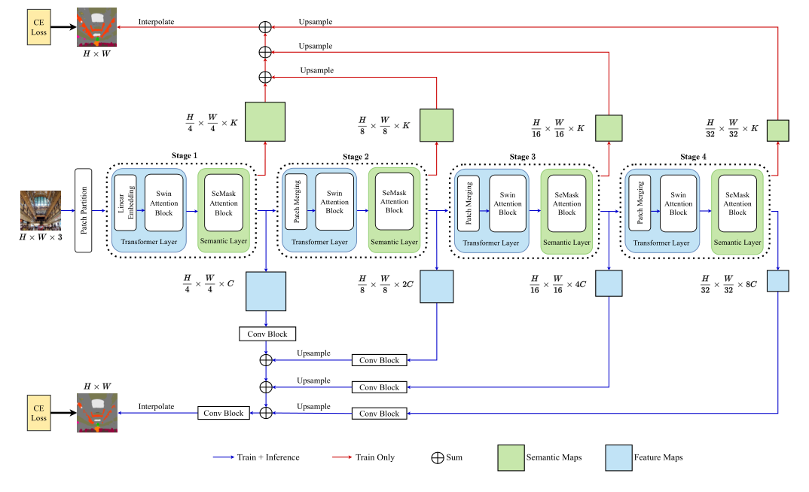
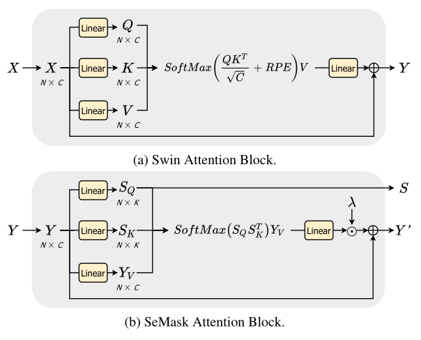

# 2021-SeMask 

> 论文题目：SeMask: Semantically Masked Transformers for Semantic Segmentation
>
> 论文链接：[https://arxiv.org/abs/2112.12782](https://arxiv.org/abs/2112.12782)
>
> 论文代码：[https://github.com/Picsart-AI-Research/SeMask-Segmentation](https://github.com/Picsart-AI-Research/SeMask-Segmentation)

## 1. 简介

### 1.1 简介

在图像转换器网络的编码器部分对预训练的主干进行微调一直是语义分割任务的传统方法。然而，**这种方法忽略了图像在编码阶段提供的语义上下文**。本文认为，在微调的同时将图像的语义信息合并到预训练的基于分层变换器的主干中可以显着提高性能。为了实现这一点，我们提出了 SeMask，这是一个简单而有效的框架，它在语义注意操作的帮助下将语义信息合并到编码器中。此外，我们在训练期间使用轻量级语义解码器来监督每个阶段的中间语义先验图。我们的实验表明，结合语义先验提高了已建立的分层编码器的性能，而 FLOP 的数量略有增加。我们通过将 SeMask 集成到 Swin-Transformer 的每个变体中作为我们的编码器与不同的解码器配对来提供经验证明。我们的框架在 ADE20K 数据集上实现了 58.22% mIoU 的最新技术水平，并在 Cityscapes 数据集上实现了超过 3% 的 mIoU 指标的改进。代码和检查点可在此 https URL 上公开获得。

## 2. 网络

### 2.1 整体架构

在 SeMask 中，大小为$H \times W \times 3$的 RGB 输入首先被拆分为$4 \times 4$个补丁（下图中的“补丁分区”块）。这种初始的微小块大小允许在分割中进行精确预测。补丁被视为标记并传递给编码器，编码器在第一阶段有一个线性嵌入层来改变每个标记的特征维度。

* 编码步骤分为四个后续阶段，每个阶段称为 SeMask 块，由两层组成：Transformer 层，具有 N个Swin Transformer 块，用于从图像中提取图像级上下文信息，以及Semantic层与$N_S$个SeMask 注意块的数量，以将语义信息与特征分离。
* 在每个阶段，原始图像的分辨率随后从 1/4 压缩到 1/32，同时通道维度增加。
* 语义层将来自 Transformer 层的特征作为输入并返回两个输出：中间语义先验图和语义掩码特征（这个名称稍后会证明是合理的）。
* 前者使用轻量级上采样操作进行聚合，预测训练时的语义先验（图像中的通道维度 K 为类数），而后者使用语义 FPN（Feature Pyramid Network）进行聚合，融合了特征通过卷积、上采样和求和运算来产生最终预测。

### 2.2 SeMask Encoder

如前所述解码器的两个主要组件是 Transformer 和语义层。Transformer层由 Microsoft 引入的 Swim Transformer 中不同的移位窗口注意力块组成，并使用移位窗口机制来克服原始 Vision Transformer 的静态补丁的限制。

这项工作的真正创新是语义层，它将Transformer层的输出$Y$作为输入，旨在对语义上下文进行建模，用作计算分割分数的先验。需要这个分数来根据图像中存在的语义性质的指示来更新特征图。

语义层将特征$Y$分为三个实体：语义查询（$S_Q$）、语义键（$S_K$）和特征值（$Y_V$）。

总结，$S_Q$返回语义图，并使用$S_K$和$S_Q$计算分割分数。分数通过线性层并乘以用于平滑微调的可学习标量$\lambda$。

添加残差连接后，得到带有语义信息的修改后的特征，称为语义掩蔽特征。

另外，$S_Q$被传递给轻量级解码器以预测语义先验图。下面显示了此过程的图形表示。

### 2.3 Decoder

### 2.4 损失函数

## 3. 代码

