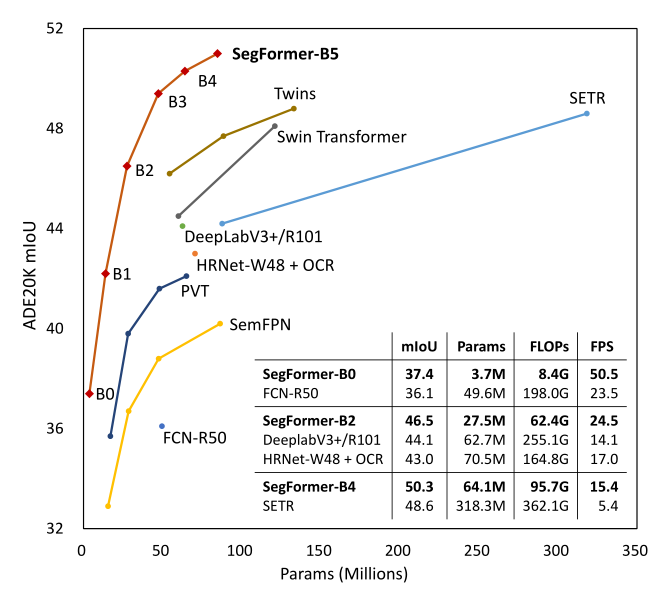
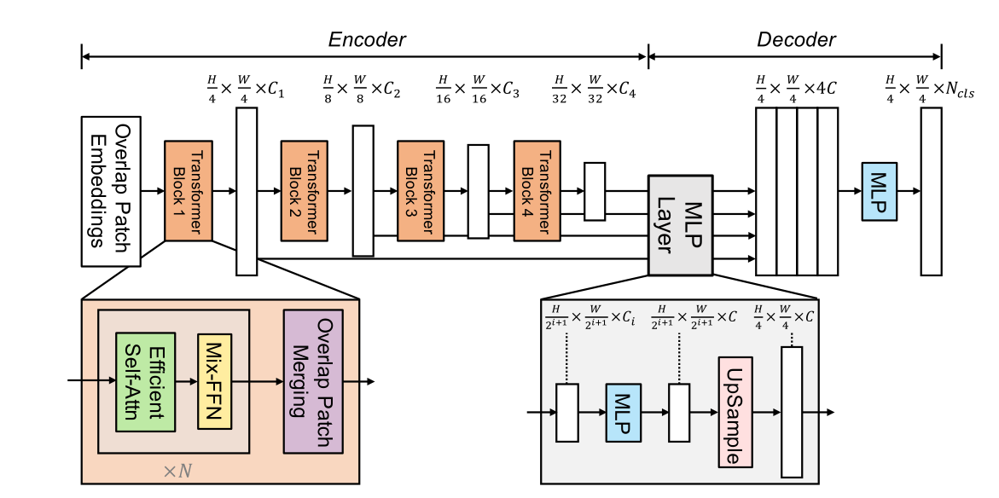
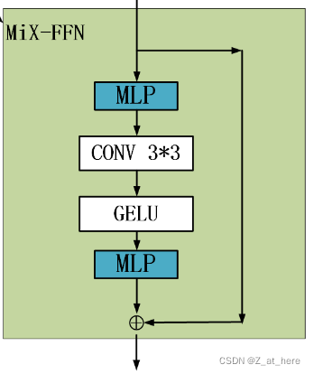
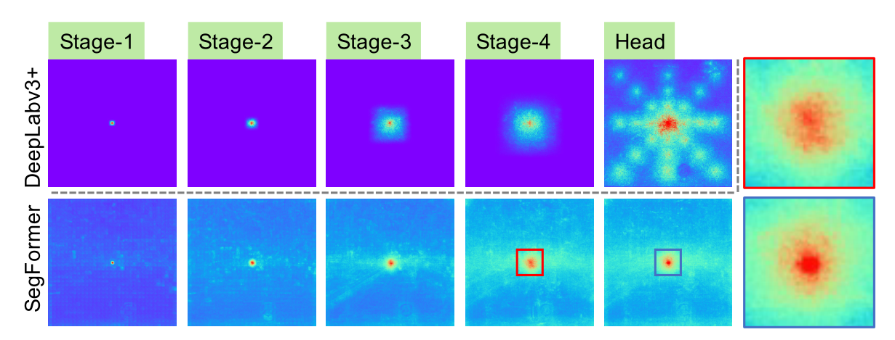

# 论文翻译

## 1. 摘要

主要提出了SegFormer，有两点特性：

1）用新颖的Transformer Encoder结构输出multiscale feature。这不需要增加位置编码，因此可以避免train和test阶段的输入image分辨率不同而引起的性能问题。

2）避免使用复杂的decoder，使用的multilayer perceptron(MLP) decoders可以结合local attention和global attention表现更加出色。

**下面是结果**，我们扩展了我们的方法，以获得从SEGFRER-B0到SEGFRER-B5的一系列模型，与以前的同类产品相比，达到了显著更好的性能和效率。例如，SEGFRER-B4在具有64M参数的ADE20K上实现了50.3%的mIoU，比以前的最佳方法小5倍，好2.2%。我们的最佳模型SEGFRER-B5在Cityscapes验证集上实现了84.0%的mIoU，并在Cityscapes-C上显示了出色的零炮鲁棒性。

## 2. 介绍

语义分割是计算机视觉中的一项基本任务，支持许多下游应用。它与图像分类相关，因为它产生每像素类别预测，而不是图像级别预测。这一关系在一项开创性的工作[1]中得到了指出和系统研究，作者使用完全卷积网络（FCN）进行语义切分任务。自那时以来，FCN激发了许多后续工作，并已成为密集预测的主要设计选择。

由于分类和语义分割之间有着密切的关系，所以采用不同的backbone是语义分割方面的活跃领域。自从FCN之后，许多SOTA的语义分割框架都是来自于ImageNet图像分类的一些变体。从早期的VGG到最近的ResNest。除此之外还有一方面比较活跃，注重于设计一些模块和方法来有效的获取上下文信息，比如deeplabv3+，通过空洞卷积来扩大感受野。

Transformer在NLP领域内获得的巨大的成功，VIT论文的作者首先将transformer应用在了图像分类任务重中。《Rethinking semantic segmentation from a sequence-to-sequence perspective with transformers》该论文作者提出了SETR来证明将Transformer应用在视觉任务中的可行性。

SETR采用VIT作为backbone，采用一些CNN的Decoder放大特征分辨率，尽管表现良好，但VIT还是有些劣势：

1）VIT的输出是单一的低分辨率feature map而不是多尺度的feature map。

2）在处理大型图像时，计算量大。为了解决这些局限性，wang等人提出了pyramid vision transformer（PVT），PVT相对于ResNet在目标识别和语义分割方面有了非常大的改进。然而相对于更新的Swin Transformer和Twins等，PVT主要是在考虑Encoder上的改进设计，而忽略了Decoder这一模块。

本文介绍了SegFormer，一种前沿的Transformer语义分割框架，它综合考虑了效率、准确性和鲁棒性。与以前的方法相比，我们的框架重新设计了Encoder和Decoder。本文的主要特点有：

1. 一种无位置编码、分级的Transformer Encoder。
2. 轻量级的MLP的解码器模块，没有复杂的计算
3. 图一所示，在三种公开语义分割数据集上的效率，准确性，鲁棒性超出了SOTA

首先，本文模型在输入不同分辨率的照片预测时，编码器去除了位置编码，但是性能显示并没有受到影响。

另外，与VIT不同的是，本文提出的分级编码器可以采集多种尺度的feature map，而VIT只能采集固定的低分辨率的feature map。

其次，我们推出的轻量级的MLP decoder的主要思想是利用Transformer-induced的特性，该特性即底层的注意力往往停留在局部，而高层的注意力则是highly non-local。（Transformer-induced features where the attentions of lower layers tend to stay local, whereas the ones of the highest layers are highly non-local.）。通过汇总不同层的信息，MLP decoder结合局部和全局的注意力。因此我们得到了一个简单而直接，又有着强大表现的解码器。

我们在三个公开的数据集上展示了SegFormer在模型大小、运行时间和准确性方面的优势:ADE20K、cityscape和COCO-Stuff。

## 3. 相关工作

**语义分割**：可以看做是一种图像分类从图像级别到像素级别上的扩展。FCN是这方面的开山之作，FCN是一种全连接卷积网络，用端到端的方式执行了像素级别的分类。在此之后，研究者集中在不同的方面来改进FCN，比如

- 扩大感受野（deeplabv2、deeplabv3、deeplabv3+、PSPNet、DenseASPP、improve semantic segmentation by GCN、）；
- 精炼上下文信息（Object Context Network for Scene parsing、Context prior for scene segmentation、Object-contextual representations for semantic segmentation、Context encoding for semantic segmentation、Context-reinforced semantic segmentation）；

**Transformer backbones**：VIT是证明纯Transformer在图像分类方面可以达到SOTA的文章。VIT将图像作用成带有序列的tokens，输入到多层Transformer层中进行分类。DeiT（End-to-End object detection with transformers. In ECCV, 2020）进一步探索了数据高效的培训策略和ViT的精馏方法。最近的一些文章T2T ViT, CPVT, TNT, CrossViT and LocalViT引入ViT的定制更改，进一步提高图像分类性能。  

除了分类之外，PVT是在Transformer中引入金字塔结构的第一个作品，与CNN相比它展示了纯Transformer主干网在密集预测任务中的潜力。之后，使用Swin[9]、CvT[58]、CoaT[59]、LeViT[60]、孪生[10]增强了特征的局部连续性，消除了固定尺寸的位置嵌入，提高了transformer在密集预测任务中的性能。

## 4.  方法

本节介绍SegFormer的鲁棒性、强壮性、有效性。SegFormer有两个模块组组成：

1）一个分层的Transformer Encoder产生高分辨率的粗的feature和低分辨率的精细的feature。

2）一个轻量级的ALL-MLP decoder融合不同层次的feature产生一个最终的结果。

输入一个$H*W*3$的image，首先将他分成$4*4$大小的patch，这一点和VIT不同（VIT分成$16*16$的patch，也就是用$16*16$的卷积核，stride=16来作用image ），SegFormer利用较小的patch来预测更加稠密的预测任务。然后将这些patchs输入到Transformer多层编码器中来获得多层的feature map，再将这些featuremap作为ALL-MLP的输入来预测mask，通过解码器产生的featuremap的分辨率是$\frac{H}{4} \times  \frac{W}{4}  \times num\_cls$。

### 4.1 Hierarchical Transformer Encoder

我们设计了MiT-B0到MiT-B5这几种相同结构但size不同的一些列Mix Transformer Encoder。MiT-B0是轻量级的预测模型，MiT-B5是性能最好的也是最大的模型。我们设计MiT的部分灵感来自于VIT，但针对语义分割做了量身定制和优化。

**Hierarchical Feature Representation**：不像VIT只能获得单一的feature map，该模型的目标就是输入一张image，产生和CNN类似的多层次的feature map。通常这些多层的feature map提供的高分辨率的粗特征和低分辨率提供的精细特征可以提高语义分割的性能。用数学语言来表达就是

input revolution $H\times W\times 3$

Output resolution :$F_i=(\frac{H}{2^{i+1}}\times \frac{W}{2^{i+1}}\times C)$

**Overlapped Patch Merging**

VIT中将一个输入$N*N*c$的image，合并为$1*1*C$的向量。利用这种特性，很容易的可以将特征图的分辨率缩小两倍。比如$F_1=(\frac{H}{4}\times \frac{W}{4}\times C) \to F_2=(\frac{H}{8}\times \frac{W}{8}\times C)$。这个过程最初用来组合non-overlapping的图像或特征块，但它不能保持这些patch周围的局部连续性。所以我们使用overlapping的图像来融合，这样就可以保证patch周围的局部连续性了。为此我们设置的三个参数K，S，P。K是patch size，S是stride，P是padding。在实验中我们分别设K,S,P为（7,4,3）和（3,2,1）的参数来执行overlapping的图像的融合过程并得到和non-overlapping图像融合一样大小的feature。

**Efficient Self-Attention**：

**Mix-FFN**

VIT使用位置编码PE（Position Encoder）来插入位置信息，但是插入的PE的分辨率是固定的，这就导致如果训练图像和测试图像分辨率不同的话，需要对PE进行插值操作，这会导致精度下降。

为了解决这个问题CPVT（Conditional positional encodings for vision transformers. arXiv, 2021）使用了3X3的卷积和PE一起实现了data-driver PE。我们认为语义分割中PE并不是必需的。

引入了一个 Mix-FFN，考虑了padding对位置信息的影响，直接在 FFN （feed-forward network）中使用 一个3x3 的卷积，MiX-FFN可以表示如下：
$$
X_{out}=MLP(GELU(Conv_{3\times3}(MLP(X_{in}))))+X_{in}
$$
其中$X_{in}$是从self-attention中输出的feature。Mix-FFN混合了一个$3*3$的卷积和MLP在每一个FFN中。即根据上式可以知道MiX-FFN的顺序为：输入经过MLP，再使用$Conv_{3\times3}$操作，正在经过一个GELU激活函数，再通过MLP操作，最后将输出和原始输入值进行叠加操作，作为MiX-FFN的总输出。在实验中作者展示了$3*3$的卷积可以为transformer提供PE。作者还是用了深度可以分离卷积提高效率，减少参数。

### 4.2 Lightweight All-MLP Decoder

SegFormer集成了轻量级的MLP Decoder，减少了很多不必要的麻烦。使用这种简单编码器的关键点是作者提出的多级Transformer Encoder比传统的CNN Encoder可以获得更大的感受野。

ALL-MLP由四步组成。第一，从MIT中提取到的多层次的feature，记作$F_i$，通过MLP层统一channel数。第二，$F_i$被上采样到四分之一大小，然后再做一次concat操作。第三，MLP对concat之后的特征进行融合。最后，另一个MLP对融合的特征进行预测，输出分辨率为$\frac{H}{4} \times  \frac{W}{4}  \times num\_cls$

$$
\begin{aligned}
\hat{F}_i&=Linear(C_i,C)(F_i),\forall i
\\ \hat{F}_i&=Upsample(\frac{W}{4}\times \frac{W}{4})(\hat{F}_i),\forall i
\\ F&=Linear(4C,C)(Concat(\hat{F}_i)),\forall i
\\ M&=Linear(C,N_{cls})(F)
\end{aligned}
$$

Effective Receptive Field Analysis：对语义分割来说，保持较大的感受野以获取更多的上下文信息一直是一个核心问题。我们使用有效感受野ERF作为一个可视化和解决的工具来说明为什么MLPdecoder表现是非常有效的在Transformer上。图三所示，对比deeplabv3+和SegFormer的四个解码器阶段和编码器头的部分的可视化图，我们可以得出结论：

1. 即使在最深的阶段，deeplabv3+的ERF还是非常小
2. SegFormer的编码器自然地产生local attentions，类似于较低阶段的卷积，同时能够输出高度non-local attentions，有效地捕获编码器第四阶段的上下文。
3. 将图片放大，MLP的MLPhead阶段（蓝框）明显和Stage-4阶段（红框）的不同，可以看出local attentions更多了。
   

CNN中感受野有限的问题只能通过增加上下文模块来提升精度，像ASPP模块，但是这样会让网络变得更复杂。本文中的decoder设计受益于transformer中的non-local attention，并且在不导致模型变复杂的情况下使得感受野变大。但是相同的decoder接在CNN的backbone的时候效果并不是很好，因为Stage4的感受野有限。如表1所示。

更重要的是在设计decoder的时候利用率Transformer的induced feature，该特性可以同时产生高度的local attention和低层的non-local attention，通过互补这两种attention，编码器在增加少量参数的情况下来实现互补和强大的表现（our MLP decoder renders complementary and powerful representations by adding few parameters）。这也是设计的另一个重要动机。仅仅从stage4获取non-local attention不能够获得较好的结果，如表1所示。

### 4.3 Relationship to SETR.

与SETR相比，SegFormer含有多个更有效和强大的设计。

1. SegFormer只在imageNet-1K上做了预训练，SETR中的ViT在更大的imageNet-22K做了预训练。
2. SegFormer的多层编码结构要比ViT的更小，并且能同时处理高分辨率的粗特征和低分辨率的精细特征，相比SETR的ViT只能生成单一的低分辨率特征。
3. SegFormer中去掉了位置编码，所以在test时输入image的分辨率和train阶段分辨率不一致时也可以得到较好的精度，但是ViT采用固定的位置编码，这会导致当test阶段的输入分辨率不同时，会降低精度。
4. SegFormer中decoder的计算开销更小更紧凑，而SETR中的decoder需要更多的3*3卷积。
   

## 5. 实验

**Dataset**：三个公开数据集：Cityscapes、ADE20K、COCO-Stuff。

参考链接

> https://blog.csdn.net/qq_39333636/article/details/124334384