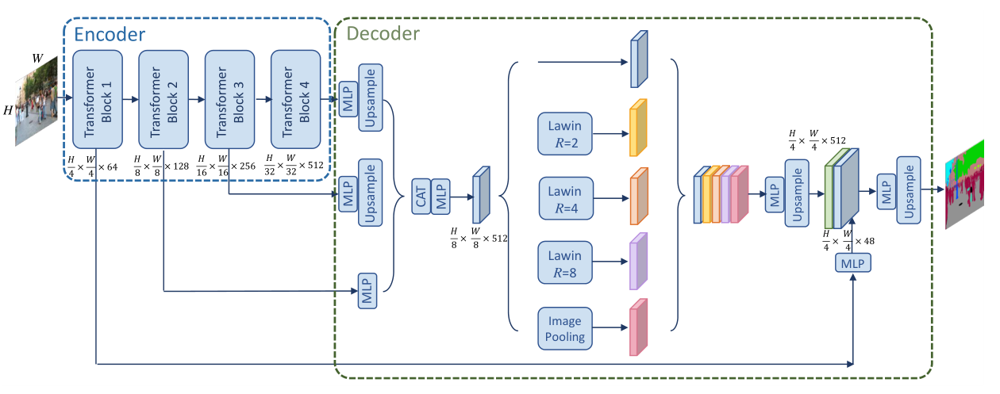
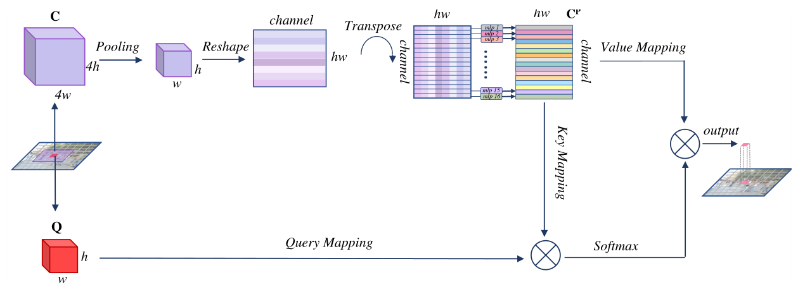
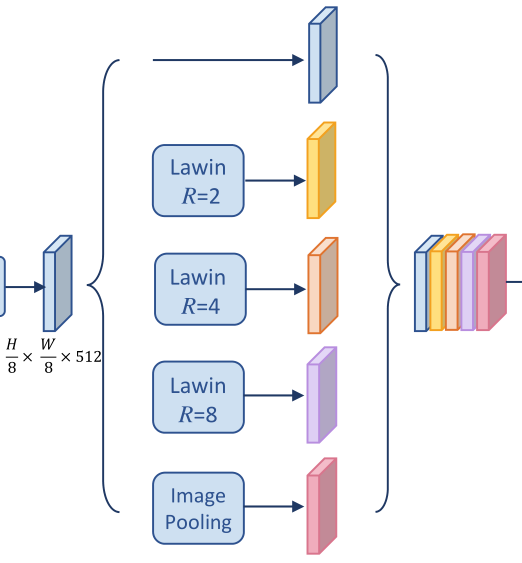

# 【语义分割】2022-Lawin 

> 论文题目：Lawin Transformer: Improving Semantic Segmentation Transformer with Multi-Scale Representations via Large Window Attention
>
> 论文链接：[https://arxiv.org/abs/2201.01615](https://arxiv.org/abs/2201.01615)
>
> 论文代码：[https://github.com/yan-hao-tian/lawin](https://github.com/yan-hao-tian/lawin)
>
> 作者：北京邮电大学
>
> 发表时间：2022年1月
>
> 引用：Yan H, Zhang C, Wu M. Lawin transformer: Improving semantic segmentation transformer with multi-scale representations via large window attention[J]. arXiv preprint arXiv:2201.01615, 2022.
>
> 引用数：4

## 1. 简介

### 1.1 简介

多尺度表示对于语义分割至关重要。目前见证了利用多尺度上下文信息的语义分割卷积神经网络 (CNN) 的蓬勃发展。由于视觉Transformer (ViT) 在图像分类方面的强大功能，最近提出了一些语义分割 ViT，其中大多数取得了令人印象深刻的结果，但以计算经济为代价。

* 通过窗口注意力机制将多尺度表示引入语义分割 ViT，并进一步提高了性能和效率。
  为此，引入了大窗口注意力，它允许局部窗口以很少的计算开销查询更大区域的上下文窗口。
* 通过调节上下文区域与查询区域的比例，使大窗口注意力能够在多个尺度上捕获上下文信息。
* 此外，采用空间金字塔池化框架与大窗口注意力协作，提出了一种名为大窗口注意力空间金字塔池化（LawinASPP）的新型解码器，用于语义分割 ViT。

### 1.2 存在的问题

* **vit** 缺点：很高的计算成本，尤其是在输入图像较大的情况下

* **SegFormer**：改进了编码器和解码器的设计，产生了非常高效的语义分割ViT。

  缺点：**仅仅依靠增加编码器的模型容量来逐步提高性能**，这可能会降低效率上限。

目前的主要问题：**缺乏多尺度的上下文信息**，从而影响了其性能和效率。

提出方法：一种新的窗口注意机制——大窗口注意。

## 2. 网络

### 2.1 整体架构

* 编码器分别输出 4个不同下采样的特征图，这是一个MiT
* 然后，最后三个阶段的特征被聚合并输入到解码器部分，这是一个LawinASPP
* .最后，利用编码器的第一级特征对得到的特征进行低级信息的增强。MLP表示多层感知器。CAT“表示连接特性。”Lawin "表示大窗口关注。"R”表示context patch的大小与query patch的大小之比。

### 2.2 大窗口注意力

大窗口注意力。

* 红色补丁Q是查询补丁，
* 紫色补丁C是上下文补丁。

> 考虑到下采样后空间信息变得抽象，我们打算增强多头注意力的空间表征能力。

这里参照的是MLP-Mixer这篇论文的做法。

### 2.3 LawinASPP

为了捕获多尺度表示，我们采用空间金字塔池化(SPP)架构与大窗口关注协作，得到了新的SPP模块LawinASPP。
LawinASPP由5个并行分支组成，其中包括一个快捷连接，3个大型窗口注意(R =(2, 4, 8))和一个图像池分支。
如图3所示，**大窗口注意分支为局部窗口提供了三个接受域层次结构。**参照之前关于窗口注意机制[30]的文献，我们将本地窗口的patch大小设为8，因此提供的接收域为(16,32,64)。

**图像池化分支**使用全局池化层获取全局上下文信息，并将其推入线性变换，然后进行双线性上采样操作，以匹配特征维数。
当输出所有上下文信息时，短路径复制输入特性并粘贴它。所有产生的特征首先被连接起来，并学习线性变换执行降维生成最终的segmentation map。

## 3. 代码

~~~python
import torch
from torch import Tensor
from torch.nn import functional as F
from einops import rearrange

import math
from torch import nn
import warnings

def _no_grad_trunc_normal_(tensor, mean, std, a, b):
    # Cut & paste from PyTorch official master until it's in a few official releases - RW
    # Method based on https://people.sc.fsu.edu/~jburkardt/presentations/truncated_normal.pdf
    def norm_cdf(x):
        # Computes standard normal cumulative distribution function
        return (1. + math.erf(x / math.sqrt(2.))) / 2.

    if (mean < a - 2 * std) or (mean > b + 2 * std):
        warnings.warn("mean is more than 2 std from [a, b] in nn.init.trunc_normal_. "
                      "The distribution of values may be incorrect.",
                      stacklevel=2)

    with torch.no_grad():
        # Values are generated by using a truncated uniform distribution and
        # then using the inverse CDF for the normal distribution.
        # Get upper and lower cdf values
        l = norm_cdf((a - mean) / std)
        u = norm_cdf((b - mean) / std)

        # Uniformly fill tensor with values from [l, u], then translate to
        # [2l-1, 2u-1].
        tensor.uniform_(2 * l - 1, 2 * u - 1)

        # Use inverse cdf transform for normal distribution to get truncated
        # standard normal
        tensor.erfinv_()

        # Transform to proper mean, std
        tensor.mul_(std * math.sqrt(2.))
        tensor.add_(mean)

        # Clamp to ensure it's in the proper range
        tensor.clamp_(min=a, max=b)
        return tensor

def trunc_normal_(tensor, mean=0., std=1., a=-2., b=2.):
    # type: (Tensor, float, float, float, float) -> Tensor
    r"""Fills the input Tensor with values drawn from a truncated
    normal distribution. The values are effectively drawn from the
    normal distribution :math:`\mathcal{N}(\text{mean}, \text{std}^2)`
    with values outside :math:`[a, b]` redrawn until they are within
    the bounds. The method used for generating the random values works
    best when :math:`a \leq \text{mean} \leq b`.
    Args:
        tensor: an n-dimensional `torch.Tensor`
        mean: the mean of the normal distribution
        std: the standard deviation of the normal distribution
        a: the minimum cutoff value
        b: the maximum cutoff value
    Examples:
        >>> w = torch.empty(3, 5)
        >>> nn.init.trunc_normal_(w)
    """
    return _no_grad_trunc_normal_(tensor, mean, std, a, b)

class DropPath(nn.Module):
    """Drop paths (Stochastic Depth) per sample (when applied in main path of residual blocks).
    Copied from timm
    This is the same as the DropConnect impl I created for EfficientNet, etc networks, however,
    the original name is misleading as 'Drop Connect' is a different form of dropout in a separate paper...
    See discussion: https://github.com/tensorflow/tpu/issues/494#issuecomment-532968956 ... I've opted for
    changing the layer and argument names to 'drop path' rather than mix DropConnect as a layer name and use
    'survival rate' as the argument.
    """
    def __init__(self, p: float = None):
        super().__init__()
        self.p = p

    def forward(self, x: Tensor) -> Tensor:
        if self.p == 0. or not self.training:
            return x
        kp = 1 - self.p
        shape = (x.shape[0],) + (1,) * (x.ndim - 1)
        random_tensor = kp + torch.rand(shape, dtype=x.dtype, device=x.device)
        random_tensor.floor_()  # binarize
        return x.div(kp) * random_tensor

class Attention(nn.Module):
    def __init__(self, dim, head, sr_ratio):
        super().__init__()
        self.head = head
        self.sr_ratio = sr_ratio
        self.scale = (dim // head) ** -0.5
        self.q = nn.Linear(dim, dim)
        self.kv = nn.Linear(dim, dim * 2)
        self.proj = nn.Linear(dim, dim)

        if sr_ratio > 1:
            self.sr = nn.Conv2d(dim, dim, sr_ratio, sr_ratio)
            self.norm = nn.LayerNorm(dim)

    def forward(self, x: Tensor, H, W) -> Tensor:
        B, N, C = x.shape
        q = self.q(x).reshape(B, N, self.head, C // self.head).permute(0, 2, 1, 3)

        if self.sr_ratio > 1:
            x = x.permute(0, 2, 1).reshape(B, C, H, W)
            x = self.sr(x).reshape(B, C, -1).permute(0, 2, 1)
            x = self.norm(x)

        k, v = self.kv(x).reshape(B, -1, 2, self.head, C // self.head).permute(2, 0, 3, 1, 4)

        attn = (q @ k.transpose(-2, -1)) * self.scale
        attn = attn.softmax(dim=-1)

        x = (attn @ v).transpose(1, 2).reshape(B, N, C)
        x = self.proj(x)
        return x

class DWConv(nn.Module):
    def __init__(self, dim):
        super().__init__()
        self.dwconv = nn.Conv2d(dim, dim, 3, 1, 1, groups=dim)

    def forward(self, x: Tensor, H, W) -> Tensor:
        B, _, C = x.shape
        x = x.transpose(1, 2).view(B, C, H, W)
        x = self.dwconv(x)
        return x.flatten(2).transpose(1, 2)

class mit_mlp(nn.Module):
    def __init__(self, c1, c2):
        super().__init__()
        self.fc1 = nn.Linear(c1, c2)
        self.dwconv = DWConv(c2)
        self.fc2 = nn.Linear(c2, c1)

    def forward(self, x: Tensor, H, W) -> Tensor:
        return self.fc2(F.gelu(self.dwconv(self.fc1(x), H, W)))

class patchembed(nn.Module):
    def __init__(self, c1=3, c2=32, patch_size=7, stride=4):
        super().__init__()
        self.proj = nn.Conv2d(c1, c2, patch_size, stride, patch_size // 2)  # padding=(ps[0]//2, ps[1]//2)
        self.norm = nn.LayerNorm(c2)

    def forward(self, x: Tensor) -> Tensor:
        x = self.proj(x)
        _, _, H, W = x.shape
        x = x.flatten(2).transpose(1, 2)
        x = self.norm(x)
        return x, H, W

class Block(nn.Module):
    def __init__(self, dim, head, sr_ratio=1, dpr=0.):
        super().__init__()
        self.norm1 = nn.LayerNorm(dim)
        self.attn = Attention(dim, head, sr_ratio)
        self.drop_path = DropPath(dpr) if dpr > 0. else nn.Identity()
        self.norm2 = nn.LayerNorm(dim)
        self.mlp = mit_mlp(dim, int(dim * 4))

    def forward(self, x: Tensor, H, W) -> Tensor:
        x = x + self.drop_path(self.attn(self.norm1(x), H, W))
        x = x + self.drop_path(self.mlp(self.norm2(x), H, W))
        return x

mit_settings = {
    'B0': [[32, 64, 160, 256], [2, 2, 2, 2]],  # [embed_dims, depths]
    'B1': [[64, 128, 320, 512], [2, 2, 2, 2]],
    'B2': [[64, 128, 320, 512], [3, 4, 6, 3]],
    'B3': [[64, 128, 320, 512], [3, 4, 18, 3]],
    'B4': [[64, 128, 320, 512], [3, 8, 27, 3]],
    'B5': [[64, 128, 320, 512], [3, 6, 40, 3]]
}

class MiT(nn.Module):
    def __init__(self, model_name: str = 'B0'):
        super().__init__()
        assert model_name in mit_settings.keys(), f"MiT model name should be in {list(mit_settings.keys())}"
        embed_dims, depths = mit_settings[model_name]
        drop_path_rate = 0.1
        self.channels = embed_dims

        # patch_embed
        self.patch_embed1 = patchembed(3, embed_dims[0], 7, 4)
        self.patch_embed2 = patchembed(embed_dims[0], embed_dims[1], 3, 2)
        self.patch_embed3 = patchembed(embed_dims[1], embed_dims[2], 3, 2)
        self.patch_embed4 = patchembed(embed_dims[2], embed_dims[3], 3, 2)

        dpr = [x.item() for x in torch.linspace(0, drop_path_rate, sum(depths))]

        cur = 0
        self.block1 = nn.ModuleList([Block(embed_dims[0], 1, 8, dpr[cur + i]) for i in range(depths[0])])
        self.norm1 = nn.LayerNorm(embed_dims[0])

        cur += depths[0]
        self.block2 = nn.ModuleList([Block(embed_dims[1], 2, 4, dpr[cur + i]) for i in range(depths[1])])
        self.norm2 = nn.LayerNorm(embed_dims[1])

        cur += depths[1]
        self.block3 = nn.ModuleList([Block(embed_dims[2], 5, 2, dpr[cur + i]) for i in range(depths[2])])
        self.norm3 = nn.LayerNorm(embed_dims[2])

        cur += depths[2]
        self.block4 = nn.ModuleList([Block(embed_dims[3], 8, 1, dpr[cur + i]) for i in range(depths[3])])
        self.norm4 = nn.LayerNorm(embed_dims[3])

    def forward(self, x: Tensor) -> Tensor:
        B = x.shape[0]
        # stage 1
        x, H, W = self.patch_embed1(x)
        for blk in self.block1:
            x = blk(x, H, W)
        x1 = self.norm1(x).reshape(B, H, W, -1).permute(0, 3, 1, 2)

        # stage 2
        x, H, W = self.patch_embed2(x1)
        for blk in self.block2:
            x = blk(x, H, W)
        x2 = self.norm2(x).reshape(B, H, W, -1).permute(0, 3, 1, 2)

        # stage 3
        x, H, W = self.patch_embed3(x2)
        for blk in self.block3:
            x = blk(x, H, W)
        x3 = self.norm3(x).reshape(B, H, W, -1).permute(0, 3, 1, 2)

        # stage 4
        x, H, W = self.patch_embed4(x3)
        for blk in self.block4:
            x = blk(x, H, W)
        x4 = self.norm4(x).reshape(B, H, W, -1).permute(0, 3, 1, 2)

        return x1, x2, x3, x4

# if __name__ == '__main__':
#     model = MiT('B0')
#     x = torch.zeros(1, 3, 224, 224)
#     outs = model(x)
#     for y in outs:
#         print(y.shape)

class MLP(nn.Module):
    def __init__(self, dim=2048, embed_dim=768):
        super().__init__()
        self.proj = nn.Linear(dim, embed_dim)

    def forward(self, x: Tensor) -> Tensor:
        x = x.flatten(2).transpose(1, 2)
        x = self.proj(x)
        return x

class PatchEmbed(nn.Module):
    def __init__(self, patch_size=4, in_ch=3, dim=96, type='pool') -> None:
        super().__init__()
        self.patch_size = patch_size
        self.type = type
        self.dim = dim

        if type == 'conv':
            self.proj = nn.Conv2d(in_ch, dim, patch_size, patch_size, groups=patch_size * patch_size)
        else:
            self.proj = nn.ModuleList([
                nn.MaxPool2d(patch_size, patch_size),
                nn.AvgPool2d(patch_size, patch_size)
            ])

        self.norm = nn.LayerNorm(dim)

    def forward(self, x: Tensor) -> Tensor:
        _, _, H, W = x.shape
        if W % self.patch_size != 0:
            x = F.pad(x, (0, self.patch_size - W % self.patch_size))
        if H % self.patch_size != 0:
            x = F.pad(x, (0, 0, 0, self.patch_size - H % self.patch_size))

        if self.type == 'conv':
            x = self.proj(x)
        else:
            x = 0.5 * (self.proj[0](x) + self.proj[1](x))
        Wh, Ww = x.size(2), x.size(3)
        x = x.flatten(2).transpose(1, 2)
        x = self.norm(x)
        x = x.transpose(1, 2).view(-1, self.dim, Wh, Ww)
        return x

class LawinAttn(nn.Module):
    """
    大窗口注意力，使用 MLP-Mixer 的操作来进行
    """
    def __init__(self, in_ch=512, head=4, patch_size=8, reduction=2) -> None:
        """

        Args:
            in_ch: 输入通道数
            head:
            patch_size: patch的代销
            reduction: 缩放倍数
        """
        super().__init__()
        self.head = head

        #
        self.position_mixing = nn.ModuleList([
            nn.Linear(patch_size * patch_size, patch_size * patch_size)
            for _ in range(self.head)])

        self.inter_channels = max(in_ch // reduction, 1)
        self.g = nn.Conv2d(in_ch, self.inter_channels, 1)
        self.theta = nn.Conv2d(in_ch, self.inter_channels, 1)
        self.phi = nn.Conv2d(in_ch, self.inter_channels, 1)
        self.conv_out = nn.Sequential(
            nn.Conv2d(self.inter_channels, in_ch, 1, bias=False),
            nn.BatchNorm2d(in_ch)
        )

    def forward(self, query: Tensor, context: Tensor) -> Tensor:
        B, C, H, W = context.shape
        context = context.reshape(B, C, -1)
        context_mlp = []

        for i, pm in enumerate(self.position_mixing):
            context_crt = context[:, (C // self.head) * i:(C // self.head) * (i + 1), :]
            context_mlp.append(pm(context_crt))

        context_mlp = torch.cat(context_mlp, dim=1)
        context = context + context_mlp
        context = context.reshape(B, C, H, W)

        g_x = self.g(context).view(B, self.inter_channels, -1)
        g_x = rearrange(g_x, "b (h dim) n -> (b h) dim n", h=self.head)
        g_x = g_x.permute(0, 2, 1)

        theta_x = self.theta(query).view(B, self.inter_channels, -1)
        theta_x = rearrange(theta_x, "b (h dim) n -> (b h) dim n", h=self.head)
        theta_x = theta_x.permute(0, 2, 1)

        phi_x = self.phi(context).view(B, self.inter_channels, -1)
        phi_x = rearrange(phi_x, "b (h dim) n -> (b h) dim n", h=self.head)

        pairwise_weight = torch.matmul(theta_x, phi_x)
        pairwise_weight /= theta_x.shape[-1] ** 0.5
        pairwise_weight = pairwise_weight.softmax(dim=-1)

        y = torch.matmul(pairwise_weight, g_x)
        y = rearrange(y, "(b h) n dim -> b n (h dim)", h=self.head)
        y = y.permute(0, 2, 1).contiguous().reshape(B, self.inter_channels, *query.shape[-2:])

        output = query + self.conv_out(y)
        return output

class ConvModule(nn.Module):
    def __init__(self, c1, c2):
        super().__init__()
        self.conv = nn.Conv2d(c1, c2, 1, bias=False)
        self.bn = nn.BatchNorm2d(c2)  # use SyncBN in original
        self.activate = nn.ReLU(True)

    def forward(self, x: Tensor) -> Tensor:
        return self.activate(self.bn(self.conv(x)))

class LawinHead(nn.Module):
    """
    分割头 ASPP 模块
    """
    def __init__(self, in_channels: list, embed_dim=512, num_classes=19) -> None:
        super().__init__()
        for i, dim in enumerate(in_channels):
            self.add_module(f"linear_c{i + 1}", MLP(dim, 48 if i == 0 else embed_dim))

        self.lawin_8 = LawinAttn(embed_dim, 64)
        self.lawin_4 = LawinAttn(embed_dim, 16)
        self.lawin_2 = LawinAttn(embed_dim, 4)
        self.ds_8 = PatchEmbed(8, embed_dim, embed_dim)
        self.ds_4 = PatchEmbed(4, embed_dim, embed_dim)
        self.ds_2 = PatchEmbed(2, embed_dim, embed_dim)

        self.image_pool = nn.Sequential(
            nn.AdaptiveAvgPool2d(1),
            ConvModule(embed_dim, embed_dim)
        )
        self.linear_fuse = ConvModule(embed_dim * 3, embed_dim)
        self.short_path = ConvModule(embed_dim, embed_dim)
        self.cat = ConvModule(embed_dim * 5, embed_dim)

        self.low_level_fuse = ConvModule(embed_dim + 48, embed_dim)
        self.linear_pred = nn.Conv2d(embed_dim, num_classes, 1)
        self.dropout = nn.Dropout2d(0.1)

    def get_lawin_att_feats(self, x: Tensor, patch_size: int):
        _, _, H, W = x.shape
        query = F.unfold(x, patch_size, stride=patch_size)

        query = rearrange(query, 'b (c ph pw) (nh nw) -> (b nh nw) c ph pw', ph=patch_size, pw=patch_size,
                          nh=H // patch_size, nw=W // patch_size)
        outs = []

        for r in [8, 4, 2]:
            context = F.unfold(x, patch_size * r, stride=patch_size, padding=int((r - 1) / 2 * patch_size))
            context = rearrange(context, "b (c ph pw) (nh nw) -> (b nh nw) c ph pw", ph=patch_size * r,
                                pw=patch_size * r, nh=H // patch_size, nw=W // patch_size)
            context = getattr(self, f"ds_{r}")(context)
            output = getattr(self, f"lawin_{r}")(query, context)
            output = rearrange(output, "(b nh nw) c ph pw -> b c (nh ph) (nw pw)", ph=patch_size, pw=patch_size,
                               nh=H // patch_size, nw=W // patch_size)
            outs.append(output)
        return outs

    def forward(self, features):
        B, _, H, W = features[1].shape
        outs = [self.linear_c2(features[1]).permute(0, 2, 1).reshape(B, -1, *features[1].shape[-2:])]

        for i, feature in enumerate(features[2:]):
            cf = eval(f"self.linear_c{i + 3}")(feature).permute(0, 2, 1).reshape(B, -1, *feature.shape[-2:])
            outs.append(F.interpolate(cf, size=(H, W), mode='bilinear', align_corners=False))

        feat = self.linear_fuse(torch.cat(outs[::-1], dim=1))
        B, _, H, W = feat.shape

        ## Lawin attention spatial pyramid pooling
        feat_short = self.short_path(feat)
        feat_pool = F.interpolate(self.image_pool(feat), size=(H, W), mode='bilinear', align_corners=False)
        #
        feat_lawin = self.get_lawin_att_feats(feat, 8)

        output = self.cat(torch.cat([feat_short, feat_pool, *feat_lawin], dim=1))

        ## Low-level feature enhancement
        c1 = self.linear_c1(features[0]).permute(0, 2, 1).reshape(B, -1, *features[0].shape[-2:])
        output = F.interpolate(output, size=features[0].shape[-2:], mode='bilinear', align_corners=False)
        fused = self.low_level_fuse(torch.cat([output, c1], dim=1))

        seg = self.linear_pred(self.dropout(fused))
        return seg

class Lawin(nn.Module):
    """
    Notes::::: This implementation has larger params and FLOPs than the results reported in the paper.
    Will update the code and weights if the original author releases the full code.
    """
    def __init__(self, backbone: str = 'MiT-B0', num_classes: int = 19) -> None:
        super(Lawin, self).__init__()

        backbone, variant = backbone.split('-')
        # 选择backbone
        self.backbone=eval(backbone)(variant)
        # print("channels",self.backbone.channels)
        self.decode_head = LawinHead(self.backbone.channels, 256 if 'B0' in backbone else 512, num_classes)
        #  初始化数据
        self.apply(self._init_weights)

    def forward(self, x: Tensor) -> Tensor:
        y = self.backbone(x)

        y = self.decode_head(y)   # 4x reduction in image size
        y = F.interpolate(y, size=x.shape[2:], mode='bilinear', align_corners=False)    # to original image shape
        return y

    #  初始化数据
    def _init_weights(self, m: nn.Module) -> None:
        if isinstance(m, nn.Linear):
            trunc_normal_(m.weight, std=.02)
            if m.bias is not None:
                nn.init.zeros_(m.bias)
        elif isinstance(m, nn.Conv2d):
            fan_out = m.kernel_size[0] * m.kernel_size[1] * m.out_channels
            fan_out // m.groups
            m.weight.data.normal_(0, math.sqrt(2.0 / fan_out))
            if m.bias is not None:
                nn.init.zeros_(m.bias)
        elif isinstance(m, (nn.LayerNorm, nn.BatchNorm2d)):
            nn.init.ones_(m.weight)
            nn.init.zeros_(m.bias)

if __name__ == '__main__':
    model = Lawin('MiT-B1')
    model.eval()
    # 输入必须是64的倍数。不然无法进行 aspp 操作
    x = torch.zeros(1, 3, 256,256)
    y = model(x)
    print(y.shape)

~~~

