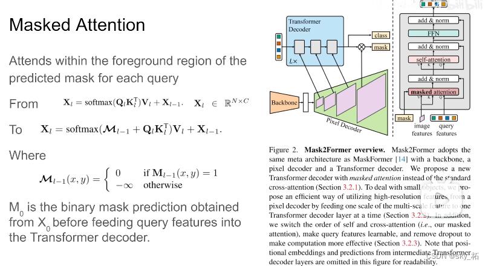

# 【语义分割】2022-Mask2Former CVPR

> 论文题目：Masked-attention Mask Transformer for Universal Image Segmentation
>
> 论文链接:[https://arxiv.org/abs/2112.01527v3](https://arxiv.org/abs/2112.01527v3)
>
> 论文代码：[https://github.com/facebookresearch/Mask2Former](https://github.com/facebookresearch/Mask2Former)
>
> 发表时间：2021年12月
>
> 引用：Cheng B, Misra I, Schwing A G, et al. Masked-attention mask transformer for universal image segmentation[C]//Proceedings of the IEEE/CVF Conference on Computer Vision and Pattern Recognition. 2022: 1290-1299.
>
> 引用数：42

## 1. 简介

### 1.1 摘要

Mask2Former在MaskFormer的基础上，

* 增加了masked attention机制，
* 另外还调整了decoder部分的self-attention和cross-attention的顺序，
* 还提出了使用importance sampling来加快训练速度。

本文的改进呢**主要是mask attention还有high-resolution features**，本质上是一个金字塔，剩下的一些关于训练上的还有optimization上改进呢，能够提高训练速度

## 2. 网络

### 2.1 整体架构

Mask2former的整体结构包含三个部分：

* Backbone：从图像中提取多尺度特征；
* Pixel decoder：类似FPN的功能，进行多尺度特征交互融合；
* Transformer Decoder：从pixel feature中迭代更新query feature，并利用query feature预测class，利用query feature和1/4高分辨率特征预测mask；

### 2.2 Pixel decoder

* 输入1/32，1/16，1/8，1/4四个分辨率的特征，采用Deformable DETR提出的Deformable Transformer进行多尺度特征交互。
* 具体来讲，对于1/32，1/16，1/8三个特征图上的每一个像素，在三个特征图上各预测K个点，最终使用3K个点的特征加权来更新当前像素点的特征。
* 关于每个分辨率$K$个点的选取，是通过以当前像素所在的位置为参考点，预测K个(x, y)偏移量得到。
* 这样，有效避免了Transformer采用全局特征来更新单个像素特征导致的极高的计算复杂度，将计算量从$HW\times HW$降低到了$HW\times K$

### 2.3 Transformer Decoder

Transformer Decoder部分采用与DETR相似的query方式进行目标检测，即首先初始化N*256的query feature，进而采用1/32，1/16，1/8三个分辨率的特征对query feature进行迭代更新并进行最终的class和mask预测。本文的Transformer Decoder与DETR中使用的Decoder有两个区别，分别是

（1）masked attention；

（2）调换self-attention和cross-attention的顺序。除此之外，与DETR的不同的是，本文采用多尺度特征更新query，避免了DETR仅仅使用1/32特征图造成的小目标的检测效果较差。

#### 1) DETR Transformer Decoder

ETR的Decoder部分主要包含self-attention，cross-attention以及FFN三部分；

self-attention：

* Q：$N*256$
* K：$N*256$
* V：$N*256$

Cross-attention

* Q：$N*256$
* K：$H*W*256$
  V：$H*W*256$

FFN

* bbox:$N*256 \rightarrow N*4$
* cls:$N*256 \rightarrow N*class$
  

#### 2) Mask Attention

我们知道decode里边有个masked attention的，就是控制哪两个token能产生attention。

这里作者使用一个大胆的假设，就是我们在做embeding的时候，我们只需要foreground这些区域，他们之间做attention就可以了，也就是原来在maskformer里边，每个像素和整张图像做attention，那么现在这个像素，只和自己同一个类别的，都是同一个qurey的像素，他们之间做attention。

这个是本文相对maskformer最主要的区别，最核心的贡献。

具体来看，maskformer里边q，k进来，

* 这里的k，value呢，都是从图像的feature里边来，
* q呢是从之前query feature里边过来的，
* 那在本作中呢，引入了mask，其实这个mask也就是标注了每个q，这里一个q代表一个类别，每个q对应的mask，在mask里边的这些像素，他们相互做attention，超过的，也就是说我们认为不是这一类的像素，不和它做attention。

在decoder结构里，image features是从pixel decoder里边来的，根据它呢对每个像素提取value，k。

那query feature区别于前作，maskformer里边是0，这里是可学习的vector。它们先做mask attention。

这个mask怎么产生呢，回顾于一下，在maskformer里边，每个q出来。通过mlp产生一个embeding，根据这个embeding再和pixel embeding结合，就得到关于mask 的prediction ，那么这个mask就是mask2former decoder里输入的mask，也就是对于第0层的decoder来说，我们还没有经过transformer decoder，首先呢把这些qurey 送到 mlp里边，然后预测出这个mask出来，然后我们在做decoder，一层一层往下做就可以了，比如说过完一层，我们有新的query，那么同样的，新的query送到mlp里边。做一个mask出来，然后加上新的image feature，为什么新的呢，下面再讲，然后再重复decoder过程就可以了，那么这个就是核心的mask attention原理。

为什么query feature 不再是zero 而是一个learning frature，因为在过decoder之前，要根据这些feature预测一个mask，那么这是一个必要的更改、

**Cross attention**
$$
\mathbf{X}_{l}=\operatorname{softmax}\left(\mathbf{Q}_{l} \mathbf{K}_{l}^{\mathrm{T}}\right) \mathbf{V}_{l}+\mathbf{X}_{l-1}
$$
**Masked attention**
$$
\mathcal{M}_{l-1}(x, y)=
\left\{\begin{array}{ll}
0 & \text { if } \mathbf{M}_{l-1}(x, y)=1 \\
-\infty & \text { otherwise }
\end{array}\right.
\\ \mathbf{X}_{l}=\operatorname{softmax}\left(\mathcal{M}_{l-1}+\mathbf{Q}_{l} \mathbf{K}_{l}^{\mathrm{T}}\right) \mathbf{V}_{l}+\mathbf{X}_{l-1}
$$

#### 调换self-attention和cross-attention的顺序

由于query feature是zero初始化的，第一层transformer Decoder直接上来就进行self-attention不会产生任何有意义的特征，因此先试用cross attention对query feature进行更新后再执行query feature内部的self-attention反而是一种更佳的做法。

### 2.4 采样点损失函数

不同于语义分割，其最终是预测$Class*H*W$的特征图，并对其进行监督。然而，maskformer则需要预测$Num\_queries*H*W$的特征图。由于query数目通常远大于类别数目，因此，这一类方法会导致巨大的训练内存占用。本文参考PointRend，在每个$H*W$的特征图依据当前像素的不确定度选取K个采样点而不是整个特征图来计算损失函数。其中，不确定度的衡量是依据像素预测置信度得到的。

除了在计算损失函数的过程中运用了采样点，本文还在matcher匈牙利匹配时才用了采样点的策略。不同之处在于，在matcher过程中，还不清楚每个query和哪个gt匹配，因此无法同样采用不确定度进行选点无法保证能够选取到gt的前景区域，因此，在matcher过程是采用均匀分布随机了K个点，同一个batch所有的query和gt均是采样这K个点。

## 3. 代码

参考资料

> [Mask2former_Nick Blog的博客-CSDN博客_mask pooling](https://blog.csdn.net/xijuezhu8128/article/details/124661079)
>
> [(1条消息) 【深度学习】语义分割:论文阅读：（2021-12）Mask2Former_sky_柘的博客-CSDN博客_语义分割最新论文](https://blog.csdn.net/zhe470719/article/details/125105590)