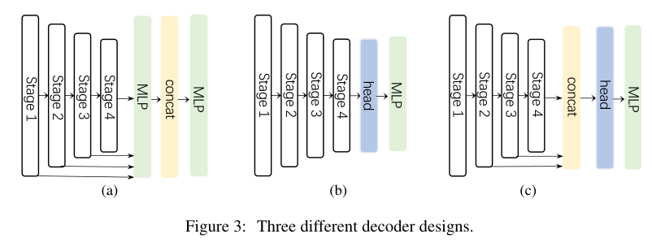

# 2022-SegNeXt  NeurIPS 

> 论文题目：SegNeXt: Rethinking Convolutional Attention Design for Semantic Segmentation
>
> 论文链接：[https://arxiv.org/abs/2209.08575v1](https://arxiv.org/abs/2209.08575v1)
>
> 论文代码：[https://github.com/Visual-Attention-Network/SegNeXt](https://github.com/Visual-Attention-Network/SegNeXt)
>
> 发表时间：2022年9月
>
> 引用：Guo M H, Lu C Z, Hou Q, et al. SegNeXt: Rethinking Convolutional Attention Design for Semantic Segmentation[J]. arXiv preprint arXiv:2209.08575, 2022.

## 1. 简介

### 1.1 动机

作为计算机视觉中最基本的研究课题之一，旨在为每个像素分配一个语义类别的语义分割在过去十年中引起了极大的关注。从早期的基于 CNN 的模型，以 FCN和 DeepLab 系列为代表，到最近的基于Transformer的方法，以 SETR和SegFormer为代表，语义分割模型在网络架构方面经历了重大变革。

通过重新审视之前成功的语义分割工作，作者总结了不同模型拥有的几个关键属性，如上表所示。 基于上述观察，作者认为一个成功的语义分割模型应该具有以下特点： 

(i) **强大的骨干网络作为编码器**。与之前基于 CNN 的模型相比，基于 Transformer 的模型的性能提升主要来自更强大的骨干网络。

 (ii) **多尺度信息交互**。与主要识别单个对象的图像分类任务不同，语义分割是一项密集的预测任务，因此需要在单个图像中处理不同大小的对象。

 (iii) **空间注意力**。空间注意力允许模型通过语义区域内区域的优先级来执行分割。

 (iv) **计算复杂度低**。这在处理来自遥感和城市场景的高分辨率图像时尤其重要。

考虑到上述分析，在本文中，作者重新思考了卷积注意力的设计，并提出了一种高效且有效的语义分割编码器-解码器架构。与之前在解码器中使用卷积作为特征细化器的基于Transformer的模型不同，本文的方法反转了Transformer-卷积 编码器-解码器架构。具体来说，对于编码器中的每个块，作者更新了传统卷积块的设计，并利用多尺度卷积特征通过简单元素乘法来唤起空间注意力。作者发现这种建立空间注意力的简单方法比空间信息编码中的标准卷积和自注意力更有效。对于解码器，作者从不同阶段收集多级特征，并使用 Hamburger进一步提取全局上下文。在此设置下，本文的方法可以获得从局部到全局的多尺度上下文，实现空间和通道维度的适应性，以及从低到高的信息聚合。

本文的网络，称为 SegNeXt，**主要由卷积操作组成，除了解码器部分，它包含一个基于分解的 Hamburger 模块 (Ham)，用于全局信息提取。**这使得本文的 SegNeXt 比以前严重依赖Transformer的分割方法更有效。

## 2. 网络

### 2.1 编码器

在大多数先前的工作之后，作者为编码器采用金字塔结构。对于编码器中的构建块，作者采用了与 ViT类似的结构，但不同的是没有使用自注意机制，而是设计了一种新颖的多尺度卷积注意 (MSCA) 模块.如图 2 (a) 所示，MSCA 包含三个部分：用于聚合局部信息的**深度卷积**，用于捕获多尺度上下文的**多分支深度条带卷积**，以及用于建模不同通道之间关系的 **1×1 卷积**。 1×1卷积的输出直接用作注意力权重来重新加权MSCA的输入。在数学上，MSCA 可以写成：
$$
\begin{aligned}
\mathrm{Att} &=\operatorname{Conv}_{1 \times 1}\left(\sum_{i=0}^{3} \operatorname{Scale}_{i}(\mathrm{DW}-\operatorname{Conv}(F))\right) \\
\text { Out } &=\mathrm{Att} \otimes F
\end{aligned}
$$
其中 F 表示输入特征。 Att 和 Out 分别是注意力图和输出。⊗ 是逐元素矩阵乘法运算。 DW-Conv 表示深度卷积

者使用两个深度方向的带状卷积来逼近具有大内核的标准深度方向的卷积。这里，每个分支的内核大小分别设置为 7、11 和 21。作者选择深度条带卷积的原因有两个。一方面，带状卷积是轻量级的。为了模拟内核大小为 7 × 7 的标准 2D 卷积，只需要一对 7 × 1 和 1 × 7 卷积。另一方面，分割场景中有一些条状物体，如人、电线杆。因此，带状卷积可以是网格卷积的补充，有助于提取带状特征。

### 2.2 解码器

在分割模型中，编码器大多是在 ImageNet 数据集上预训练的。为了捕获高级语义，通常需要一个解码器，它应用于编码器。在这项工作中，作者研究了三个简单的解码器结构，如上图所示。

* 第一个在 SegFormer中采用，是一个纯粹基于 MLP 的结构。
* 第二种主要采用基于 CNN 的模型。在这种结构中，编码器的输出直接用作重型解码器头的输入，如 ASPP、PSP 和 DANet 。
* 最后一个是本文的 SegNeXt 中采用的结构。作者汇总了最后三个阶段的特征，并使用轻量级 Hamburger来进一步建模全局上下文。结合强大的卷积编码器，作者发现使用轻量级解码器可以提高性能计算效率。

与 SegFormer 的解码器聚合从阶段 1 到阶段 4 的特征不同，本文的解码器只接收来自最后三个阶段的特征，这一点毫无价值。这是因为本文的 SegNeXt 基于卷积。第 1 阶段的特征包含过多的低级信息并损害性能。此外，Stage 1 上的操作带来了沉重的计算开销。在本文的实验部分，作者将证明本文的卷积 SegNeXt 比最近最先进的基于Transformer的 SegFormer和 HRFormer表现得更好。

## 3. 代码

~~~python

~~~

