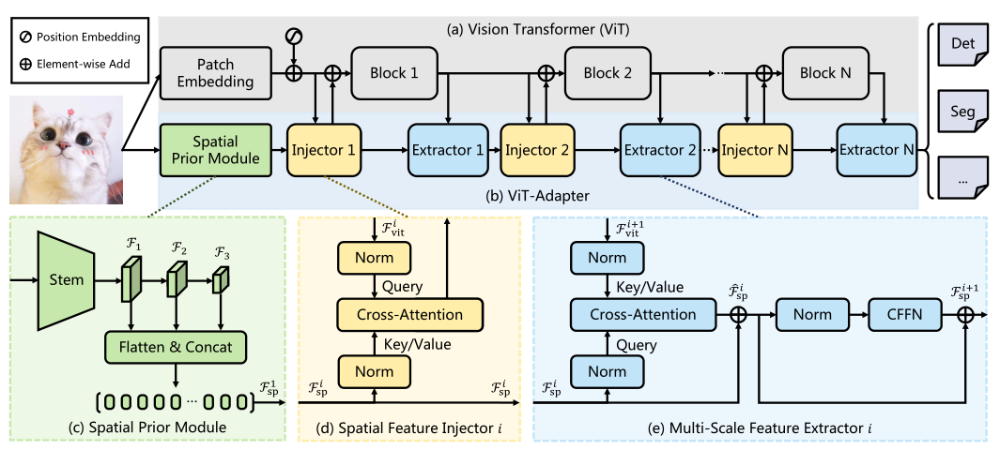
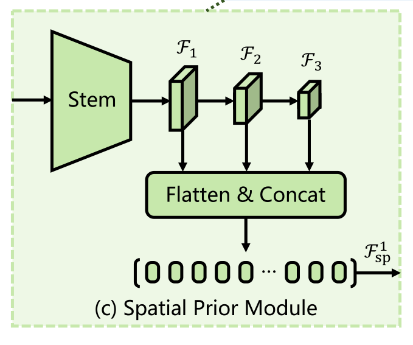
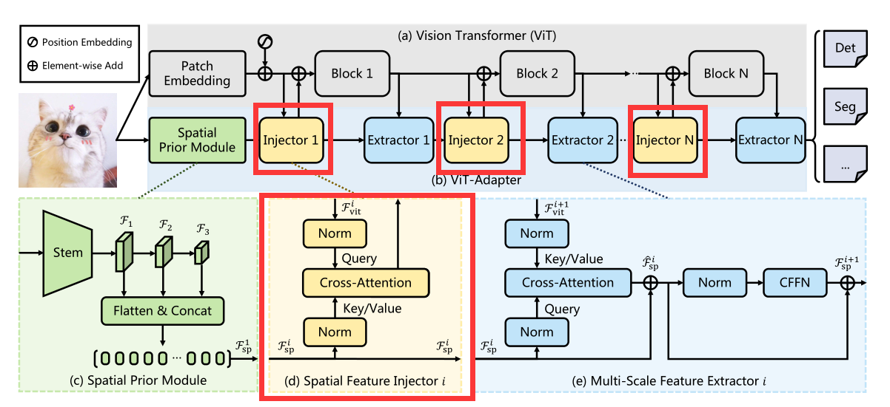
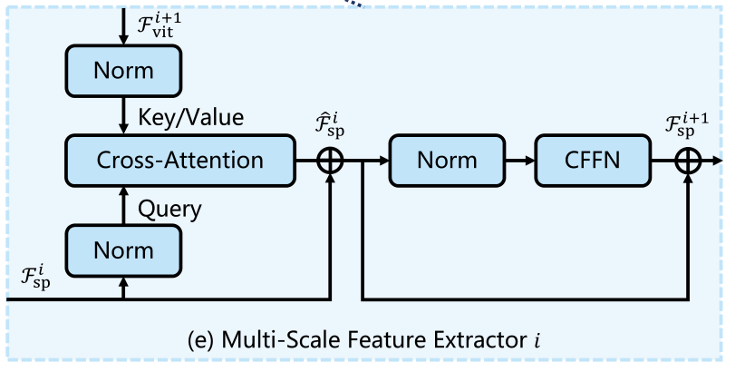

# 【图像分割】2022-ViT Adapter 

> 论文题目: Vision Transformer Adapter for Dense Predictions
>
> 论文地址: [https://arxiv.org/abs/2205.08534](https://arxiv.org/abs/2205.08534)
>
> 论文代码：[https://github.com/czczup/ViT-Adapter](https://github.com/czczup/ViT-Adapter)
>
> 论文作者：南京大学&上海人工智能实验室&清华大学

## 1. 简介

### 1.1 前提

首先得了解 为什么Transformer 比 CNN 少 inductive biases 归纳偏置 ？？

**什么叫先验信息(归纳偏置)？？？**

CNN 的先验信息是 

> * **locality** : CNN用滑动窗口在图片上做卷积。假设是图片相邻的区域有相似的特征。i.e., 桌椅在一起的概率大，距离近的物品 相关性越强。
>
> * **平移等变性 translation equaivariance**（平移不变性 spatial invariance）。 
>
>   $f(g(x))=g(f(x))$
>
>   $f$和$g$函数的顺序不影响结果。
>
>   $f$：卷积 $g$：平移; 无论先做平移$g$还是先做卷积$f$ , 最后结果一样。
>
>   CNN 的卷积核像一个template 模板，同样的物体无论移动到哪里，遇到了相同的卷积核，它的输出一致。 

**总结**

CNN有locality和translation equivariance 归纳偏置，--> CNN 有 很多先验信息 --> 需要较少的数据去学好一个模型。

Transformer 没有这些先验信息，只能 从图片数据里，自己学习对 视觉世界 的感知。

### 1.2 解决办法

1. 现存问题： ViT由于缺乏图像的**先验信息**，因此**在密集预测任务中的性能较差**。
2. 解决方法： 为了解决这个问题，论文提出了ViT-Adapter，它可以**通过一种额外的架构引入感应偏差，从而弥补ViT的缺陷。**

### 1.3 改进点

原始的Transformer没有针对视觉任务设计特定的模块，这使得原始的Transformer相较于专用Transformer没有竞争力。这里的Adapter就是基于这种想法设计一个专用的视觉Transformer（Adapter起源于NLP领域）。具体而言，这篇文章设计了三个模块：

（1）一个空间先验模块，用于捕捉空间局部语义（引入CNN，具体是ResNet）；

（2）一个空间特征注入器（多头注意力）；

（3）多尺度特征提取器（多头注意力接CFFN）

## 2. 网络

### 2.1 总体架构

让我们来**具体**看一下这篇文章是怎么来弥补 这种先验信息的

**总体架构**

如下图所示，`ViT-Adapter`模型可以分为2部分。

- 第1部分是`Backbone`（即 `ViT`）：它由1个`Patch Embedding`和L个`Transformer Encoder`层组成（见图3(a)）。
- 第2部分是提出的`ViT-Adapter`：如图3(b)所示，它包含1个`Spatial prior module`，用于从输入图像中捕获空间特征，1个`Spatial Feature injector`，用于将空间先验注入到`ViT`中，以及1个多尺度特征提取器，用于从`ViT`中提取分层特征。

**VIT的流程**

对于`ViT`，首先将输入图像输入`Patch Embedding`，将图像分成16×16个不重叠的`Patch`。在此之后，这些`Patch`被`Flatten`并投影到d维`Embedding`中。这里的特征分辨率降低到原始图像的1/16。最后，嵌入的`Patch`被和位置嵌入通过`ViT`的L编码器层。

----

**ViT-Adapter流程**

对于`ViT-Adapter`，首先将输入图像输入到`Spatial prior module`中。将收集3种目标分辨率(即1/8、1/16和1/32）的d维空间特征。然后，这些特征映射被`Flatten`并连接起来，作为特征交互的输入。

* 具体来说，给定交互时间N，将`ViT`的Transforer编码器均匀地分割成N个Blocks，每个Block包含L/N编码器层。
* 对于第i个Block，首先通过`Spatial Feature injector`将空间先验注入到Block中，然后通过多尺度特征提取器从Block的输出中提取层次特征。
* 经过N个特征交互后，获得了高质量的多尺度特征，然后将特征分割并`reshape`为3个目标分辨率`1/8、1/16和1/32`。
* 最后，通过2×2的转置卷积对1/8尺度的特征图进行上采样，得到了1/4尺度的特征图。

通过这种方法，得到了一个与`ResNet`分辨率相似的特征金字塔，它可以用于各种密集的预测任务。

### 2.2 Spatial Prior Module(空间先验模块)

最近的工作表明具有重叠滑动窗口的卷积可以帮助Transforer更好地捕捉输入图像的局部连续性。

受此启发，作者在`ViT`中引入了一个基于卷积的`Spatial prior module`，它通过一个`stem`和3个卷积将H×W输入图像下采样到不同的尺度。该模块旨在模拟与`Patch Embedding`平行的图像的局部空间上下文，以免改变`ViT`的原始架构。

下面是模型的流程

* 采用了1个借鉴于`ResNet`的标准卷积`stem`，它由3个卷积层和一个最大池化层组成。
* 接下来，使用一个步长为2的3×3卷积堆栈构成了该模块的其余部分，它使通道数量增加了一倍并减小了特征图的大小。
* 最后，在最后采用几个1×1卷积将特征映射投影到D维。通过这种方法，可以得到了1个特征金字塔，它包含了分辨率分别为1/8、1/16和1/32的D维特征图。
* 最后，将这些特征映射`Flatten+Concat`到特征token

### 2.3 Feature Interaction(特征融合模块)

由于柱状结构，`ViT`中的特征图是单尺度和低分辨率的，与金字塔结构的`Transformer`相比，`ViT`对于密集预测任务的性能是次优的。

为了缓解这个问题，作者提出了2个特征交互模块，在适配器和ViT之间传递特征映射。

具体来说，这2个模块分别是基于`Cross-Attention`的`Spatial Feature Injector`和`Multi-Scale Feature Extractor`。

#### 1) Spatial Feature Injector(空间特征注入器)

该模块用于将空间先验注入`ViT`。具体来说，对于`Transformer`的第i个Block，将以输入特征作为`query`，将上文中的空间先验模块 以输入特征作为`key` 和`value`。使用 `Cross-Attention` 将空间特征注入到输入特征中，该过程通过数学表达式可以表示为：
$$
F_{vit}^i=F_{vit}^i+\gamma^iAttention(norm(F_{vit}^i),norm(F_{sp}^i))
$$
其中归一化层为`LayerNorm`，注意层的注意力机制是可选的。这里为了降低计算代价，采用了一种具有线性复杂度的可变形注意力来实现注意力层。

此外应用一个可学习的向量$\gamma$来平衡注意力层的输出和输入特征，它被初始化为0。这种初始化策略确保了的特征分布不会由于空间先验的注入而被大幅修改，从而更好地利用了预训练后的`ViT`权值。

**啥意思呢？？**

* 首先，有两个输入，

  一个是第$i$个transform blocks 的输出的特征图为$F_{vit}^i$。作为query

  一个是第$i$个空间先验模块(或者多尺度特征提取器)的输出的特征图$F_{sp}^i$。作为key 和value

* 这样子，做一个cross-attention的可变形注意力，一种具有线性复杂度的稀疏注意力，来实现注意力层。

* $\gamma$这个向量是用来平衡注意力层的输出和输入特征的。

#### 2) Multi-Scale Feature Extractor(多尺度特征抽取器)

这里有两步的操作。

首先有两个两个输入

* 一个是上一个adapter出来的空间先验信息$F_{sp}^i$
* 一个是经过第$i$个transformer block 出来的$F_{vit}^{i+1}$。$F_{vit}^i\to Transformer\quad blocks\to F_{vit}^{i+1}$

两个输入做了一下 注意力的操作
$$
\hat{F}_{sp}^{i}=F_{sp}^i+Attention(norm(F_{sp}^i), norm(F^{i+1}_{vit})).
$$
然后对出来的结果，经过一个CFFN(卷积的前馈网络)。出来就是下一个模块的空间先验信息特征$F_{sp}^{i+1}$
$$
F_{sp}^{i+1}=\hat{F}_{sp}^i+CFFN(norm(\hat{F}_{sp}^i))
$$

## 3. 代码

参考资料

> [屠榜语义分割！ViT-Adapter：用于密集预测的视觉Transformer 适配器 - 知乎 (zhihu.com)](https://zhuanlan.zhihu.com/p/519030735)
>
> [分割冠军 | 超越Swin v2、PvT v2等模型，ViT-Adaptiver实现ADE20K冠军60.5mIoU_Tom Hardy的博客-CSDN博客](https://blog.csdn.net/qq_29462849/article/details/124875561)