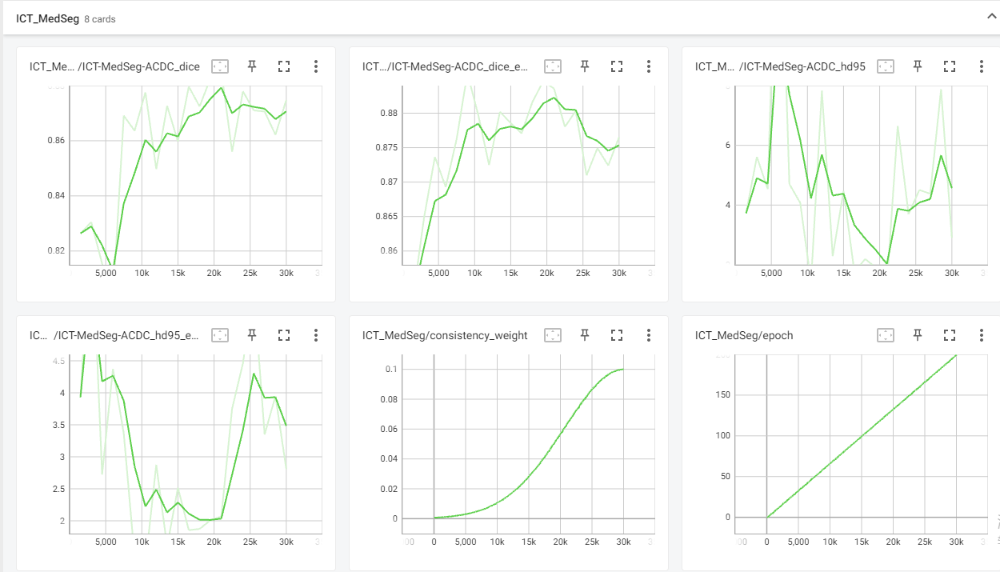

# 【半监督医学图像分割 ISBI】2022-ICT-MedSeg

> 论文题目：AN EMBARRASSINGLY SIMPLE CONSISTENCY REGULARIZATION METHOD FOR SEMI-SUPERVISED MEDICAL IMAGE SEGMENTATION
>
> 中文题目：一种简单的一致性正则化半监督医学图像分割方法
>
> 论文链接：[https://arxiv.org/abs/2202.00677](https://arxiv.org/abs/2202.00677)
>
> 论文代码：[https://github.com/hritam-98/ICT-MedSeg](https://github.com/hritam-98/ICT-MedSeg)
>
> 发表时间：2022年2月
>
> 团队：贾达布尔大学
>
> 引用：Basak H, Bhattacharya R, Hussain R, et al. An Embarrassingly Simple Consistency Regularization Method for Semi-Supervised Medical Image Segmentation[J]. arXiv preprint arXiv:2202.00677, 2022.
>
> 引用数：6（截止时间：2022年12月27号）

## 1. 简介

### 1.1 摘要

像素级注释的缺乏是医学图像分割任务中普遍存在的问题。在本文中，我们介绍了一种新的基于插值混合的正则化策略，用于半监督医学图像分割。所提出的方法是一种新的一致性正则化策略，它鼓励两个未标记数据的插值分割与这些数据的分割映射的插值一致。该方法代表了一种特定类型的数据自适应正则化范式，有助于最大限度地减少在高置信度值下标记数据的过拟合。该方法不需要额外的计算量，优于对抗模型和生成模型。

### 1.2 贡献

提取了一种新的一致性正则化策略(数据扰动)。减少了昂贵的梯度计算的必要性

## 2. 网络

### 2.1 整体架构图

现在有两个未标注数据$u_i$和$u_j$,有个超参$\alpha$。把一个图像插值到另一个图像中，类似于Mixup，混合后的图像为$\mathcal{M}_{\alpha}\left(u_{1}, u_{2}\right)=\alpha u_i+(1-\alpha)u_j$。使用数据集中未标记的样本(unlabel image) 来生成新的插值图像和相应的伪标签$f_{\theta}\left(\mathcal{M}_{\alpha}\left(u_{1}, u_{2}\right)\right)$。

未标注数据$u_i,u_j$使用Teacher模型生成的分割图，然后对分割图进行差值，生成伪标签$\mathcal{M}_{\alpha}\left(f_{\theta^{\prime}}\left(u_{1}\right), f_{\theta^{\prime}}\left(u_{2}\right)\right)$。

网络需要对这种扰动，做出一致性的预测，如下面的公式
$$
\mathcal{M}_{\alpha}\left(f_{\theta^{\prime}}\left(u_{1}\right), f_{\theta^{\prime}}\left(u_{2}\right)\right) \simeq f_{\theta}\left(\mathcal{M}_{\alpha}\left(u_{1}, u_{2}\right)\right)
$$

这种数据混合技术将帮助模型学习更健壮的特征，改善后续(目标)任务的半监督学习，因为随机扰动不保证对抗性扰动。

## 3. 代码

[https://github.com/hritam-98/ICT-MedSeg](https://github.com/hritam-98/ICT-MedSeg)

代码写的非常好。非常容易懂

### 3.1 数据集

ACDC 数据集下载 [ACDC-h5 | Kaggle](https://www.kaggle.com/datasets/jokerak/acdch5)[ACDC-h5 | Kaggle](https://www.kaggle.com/datasets/jokerak/acdch5)

使用的数据集为处理过后的

### 3.2 训练结果

> 训练结果。10% label 。使用unet,达到 88.5%和论文里89.6% 差不多

下面是训练截图

