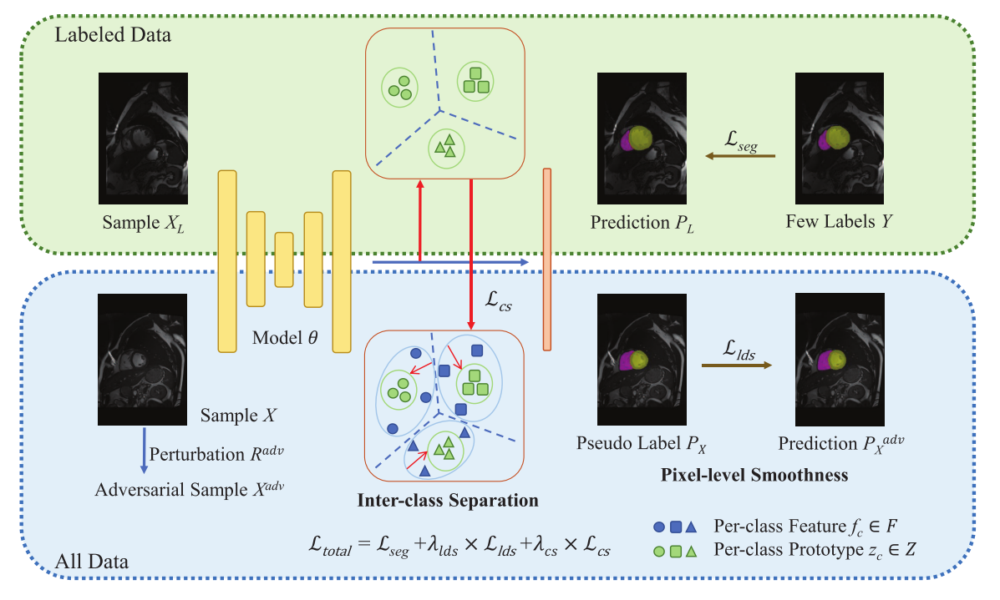

# 【半监督医学图像分割 MICCAI】2022-SS-Net 

> 论文题目：Exploring Smoothness and Class-Separation for Semi-supervised Medical Image Segmentation
>
> 中文题目：半监督医学图像分割中的平滑性和类分离方法研究
>
> 论文链接：[https://arxiv.org/abs/2203.01324v3](https://arxiv.org/abs/2203.01324v3)
>
> 论文代码：[https://github.com/ycwu1997/SS-Net](https://github.com/ycwu1997/SS-Net)
>
> 发表时间：2022年3月
>
> 论文团队：莫那什大学&南洋理工大学
>
> 引用：Wu Y, Wu Z, Wu Q, et al. Exploring Smoothness and Class-Separation for Semi-supervised Medical Image Segmentation[J]. arXiv preprint arXiv:2203.01324, 2022.
>
> 引用数：3(截止时间2023年1月12号)

## 摘要

半监督分割在医学成像中仍然具有挑战性，因为带注释的医学数据量通常很少，并且在粘合剂边缘附近或在低对比度区域中存在许多模糊像素。

为了解决这些问题，我们主张首先约束具有和不具有强扰动的像素的一致性以应用足够的平滑度约束，并进一步鼓励类级分离以利用低熵正则化进行模型训练。

特别地，本文通过同时探索像素级平滑度和类间分离度，提出了SS-Net用于半监督医学图像分割任务。

像素级平滑度迫使模型在对抗性扰动下生成不变结果。

同时，类间分离鼓励单个类的特征向其对应的高质量原型逼近，以使每个类的分布更加紧凑，并将不同的类分离开来。

我们在公共LA和ACDC数据集上根据五种最新方法评价了我们的SS-Net。

在两种半监督环境下的大量实验结果证明了我们提出的SS-Net模型的优越性，在两个数据集上都取得了新的最先进的（SOTA）性能.

## 1. 介绍

大多数基于深度学习的分割模型都依赖于大规模的密集注释来很好地收敛和泛化。然而，为模型训练获得足够的每像素标签是非常昂贵和耗力的。

如此沉重的注释成本促使社区研究半监督分割方法 [15,22,9]，旨在训练具有少量标记数据和大量未标记数据的模型，同时仍能获得令人满意的分割性能。

现有的半监督分割方法通常基于两个假设：平滑性和低熵。平滑假设鼓励模型在数据级别 [19,3,14,8]、特征级别 [16,4,25,23] 和模型级别 [24,10,11, 28,7]。

它的成功意味着局部分布平滑度 (LDS) 对于利用大量未标记数据进行模型训练至关重要。

低熵假设进一步限制了决策边界应位于低密度区域 [6,17,21,20]。

换句话说，即使没有相应标签的监督，半监督模型也有望输出高度自信的预测，旨在实现类间分离。

尽管取得了进展，但由于两个因素，医学成像领域的半监督分割仍然具有挑战性：标签较少和目标模糊。

如图 1 所示，在粘合边缘或低对比度区域附近有许多模糊像素，标记数据的数量通常是有限的。

这些伴随而来的挑战可能会导致现有模型的性能不佳 [28,7,10,11,21]。

我们进一步使用`合成的双月数据集`作为玩具示例来说明这种情况。

具体来说，我们以监督方式训练了一个四层 MLP，然后使用 tSNE 工具 [12] 来可视化深层特征。

我们可以看到，标签越少，数据越模糊（gamma 越大），性能会显着下降，并且模型不能很好地区分不同的类别，因为不同类别的特征流形是相互连接的，参见图 1 的第 3 列，其中违反了低熵假设。

为了缓解这些问题，我们提倡：

(1) 需要强烈的扰动来充分规范大量未标记的医学数据[3]；

(2) 类级分离也被建议用于追求低密度区域的决策边界。

因此，在本文中，我们提出了 SS-Net，以同时探索像素级平滑度和类间分离度，用于半监督医学图像分割。

具体来说，我们的 SS-Net 有两个新颖的设计。首先，受虚拟对抗训练 (VAT) 模型 [14] 的启发，我们采用对抗性噪声作为强扰动来强制执行足够的平滑约束。其次，为了鼓励类间分离，我们从标记数据中选择一组高质量的特征作为原型，并强制其他特征接近其对应的原型，使每个类分布紧凑并推开不同的类。我们在公共 LA 和 ACDC 数据集 [26,2] 上评估了我们的 SS-Net。广泛的实验结果表明我们的模型能够实现显着的性能提升。

总的来说，我们的贡献有三方面：

(1) 我们指出了半监督医学图像分割的两个挑战，即更少的标签和模糊的目标，并展示了我们的关键见解，即充分利用强扰动是至关重要的约束像素级平滑度，同时鼓励类间分离，使模型能够产生低熵预测； 

(2) 在我们的 SS-Net 中，我们将对抗性噪声引入为强扰动。据我们所知，它是第一个应用这种技术来扰乱半监督任务的医学数据的人之一。然后，通过缩小每个类的分布来鼓励类间分离，这会带来更好的性能并补充像素级的平滑度； 

(3) 通过利用这两种技术，我们的 SS-Net 优于最近的五种半监督方法，并在 LA 和 ACDC 数据集上设置了最新的技术水平。

## 2. 方法

图 2 显示了我们的 SS-Net 的整体管道。我们提出了两种设计来分别鼓励像素级平滑度和类间分离。首先，像素级平滑度是通过在原始图像 x ∈ X 及其扰动样本与每像素对抗性噪声之间应用一致性约束来强制执行的。其次，我们从标记数据 XL 中计算一组特征原型 Z，然后鼓励高维特征 F 接近原型 Z，以便在特征空间中分离不同的类。我们现在深入研究细节。

> 我们提出的 SS-Net 的管道。通过应用对抗性噪声作为强扰动，像素级平滑度在像素级受到约束，而类间分离则通过基于原型的策略在特征级执行。

### 2.1 像素级平滑度

现在人们普遍认为 LDS 对于半监督学习 [15] 至关重要。这种正则化可以表述为：
$$
\mathcal{L D S}(x ; \theta)=D[\hat{y}, p(x+r)],\|r\| \leq \epsilon
$$
其中$D$用于计算扰动样本的预测与其真实标签$\hat{y}\in Y$之间的差异，和$\epsilon$控制强制扰动$r$的大小。

由于在半监督场景中没有足够的真实标签可用，因此通常将$\hat{y}$设置为伪标签$p(\hat{y}|x)$。

本质上，LDS 将模型正则化为稳健或与数据的小扰动一致。

同时，为了施加强扰动，遵循 VAT 模型 [14]，我们使用梯度 g 作为$r^{adv}$的方向来扰动原始样本$x$，其处于像素级别，可以估计为：
$$
\begin{array}{l}
g=\nabla_{r^{i n i}} D\left[p(\hat{y} \mid x), p\left(y \mid x+r^{i n i}\right)\right] \\
r^{a d v}=\epsilon \times g /\|g\|_{2}
\end{array}
$$
其中$r^{ini}$可以设置为随机噪声向量，$g$表示在$D$的测量中变化最快的方向,$r^{adv}\in R^{adv}$是相应的对抗性噪声向量。

请注意，在原始 VAT 模型 [14] 中，采用 D 作为 K-L 散度。然而，通过实验，我们发现 K-L 散度可能不适合分割任务。因此，我们利用 Dice 损失作为 D 来生成对抗性噪声，并且 LDS 损失变为
$$
\mathcal{L}_{l d s}=\frac{1}{C} \sum_{c=1}^{C}\left[1-\frac{2\left\|p\left(\hat{y}_{c} \mid x\right) \cap p\left(y_{c} \mid x+r^{a d v}\right)\right\|}{\left\|p\left(\hat{y}_{c} \mid x\right)\right\|+\left\|p\left(y_{c} \mid x+r^{a d v}\right)\right\|}\right]
$$
其中$C$是类的数量。 $p\left(\hat{y}_{c} \mid x\right)$和$p\left(y_{c} \mid x+r^{a d v}\right)$分别表示在第$c$类中有和没有强扰动的$x$的预测。

这样，可以通过反向传播方案有效地计算$g$。与随机噪声相比，这种对抗性噪声可以提供更强的平滑约束以促进模型训练[14]。

### 2.2 类间分离

在分割模糊目标时，仅执行 LDS 是不够的，因为决策边界附近的模糊像素很容易被分配给不确定的标签，这会混淆模型训练。因此，为了补充 LDS，我们进一步鼓励特征空间中的类间分离。与直接对结果应用熵最小化相比，这种特征级约束对于半监督图像分割[16]更有效。

因此，我们采用基于原型的策略 [1,27] 来断开不同类别的特征流形，从而降低计算成本。

具体来说，我们首先使用非线性投影仪来获得投影特征$F=F_l\cup F_u$。

然后，根据它们在目标类别中的正确预测选择标记特征$F_l$的子集。

接下来，我们通过$C$个注意力模块生成的排名分数对这些候选特征进行排序，最终采用得分最高的前$K$个特征作为高质量原型$Z$。

之后，我们利用当前预测对单个类特征$f_c\in F$进行分组，并迫使它们逼近其对应的原型$z_c\in Z$，旨在缩小类内分布。

我们使用余弦相似度来计算$z_c$和$f_c$之间的距离，损失$\mathcal{L}_{cs}$定义为

$$
\mathcal{L}_{c s}=\frac{1}{C} \frac{1}{N} \frac{1}{M} \sum_{c=1}^{C} \sum_{i=1}^{N} \sum_{j=1}^{M} w_{i j}\left(1-\frac{\left\langle z_{c}^{i}, f_{c}^{j}\right\rangle}{\left\|z_{c}^{i}\right\|_{2} \cdot\left\|f_{c}^{j}\right\|_{2}}\right)
$$

其中$w_{ij}$是归一化的权重，如[1]，$N$或$M$分别表示第$c$类中原型或投影特征的数量。

在这里，$\mathcal{L}_{cs}$可以对齐标记/未标记的特征并使每个类分布紧凑，从而在特征空间中很好地分离不同的类。
$$
\mathcal{L}_{\text {total }}=\mathcal{L}_{\text {seg }}+\lambda_{lds} \times \mathcal{L}_{l d s}+\lambda_{cs} \times \mathcal{L}_{cs}
$$
其中$\lambda_{lds}$和$\lambda_{cs}$是平衡损失的相应权重。请注意，$\mathcal{L}_{\text {seg }}$是 Dice 损失，适用于少数标记数据。其他两个损失应用于所有数据以规范模型训练。

## 3. 实验结果

### 3.1 数据集

我们在 LA* 数据集 [26] 和 ACDC† 数据集 [2] 上评估提出的 SS-Net。 LA 数据集由 100 个钆增强 MRI 扫描组成，固定拆分 80 个样本用于训练，20 个样本用于验证。我们将验证集的性能报告为 [28,7,10,21] 以进行公平比较。

在 ACDC 数据集上，数据拆分§也固定为 70、10 和 20 名患者的扫描，分别用于训练、验证和测试。

所有实验都遵循相同的设置以进行公平比较，我们考虑具有挑战性的半监督设置来验证我们的模型，其中使用 5% 和 10% 的标签，训练集中的其余部分被视为未标记数据。

### 3.2 实现细节

按照两个数据集上的公共方法 [28,7,10,21,11]，所有输入都被归一化为零均值和单位方差。我们使用旋转和翻转操作来扩充数据，并通过学习率为 0.01 的 SGD 优化器训练我们的模型。损失权重 λlds 和 λcs 被设置为依赖于迭代的预热函数 [5]，并且 wij 是通过将可学习的注意力权重标准化为 [1] 获得的。我们以在线方式更新了大小为 32 × 32 的每个类级特征原型。在 LA 上，ε 设置为 10，我们选择 V-Net [13] 作为主干。为了进行训练，我们随机裁剪了 112 × 112 × 80 块，批量大小为 4，包含两个标记块和两个未标记块。我们通过 15K 次迭代训练模型。为了进行测试，我们采用固定步长 (18 × 18 × 4) 来提取补丁，并且整个预测都是从基于补丁的输出中重组的。在 ACDC 上，我们将 ε 设置为 6，并选择 U-Net 模型 [18] 作为主干来处理大小为 256 × 256 的二维块。批量大小为 24，总训练迭代次数为 30K。本文中的所有实验均在具有固定随机种子的相同环境中进行（硬件：单个 NVIDIA Tesla V100 GPU；软件：PyTorch 1.8.0+cu111 和 Python 3.8.10）。

### 3.3 结果

LA 数据集上的性能在表 1 中，我们使用 Dice、Jaccard、95% Hausdorff 距离 (95HD) 和平均表面距离 (ASD) 的指标来评估结果。它表明：(1) 与下限相比，即仅使用 5%/10% 的标记数据训练，我们提出的 SS-Net 可以有效地利用未标记数据并在所有指标上产生令人印象深刻的性能提升； (2) 当使用更少的标签进行训练时，即 5%，我们的 SS-Net 在 LA 数据集上明显优于其他模型。这表明当标记数据的数量有限时，强制执行对抗性扰动对于充分规范未标记数据是有用的。此外，我们通过选择最大的连接组件作为 [7] 对所有结果进行后处理，以进行公平比较。请注意，我们没有强制执行任何边界约束来训练我们的模型，并且我们的模型自然地在 LA 数据集上实现了令人满意的形状相关性能。图 3 中的可视化结果表明，我们的 SS-Net 可以检测到大多数器官细节，尤其是模糊边缘和细分支（用黄色圆圈突出显示），这是临床应用的关键属性。

> 在 LA 数据集（前两行）和 ACDC 数据集（下行）上使用 5% 标记数据训练和相应的地面实况 (GT) 的几种半监督分割方法的示例结果。

> 表 1. 与 LA 数据集上的五种最新方法的比较。所有结果都在相同的实验设置中重新生成为 [28,7,10,11,21] 以进行公平比较。

ACDC 数据集上的性能 表 2 给出了 ACDC 数据集上的三类分割的平均性能，包括心肌、左心室和右心室。我们可以看到，使用 5% 的标记数据训练，UA-MT 模型 [28] 的性能显着下降，甚至低于下限，即 46.04% vs. Dice 中的 47.83%。由于 [28] 在训练过程中过滤了高度不确定的区域，这种性能下降表明需要充分利用模糊像素，特别是在标签极其稀缺的情况下。相反，如表 2 所示，我们的 SS-Net 超越了所有其他方法并实现了最佳分割性能。图 3 的底行还表明，我们的模型可以输出良好的分割结果，并有效地消除了 ACDC 上的大部分假阳性预测。

