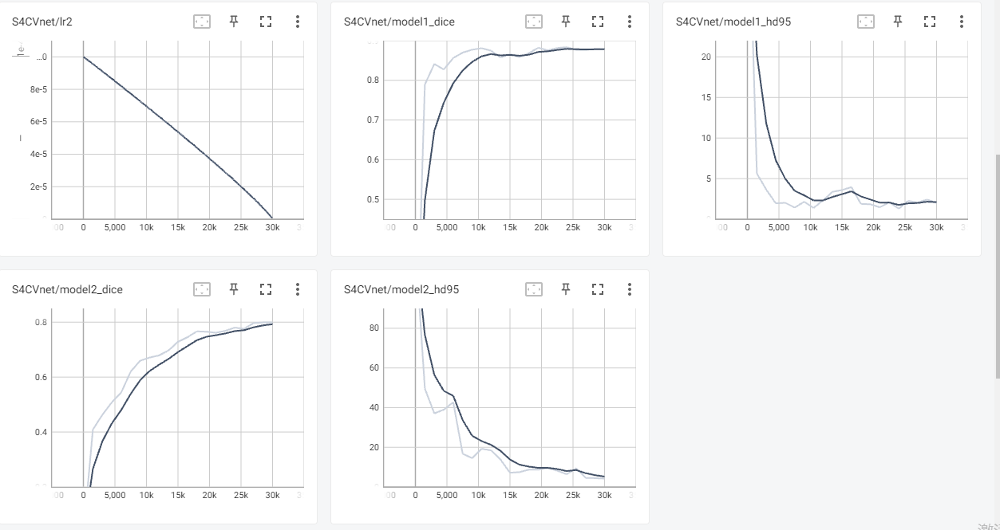
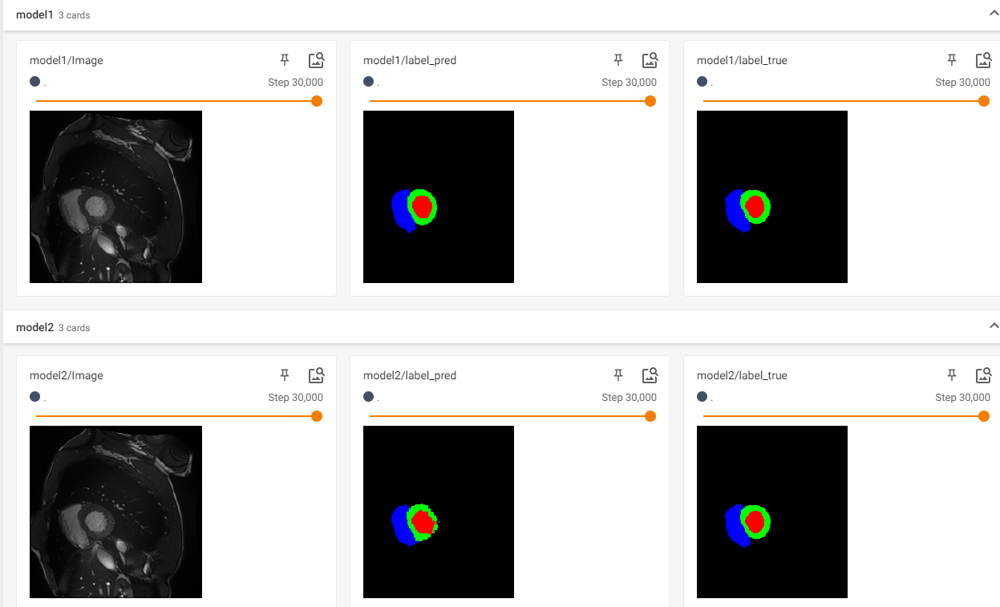

# 【半监督医学图像分割 2022 CVPR】S4CVnet论文翻译

>论文题目：When CNN Meet with ViT: Towards Semi-Supervised Learning for Multi-Class Medical Image Semantic Segmentation
>
>中文题目：当CNN与ViT相遇:面向多类医学图像语义分割的半监督学习
>
>论文链接：[https://arxiv.org/abs/2208.06449](https://arxiv.org/abs/2208.06449)
>
>论文代码：[https://github.com/ziyangwang007/CV-SSL-MIS](https://github.com/ziyangwang007/CV-SSL-MIS)
>
>论文翻译：[https://blog.csdn.net/wujing1_1/article/details/128620158](https://blog.csdn.net/wujing1_1/article/details/128620158)
>
>发表时间：2022年8月
>
>团队：牛津大学计算机科学系&牛津大学肯尼迪风湿病研究所&伦敦帝国理工学院外科
>
>引用：Wang Z, Li T, Zheng J Q, et al. When CNN Meet with ViT: Towards Semi-Supervised Learning for Multi-Class Medical Image Semantic Segmentation[J]. arXiv preprint arXiv:2208.06449, 2022.
>
>引用数：1(截止时间：2023年1月6号)

## 1. 简介

### 1.1 摘要

由于医学影像界缺乏高质量标注，半监督学习方法在图像语义分割任务中受到高度重视。

为了充分利用视觉转换器(ViT)和卷积神经网络(CNN)在半监督学习中的强大功能，本文提出了一种基于一致性感知伪标签的自集成方法。我们提出的框架包括一个由ViT和CNN相互增强的特征学习模块，以及一个用于一致性感知目的的健壮的指导模块。

伪标签由特征学习模块中的CNN视图和ViT视图分别循环地推断和利用，以扩展数据集，彼此有益。同时，对特征学习模块设计了扰动方案，并利用平均网络权值设计了制导模块。

通过这样做，该框架结合了CNN和ViT的特征学习优势，通过双视图联合训练增强了性能，并以半监督的方式实现了一致性感知监督。详细验证了使用CNN和ViT的所有替代监督模式的拓扑探索，展示了我们的方法在半监督医学图像分割任务上最有前途的性能和特定设置。实验结果表明，该方法在具有多种指标的公共基准数据集上达到了最先进的性能。

### 1.2 解决的问题+贡献

为了充分利用CNN和ViT的特征学习能力，提出了一种增强型双视图协同训练模块。CNN和ViT都具有相同的u型编码器-解码器风格的分割网络，以便进行公平的比较和探索

## 2. 网络

## 3. 代码

实验结果

