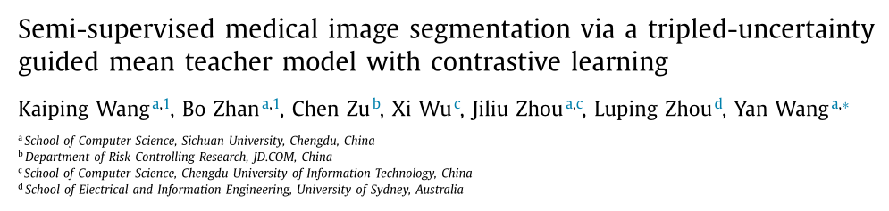

# 论文翻译

> 论文题目：Semi-supervise d me dical image segmentation via a triple d-uncertainty 
> guided mean teacher model with contrastive learning 
>
> 中文题目：基于对比学习的三维不确定性指导平均教师模型的半监督图像分割
>
> 论文链接：[https://www.sciencedirect.com/science/article/pii/S1361841522000925](https://www.sciencedirect.com/science/article/pii/S1361841522000925)

## 摘要

## 1. 介绍

