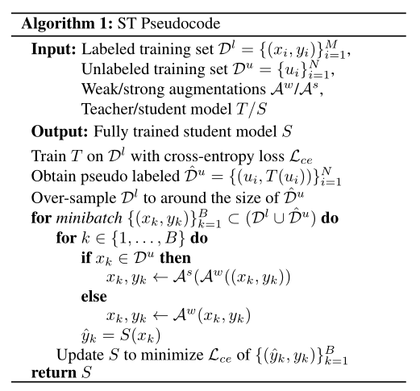
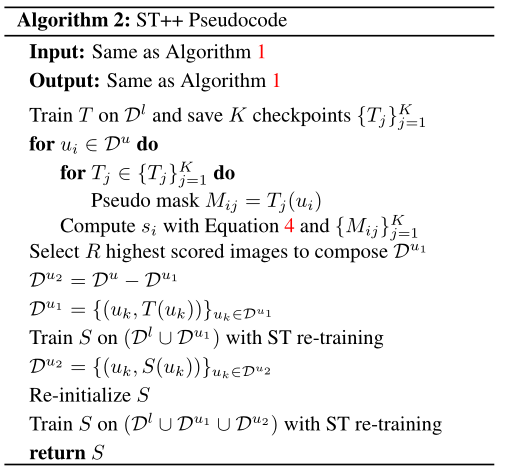

# 2022-ST++- CVPR

> 论文题目：ST++: Make Self-training Work Better for Semi-supervised Semantic Segmentation
>
> 论文链接：[https://arxiv.org/abs/2106.05095](https://arxiv.org/abs/2106.05095)
>
> 论文代码：[https://github.com/LiheYoung/ST-PlusPlus](https://github.com/LiheYoung/ST-PlusPlus)
>
> 原作者博文：[https://zhuanlan.zhihu.com/p/476692814](https://zhuanlan.zhihu.com/p/476692814)
>
> 发表时间：2021年6月
>
> 团队：南京大学、腾讯、东南大学
>
> 引用：Yang L, Zhuo W, Qi L, et al. St++: Make self-training work better for semi-supervised semantic segmentation[C]//Proceedings of the IEEE/CVF Conference on Computer Vision and Pattern Recognition. 2022: 4268-4277.
>
> 引用数：21

## 1. 简介

### 1.1 摘要

在本文中，作者研究是否可以使 self-training 这样一个简单但流行的框架更好地用于半监督分割。由于半监督环境下的核心问题在于对未标记数据的有效利用，我们注意到增加未标记数据的 diversity（差异性) 和 hardness（难度) 是提高性能的关键。考虑到这一事实，作者提出了采用最简单的 self-training 方案，并对未标记数据(即ST)进行适当的强数据扩充，在没有任何 bells and whistles 的情况下，出人意料地优于以往的方法；

此外，为了减轻错误标记图像的负面影响，我们进一步提出了一种改进的自我训练框架(即ST++)，该框架通过选择和优先选择更可靠的未标记图像来实现选择性的再训练。在此基础上，我们提出了一种改进的自训练框架(ST++)，该框架通过对**更可靠的未标记图像进行选择和优先排序来实现选择性再训练**。因此，提出的ST++显著提高了半监督模型的性能，并且在PascalVOC 2012和CITYSCAPES benchmark 上大大超过了现有的方法。总体而言，作者希望这个直截了当和简单的框架将成为未来工作的强大基线或竞争者。

### 1.2 简介

在本工作中，我们在半监督语义分割领域重新思考了传统的多阶段自训练（self-training）范式，并提出两点关键的改进策略，使得这种较为古老的训练流程仍能达到当前最佳的性能。

近来较多的半监督学习工作都是基于端到端的框架来做的，学生模型不断学习教师模型产生的伪标签。由于模型不断被更新，伪标签的质量也会不断提升，进而持续促进半监督学习的性能。其中比较具有代表性的有半监督分类中的`FixMatch`，半监督语义分割中的`CutMix-Seg`、`PseudoSeg`、`CPS`，半监督目标检测中的`Unbiased Teacher`、`Humble Teacher`、`Soft Teacher`等。

尽管这些方法取得了巨大的成功，然而在训练前期，即使手动设置了置信度阈值，依然存在较多的错误伪标签会误导学生模型的学习。此外，这种在线学习的范式需要在不同epochs对同一张图像多次打出伪标签，比较耗时和耗显存（一个minibatch中需要同时包含有标签图像以及强、弱增广的无标签图像）。因此我们希望重新思考一下传统的多阶段self-training范式在半监督语义分割中的应用前景。self-training流程的优点在于，模型在有标签图像上充分训练后，对所有无标签图像只需要预测一次伪标签，且伪标签质量比较有保障。

在此基础上，我们提出了两种改进方案：

- 在学习无标签图像时，在其上施加强数据增广，以增加学习的难度，可以学得额外的信息，并缓解对错误伪标签的过拟合
- 由易至难、从可靠标签到不可靠标签，渐进式地利用无标签图像及其伪标签。其中，我们提出基于第一阶段训练过程中伪标签的稳定性来选取可靠的图像，而非像素。

### 1.2 背景

首先介绍一下最简单的self-training范式，总共分为三个阶段：

1.【有监督预训练】在有标签图像上完全训练得到一个初始的教师模型

2.【生成伪标签】用教师模型在所有的无标签图像上预测one-hot伪标签

3.【重新训练】混合有标签图像和无标签图像及其伪标签，在其上重新训练一个学生模型，用于最终的测试

### 1.3 问题1

## 2. 训练方式改进

我们的方法分为两部分，分别是ST和ST++，后者是在前者的基础上又做了进一步的渐进式选择策略的改进。

### 2.1 ST

我们提出的ST仅需对传统的self-training范式做很小的改进，就可以显著提升其性能。

具体来说，由于第二阶段预测出的伪标签仍然是包含较多噪声的，如果在重新训练阶段直接对这些原图以及带噪声的标签进行学习，很容易过拟合其中的噪声标签；此外，由于学生模型直接学习同样结构的教师模型产生的伪标签，此过程并没有引入额外的信息，学生模型唯一在做的其实只是entropy minimization（因为我们对教师模型的预测结果取了one-hot label）。

基于上述两点动机，我们提出在重新训练阶段对无标签图像进行强数据增广来学习。首先，由于每次无标签图像输入进入模型前都进行了随机的强数据增广，也就是说尽管是同样一张图像，不同epochs见到的输入也一直在变化，也就没有固定的输入-输出的映射，模型在这种情况下不容易过拟合伪标签中的噪声；此外，学生模型是在强增广的图像上学习的，可以在教师模型的基础上学得更加丰富的表征。

这种设计使得学生模型不仅仅是在做entropy minimization，同时由于不同版本的强增广图像都受到同样的伪标签的监督（也就是教师模型生成的固定的one-hot label），此过程也可以看作是在不同的epochs之间对同一张无标签图像进行consistency regularization。因此，注入了强增广操作的self-training范式，也就是我们的ST，同时包含了半监督学习中两种主流的做法，即entropy minimization和consistency regularization。

我们在实验中采用了四种十分基本的强增广策略，包括colorjitter、blur、grayscale、以及Cutout。事实上前三种增广策略的组合就已经能够得到足够好的结果。

需要注意的是，为了尽可能的减少超参数，以及增加我们方法的普适性，我们没有根据模型预测出的置信度设置一个阈值来选取高质量的伪标签。并且根据我们的实验，这种做法也并没有在众多settings上带来稳定的提升。此外，为了尽可能减少训练时间，我们也没有进一步的迭代打伪标签并重训练（也就是用重新训练得到的学生模型重新打伪标签再训练），但是根据我们的实验，这样做可以进一步提升ST的性能。

下面可以看一下更加详细的ST伪代码，流程还是比较直观的：

### 2.2 ST++

**由易至难、从可靠到不可靠，以图像级别选取无标签图像及其伪标签**

在ST的基础上，为了进一步缓解错误的伪标签带来的负面影响，我们提出了ST++，由易至难、从可靠伪标签到不可靠伪标签，渐进式地利用无标签图像；并且不同于一般做法中选取高置信度的像素，ST++根据第一阶段训练过程中伪标签的稳定性来选取可靠的图像。

给定有标签数据集$D^l$和无标签数据集$D^u$，ST++首先需要从$D^u$中选取出前$K$张最可靠的无标签图像及其伪标签（选取策略后面介绍）构成  $D^{u_1}$

## 3. 代码

参考资料

> 原作者的论文[CVPR 2022 | ST++: 半监督语义分割中更优的自训练范式 - 知乎 (zhihu.com)](https://zhuanlan.zhihu.com/p/476692814)

[CVPR 2022 | ST++: 半监督语义分割中更优的自训练范式_机器学习与AI生成创作的博客-CSDN博客](https://blog.csdn.net/lgzlgz3102/article/details/123391303)

