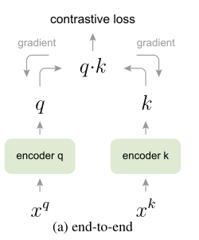
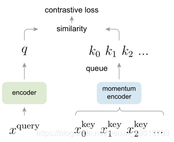

# MocoV1

> [论文地址](https://arxiv.org/abs/1911.05722)
>
> https://www.bilibili.com/video/BV1C3411s7t9 感谢大佬！！！

## 1. 简介

MoCo：无监督的表征学习工作 在 CV上表现怎么样？

分类：逼近了有监督的 baseline
检测、分割、人体关键点检测：大幅超越有监督预训练的模型 (ImageNet 上预训练的模型)

## 2. 网络(创新点)

### 2.1 动量编码器

memory bank

这里对memory bank 进行了优化

Momentun 

Contrast（MoCo）满足了要求。
x为一个batch的原始数据，经过数据增强，分别得到xq和xk。MoCo有两大特点：

> - $x_q$代表某一图片$p_q$的图像增强操作（包括旋转、平移、裁剪等）后的一个矩阵;
> - $x_k$代表多张图片$p_k$（$p_k$中包含$p_q$）的图像增强操作之后的多个矩阵;
> - Encoder、momentum encoder代表两个编码网络，这两个网络的结构相同，参数不同
> - q代表$x_q$经过encoder网络编码之后的一个向量
> - k代表$x_k$经过momentum encoder网络编码之后的多个向量

#### 字典对列化

当前mini-batch样本$x_k$被输入字典，排在样本队列的最后，同时删除样本队列的第一项，维持样本队列的长度恒定。对于查询样本$x_q$，在此队列中只有一个正样本，也就是排在最后的样本，其余均为负样本。

这能使字典变大。进行反向传播时，只需要传播到当前队列中的样本，不会受到GPU内存的限制，因此更多的样本能够参与训练。

#### 动量更新

但是，梯度应该传播到所有的样本中，而不仅仅是当前队列。仅传播到当前队列中，会使参数更新不连续。为了增强参数更新的连续性，提出了动量更新：

$$
\theta_k\leftarrow m\theta_k+(1-m)\theta_q
$$

### 2.2 Info NCE

NCE全称是`噪声对比估计`（Noise Contrastive Estimation）,通过引入`一个噪声分布`，解决多`分类问题softmax分母归一化中分母难以求值`的问题。具体做法是把多分类问题通过引入一个噪音分布变成一个二元分类问题，将原来构造的多分类分类器（条件概率）转化为`一个二元分类器`，用于判别给定样例是`来源于原始分布还是噪声分布`，进而更新原来多元分类器的参数。

如果把`噪音分布的样本`想成`负样例`，那这个二元分类问题就可以理解为让模型`对比正负样例作出区分`进而学习到正`样例(原始分布)的分布特征`

而`InfoNCE`, 又称global NCE,继承了NCE的基本思想，从一个新的分布引入负样例，构造了`一个新的多元分类问题`，并且证明了`减小这个损失函数相当于增大互信息(mutual information)的下界`。
$$
L_q(u,v^+,\{v^-\})=-\log \frac{exp(u\cdot v^+/\tau)}{\sum_{v\in\{v^+,v-\}}exp(u\cdot v/\tau)}
$$
其中$u$、$v^+$、$v^-$分别为原样例、正样例、负样例归一化后的表示，为温度超参。

温度超参是softmax中常见的超参，$t$越小，softmax越接近真实的max函数，$t$越大越接近一个均匀分布。因此，当$t$很小时，只有难区分的负样例`才会对`损失函数产生影响`，同时，`对错分的样例`（即与原样例距离比正样例与原样例距离近）有`更大的惩罚`。实验结果表明，对比学习对$t$很敏感。

## 3. 总结架构

> 由于无监督学习的特征分布和有监督学习到的特征分布是很不一样的，在将无监督预训练模型应用到下游任务时，不能每个任务的分类头都进行参数搜索，这样就失去了无监督学习的意义，解决方法是：归一化，然后整个模型进行参数微调。BN层用的是synchronized BN，即多卡训练时，把所有卡的信息都进行统计，计算总的running mean 和running variance，然后更新BN层，让特征归一化更彻底，模型训练更稳定。

## 3. 代码

~~~python

~~~

