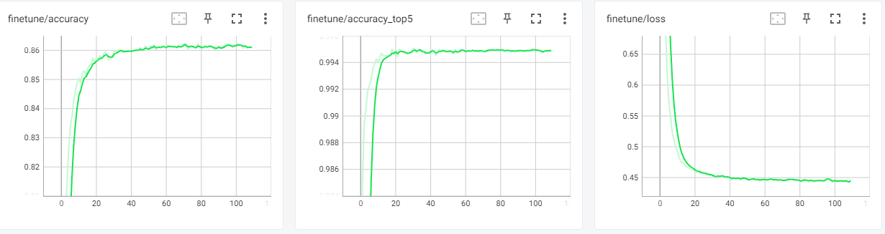

# 【自监督对比学习 CVPR 2020】MoCOv2

> 论文题目：Improved Baselines with Momentum Contrastive Learning
>
> 论文代码：[https://github.com/facebookresearch/moco](https://github.com/facebookresearch/moco)
>
> 论文链接：[https://arxiv.org/abs/2003.04297](https://arxiv.org/abs/2003.04297)
>
> 发表时间：2020年3月
>
> 团队：facebook
>
> 引用：Chen X, Fan H, Girshick R, et al. Improved baselines with momentum contrastive learning[J]. arXiv preprint arXiv:2003.04297, 2020.
>
> 引用数：1545

## 1. 简介

### 1.1 改进

`MoCov2`主要是借鉴了`SimCLR`而做的优化，比如引入了mlp projection head以及使用更多的数据增强。

MoCov2刷新了ImageNet 上的最好成绩，比之前的MoCo以及最新的SimCLR都高很多 。其上传的日期是3月9日，离SimCLR的发布还不到一个月。

MoCov2对比MoCo主要有4个改动：

* 添加 projection head
* 使用更多的数据增强
* 训练时使用cosine的learning rate schedule
* 训练的epoch，从200增加到800
  

## 2. 网络

MoCoV1步骤如下

1. 随机增强出 $x^{q} 、 x^{k}$ 两种 view ;
2. 分别用 $f_{q}$ , $f_{k}$ 对输入进行编码得到归一化的 $q$ 和 $\mathrm{k}$ , 并去掉 $\mathrm{k}$ 的梯度更新 ;
3. 将 $\mathrm{q}$ 和 $\mathrm{k}$ 中的唯一一个正例做点积得 cosine相似度 ($\mathrm{Nx} 1$) , 再将 $\mathrm{q}$ 和队列中存储的K个负样本做点积得 cosine相似度 ($\mathrm{NxK}$) , 拼接起来的到 $\mathrm{Nx}(1+\mathrm{K}) $ 大小 的矩阵, 这时第一个元素就是正例，直接计算交叉摘损失, 更新 $f_{q}$ 的参数；
4. 动量更新 $f_{k}$ 的参数： $f_{k}=m * f_{k}+(1-m) * f_{q}$；
5. 将 $\mathrm{k}$ 加入队列，把队首的旧编码出队，负例最多时有 65536 个。

然后呢？？MoCoV2对其做了改进，借鉴了`SimCLR`而做的优化，引入了mlp projection head以及使用更多的数据增强。

在MoCo框架中，大量的负样本是现成的；MLP头部和数据增强与对比学习的实例化方式是正交的。

## 3. 代码

复现参考代码[https://github.com/AidenDurrant/MoCo-Pytorch](https://github.com/AidenDurrant/MoCo-Pytorch)

数据集使用cifar10，

预训练结果，训练800epoch, 一个epoch 大概20s

微调结果

