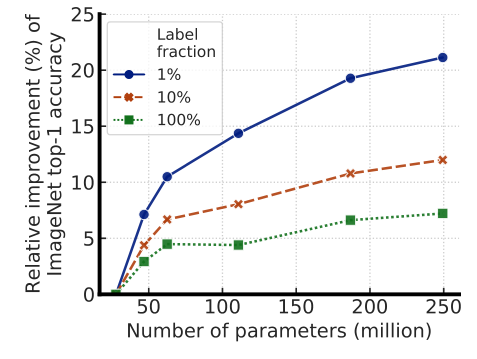
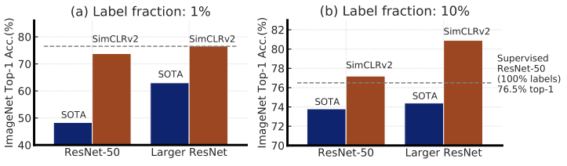
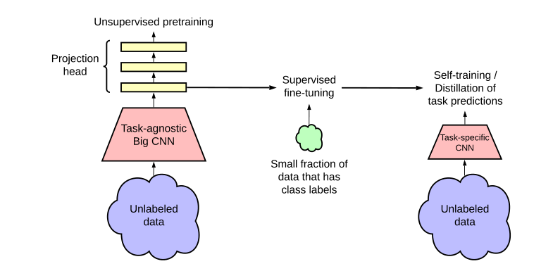
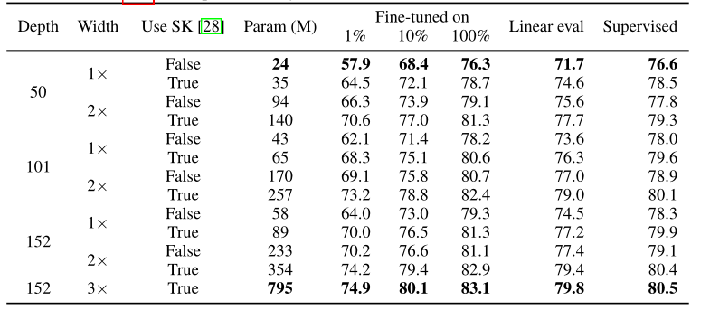
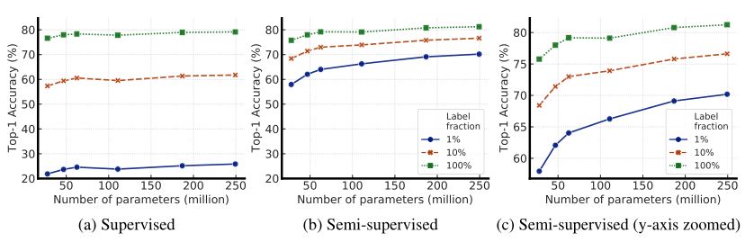
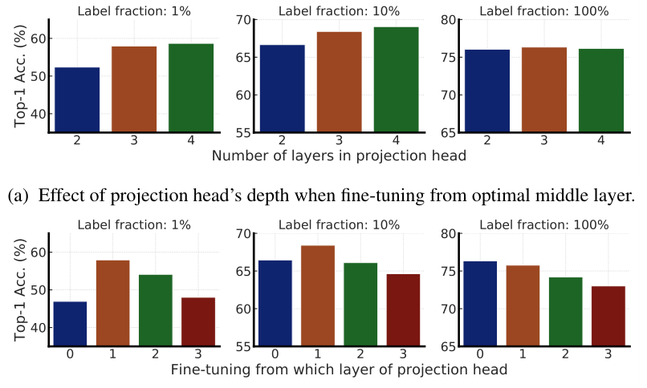
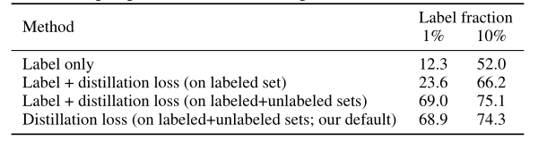
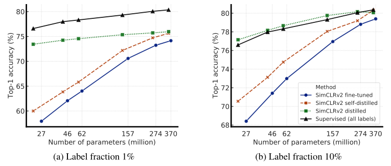
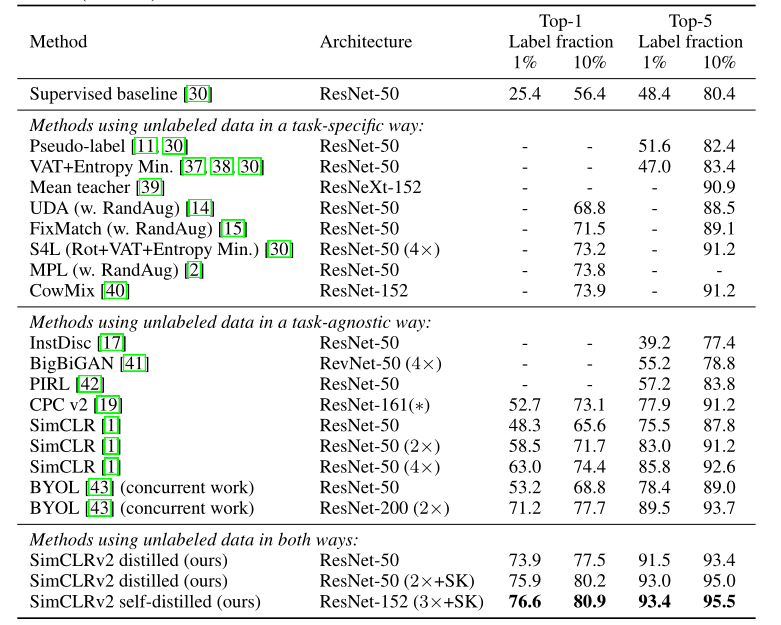

# 【NeurIPS 2020】自监督学习：SimCLR v2

>  论文题目：Big Self-Supervised Models are Strong Semi-Supervised Learners
>
>  中文题目：SimCLR v2：大型自监督模型是强大的半监督学习者
>
>  论文链接：[https://arxiv.org/abs/2006.10029](https://arxiv.org/abs/2006.10029)
>
>  论文代码：[https://github.com/google-research/simclr](https://github.com/google-research/simclr)
>
>  发表时间：2020年6月
>
>  引用：Chen T, Kornblith S, Swersky K, et al. Big self-supervised models are strong semi-supervised learners[J]. Advances in neural information processing systems, 2020, 33: 22243-22255.
>
>  引用数：1149

## 1. 简介

### 1.1 摘要

“无监督预训练+有监督微调”是在充分利用大量无标签数据的情况下，从少数有标签的示例中学习的一种范式。尽管这种范式以任务无关的方式使用无标签的数据，但与计算机视觉中常用的半监督学习方法相比，我们发现它对于ImageNet上的半监督学习非常有效。我们方法的一个关键要素是在预训练和微调期间使用大(深度和宽度)的网络。我们发现，标签越少，这种方法就越能从更大的网络中获益。在微调之后，通过第二次使用无标签的数据(但以任务特定的方式)，可以进一步改进大型网络，将其蒸馏为更小的网络，分类精度的损失也很小。本文提出的半监督学习算法可概括为三个步骤：使用SimCLRv2对大型ResNet模型进行无监督预训练，使用有标签数据进行有监督的微调，使用无标签数据进行蒸馏以提炼和迁移任务特定的知识。该方法仅使用1%的标签即可实现73.9%的ImageNet Top-1精度，标签效率比以前的SOTA水平提高了10倍。对于10%的标签，使用我们的方法训练的ResNet-50达到77.5%的Top-1精度，优于使用全量标签的标准的有监督训练方法。

> 图1：当使用较少的有标签数据进行微调时，较大的模型会产生更大的收益。

> 图2：SOTA方法和SimCLRv2在ImageNet上仅使用1%或10%标签的Top-1精度。

## 2. 网络

### 2.1 架构

本文提出的半监督学习框架包括三个步骤，如图3所示：(1)无监督或自监督的预训练，(2)有监督的微调，(3)使用无标签数据进行蒸馏。我们开发了一个SimCLR的改进版本，用于对ResNet进行无监督预训练，我们将这个框架称为SimCLRv2。

> 图3：本文提出的半监督学习框架以两种方式利用无标签数据：(1)在无监督预训练阶段以任务无关的方式使用，(2)在自训练/蒸馏阶段以任务特定的方式使用。

受到最近从无标签数据学习成功的启发，我们提出的半监督学习框架以任务无关和任务特定的方式利用无标签数据。第一次使用无标签的数据时，它是以任务无关的方式，通过无监督的预训练学习泛化(视觉)表示。然后，通过有监督的微调，将泛化表示用于特定的任务。第二次使用无标签数据时，以任务特定的方式进行，以进一步提高预测性能并获得一个紧凑的模型。为此，我们利用微调后的教师网络对无标签数据打上伪标签，并基于这些伪标签数据来训练学生网络。我们的方法可以概括为三个主要步骤：预训练、微调、蒸馏，详细过程如图3所示。

### 2.2 总结

在这项工作中，我们提出了一个简单的用于ImageNet分类的半监督学习框架，分为三个步骤：无监督的预训练、有监督的微调、使用无标签数据的蒸馏。虽然类似的方法在NLP中很常见，但我们证明，这种方法也可以成为计算机视觉中半监督学习的令人惊讶的强大基线，大大优于SOTA技术。我们观察到，较大的模型可以利用更少的有标签数据获得更大的提升。我们主要在ImageNet上研究了这一现象，但在更小的数据集CIFAR-10上观察到了类似的结果。大模型的有效性已在有监督学习、微调的有监督模型、语言的无监督学习上得到了证明。然而，仍然有些令人惊讶的是，在少量有标签数据上容易过拟合的大模型可以更好地泛化。通过以任务无关的方式对无标签数据加以利用，我们推测较大的模型可以学习更多的泛化特征，这增加了学习任务相关特征的机会。然而，还需要进一步的工作来更好地解释这一现象。除了模型大小之外，我们还看到了提高参数效率的重要性，这是提高模型性能的另一个重要维度。尽管大型模型对于预训练和微调非常重要，但对于特定任务，例如ImageNet分类，我们证明了任务无关学习的泛化表示可以通过使用无标签数据蒸馏成更专业、更紧凑的网络。为此，我们只需使用教师网络为无标签数据打上伪标签，而无需使用噪声、增广、置信阈值或一致性正则化。当学生网络具有与教师网络相同或相似的架构时，此过程可以持续提高分类性能。我们相信，我们的框架可以从更好的方法中获益，利用无标签数据来改进和迁移特定任务的知识。我们还认识到ImageNet是一个精心策划的数据集，可能无法反映半监督学习的所有实际应用。因此，一个潜在的未来方向是探索更广泛的真实数据集。

### 2.3 实验结果

表1：微调的SimCLRv2、线性分类器和有监督模型的Top-1精度。

图4：有监督和半监督(SimCLRv2微调)模型的Top-1精度。

图5：在不同投影头设置和标签比例条件下进行微调的Top-1精度(使用ResNet-50)。

表2：针对不同类型的目标训练的ResNet-50的Top-1精度。

图6：蒸馏的SimCLRv2、微调的SimCLRv2、全量标签训练的有监督模型的Top-1精度。

表3：在半监督设置下训练的模型的ImageNet精度。

## 3. 代码

[SimCLR v2：大型自监督模型是强大的半监督学习者 - 知乎 (zhihu.com)](https://zhuanlan.zhihu.com/p/460194137)