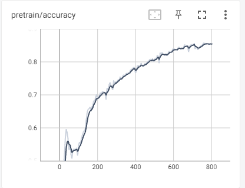
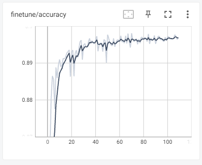

# SimSiam

论文题目:**Exploring Simple Siamese Representation Learning**

论文地址:[https://arxiv.org/abs/2011.10566](https://links.jianshu.com/go?to=https%3A%2F%2Farxiv.org%2Fabs%2F2011.10566)

非官方实现:[https://github.com/PatrickHua/SimSiam](https://links.jianshu.com/go?to=https%3A%2F%2Fgithub.com%2FPatrickHua%2FSimSiam)

[SimSiam论文简析——笔记 - 简书 (jianshu.com)](https://www.jianshu.com/p/0383645ca4d5)

[【论文解读】何恺明团队最新力作SimSiam：消除表征学习“崩溃解”，探寻对比表达学习成功之根源..._qq62985c01d4e12的技术博客_51CTO博客](https://blog.51cto.com/u_15671528/5604995)

[MoCo v1、V2和V3对比 - 知乎 (zhihu.com)](https://zhuanlan.zhihu.com/p/540707764)

预训练结果

微调结果

