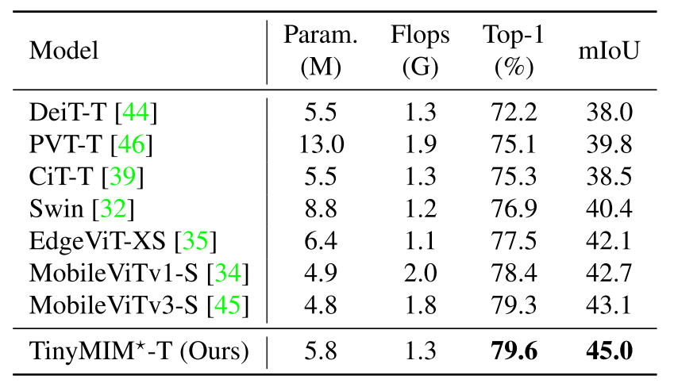
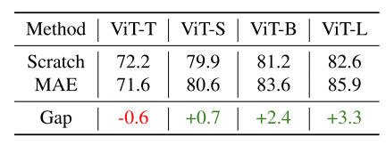

# 【自监督学习 2022 CVPR】TinyMIM

> 论文题目：TinyMIM: An Empirical Study of Distilling MIM Pre-trained Models
>
> 中文题目：TinyMIM：蒸馏 MIM 预训练模型的实证研究
>
> 论文链接：[https://arxiv.org/abs/2301.01296](https://arxiv.org/abs/2301.01296)
>
> 论文代码：[https://github.com/OliverRensu/TinyMIM](https://github.com/OliverRensu/TinyMIM)
>
> 论文团队：微软亚洲研究院
>
> 发表时间：2023年1月
>
> 引用：Ren S, Wei F, Zhang Z, et al. TinyMIM: An Empirical Study of Distilling MIM Pre-trained Models[J]. arXiv preprint arXiv:2301.01296, 2023.
>
> 引用数：

##  摘要

掩码图像建模 (MIM) 在预训练大型视觉转换器 (ViT) 方面表现出色。

然而，对于现实世界应用程序至关重要的小型模型不能或只能从这种预训练方法中受益匪浅。在本文中，我们探索了蒸馏技术，以将基于 MIM 的大型预训练模型的成功转移到较小的模型上。我们系统地研究了蒸馏框架中的不同选项，包括蒸馏目标、损失、输入、网络正则化、顺序蒸馏等，揭示：

1）蒸馏令牌关系比基于 CLS 令牌和特征的蒸馏更有效； 

2）当学生的深度与教师的深度不匹配时，作为目标的教师网络的中间层比使用最后一层的表现更好；

 3）弱正则化优先；

等等。根据这些发现，我们使用所有 ViT-Tiny、ViT-Small 和 ViTbase 模型在 ImageNet-1K 分类上实现了相对于 scratch MIM 预训练的显着微调精度改进，+4.2%/+2.4% /+1.4% 收益，分别。我们的基本大小的 TinyMIM 模型在 AE20K 语义分割中达到 52.2 mIoU，比 MAE 基线高出 +4.1。我们的微小尺寸 TinyMIM 模型在 ImageNet-1K 图像分类上达到了 79.6% 的 top-1 准确率，这创造了相同尺寸和计算预算的小型视觉模型的新记录。

这种强大的性能表明了开发小型视觉 Transformer 模型的另一种方法，即探索更好的训练方法，而不是像大多数以前的作品那样将归纳偏差引入架构。

## 1. 介绍

掩码图像建模(masking image modeling, MIM)是一种非常有效的预训练视觉变形金刚的自监督方法[2,12,18,53]，它可以将大部分的图像区域进行蒙面，并训练一个网络来恢复蒙面区域的原始信号。

由于其较强的微调性能，MIM目前已成为视觉变形金刚预训练的主流方法，在这一研究领域也开展了大量后续研究，如如何设置解码架构[25]、重建目标[11,36,48,60]等，并揭示其属性[49,52,54]。

> TinyMIM(我们的)，MAE[18]和使用ViT-T,ViT-S,ViT-B在ImageNet-1K上从头开始训练的比较。我们的报告是最准确的。我们从头开始训练时采用DeiT[44]。我们首次成功地对小型vit进行了蒙板图像建模的预训练。

> 与最先进的微型变形金刚的建筑变种相比。这些参数表示分类时不包括最后一分类层的参数的骨干参数，分割时不包括解码器的参数。我们报告了在ImageNet-1K分类和mIoU在ADE20K分割的top-1准确度。

但如表2所示，MIM训练前[18]主要作用于较大的模型。

当模型尺寸小到ViT-Tiny(500万个参数)时，这对于现实世界的应用是至关重要的，MIM预训练甚至会影响ImageNet-1K分类的微调精度。

事实上，与从头开始训练的对象相比，准确率下降了-0.6。

这就提出了一个问题:小型模型是否也能从MIM的预培训中受益，如何实现这一点?

此外，现有的关于小视觉变形金刚的研究主要集中将一定的感性偏置引入到体系结构设计中[6,26,34,35]。

额外的架构归纳偏见促进了优化，但限制了表达能力。

人们很自然地会问，我们是否可以让普通的小视觉变形金刚也有同样的表现。

> 在ImageNet1K上使用ViT-T,ViT-S,ViT-B和ViT-L从头开始训练的vit与MAE预训练的vit的比较我们从零开始培训时采用DeiT。我们的报告是最准确的。随着模型尺寸的缩小，MAE的优势逐渐消失。MAE甚至损害了vit的性能。

在本文中，我们提出了TinyMIM，它回答了上述问题。

TinyMIM使用蒸馏技术[24]将较大MIM预训练模型的知识转移到较小模型，而不是使用MIM借口任务直接训练小ViT模型。

蒸馏将较大的MIM预训练模型的良好特性赋予较小的模型，同时避免解决“太”困难的MIM任务。

注意到知识蒸馏已经发展得很好，特别是对于监督模型[16]，我们的主要工作是首次系统地研究当使用MIM预训练模型作为教师时，蒸馏框架中不同设计选项的影响。具体考虑精馏目标、数据扩充、网络正则化、辅助损失、宏观精馏策略等。并得出了一些有用的结论

* 蒸馏目标。有两个与蒸馏目标相关的主要发现：1）提取标记关系比提取CLS标记和特征映射更有效。2)使用中间层作为目标可以比使用最后一层执行得更好，并且对于不同的下游任务使用最佳目标层，分类和分割可以不同。
* 数据和网络正规化。弱增强和正则化是优选的：1）使用掩蔽图像的性能比使用原始图像差;2）相对较小的丢弃路径速率（教师为0，学生为0.1）性能最佳。
* 数据和网络正规化。弱增强和正则化是优选的：1）使用掩蔽图像的性能比使用原始图像差;2）相对较小的丢弃路径速率（教师为0，学生为0.1）性能最佳。辅助损耗。我们发现辅助MIM损耗并不能提高微调精度。
* 宏观蒸馏策略。我们发现使用顺序蒸馏策略，即，"ViT-B → ViT-S → ViT-T"的提取方法比直接从ViT-B提取ViT-T的方法效果更好。

通过选择最佳的框架选择,我们达到显著的微调精度改进直接MIM训练的“ImageNet-1K分类,使用维特不同大小的模型,如图1所示。具体来说,收益的TinyMIM ViT-Tiny, ViT-Small,和ViT-base模型+ / + 2.4% / 4.2% + 1.4%,分别。

特别是, 我们的TinyMIM-T模型在微调过程中进行了知识蒸馏，在ImageNet-1K分类上获得了79.6%的最高精度(见表1)，比之前所有通过引入架构归纳偏差或更小的特征分辨率来开发小型视觉Transformer模型的作品表现得更好。

采用相似的模型尺寸和计算预算，建立了新的计算精度记录。在ADE20K语义分割上，TinyMIM-T达到45.0 mIoU，比第二优方法MobileViTv3-S[45]高出+1.9。TinyMIM-T的强大微调精度为开发小型视觉Transformer模型提供了另一种方法，即通过探索更好的训练方法，而不是像大多数以前的工作那样，在架构中引入归纳偏差。

## 2. 相关工作

### 2.1 掩码图像建模

一个通过强制感知相似性的新标记器。iBot[60]和data2vec[1]采用指数移动平均(EMA)更新模型作为令牌器。米兰[25]采用一个预先训练的CLIP作为教师。类似地，BeiTv2[36]也使用CLIP[37]进行令牌器训练。不同于这些使用各种标记器/教师的作品，我们采用了一个蒙面图像建模预训练模型作为我们的教师。从基本尺寸到巨型尺寸，MIM的预训练在相对较大的模型上表现得非常好[31,53]。

然而，当模型很小的时候，可能是由于有限的上限使得MIM任务对于小的模型来说“太”困难。本文通过对精馏技术的系统研究，探索了如何使小型视觉变压器模型也受益于MIM训练。用于自监督Transformer预训练的蒙面语言建模(MLM)[10]在自然语言处理(NLP)领域取得了令人难以置信的成功。受到掩蔽和重建的相同思想的启发，BEiT[2]是通过编码掩蔽图像和预测dell - e[38]生成的掩蔽令牌在计算机视觉领域取得成功的先驱。

SimMIM[53]和MAE[18]发现重构RGB像素具有良好的表示效果。MAE采用非对称的编解码体系结构。编码器只对可见的标记进行编码，并去掉大部分掩码标记，以减少计算负担。然后，轻量级解码器生成重构的补丁。与自然语言处理中的符号具有丰富的语义不同，计算机视觉中的像素是低级信息，因此，最近的许多工作都是为了寻找更好的监督。MaskFeat[48]将手工制作的HOG描述符[9]产生的局部梯度特征作为监督。PeCo[11]通过强制感知相似性来训练新的标记器。iBot[60]和data2vec[1]采用指数移动平均(EMA)更新模型作为令牌器。米兰[25]采用一个预先训练的CLIP作为教师。

类似地，BeiTv2[36]也使用CLIP[37]进行令牌器训练。不同于这些使用各种标记器/教师的作品，我们采用了一个蒙面图像建模预训练模型作为我们的教师。从基本尺寸到巨型尺寸，MIM的预训练在相对较大的模型上表现得非常好[31,53]。然而，当模型很小的时候，可能是由于有限的上限使得MIM任务对于小的模型来说“太”困难。本文通过对精馏技术的系统研究，探索了如何使小型视觉变压器模型也受益于MIM训练。

## 3. 方法

> 我们综合研究了可能影响TinyMIM预训练的各种因素(用Royal Blue表示)，包括输入、蒸馏目标(特征或关系)和目标块。

我们采用一个较大的MIM预训练模型作为教师，和一个较小的ViT作为学生。

TinyMIM的目标是以知识蒸馏的方式模仿教师产生的目标，对随机初始化的学生进行训练。

经过预训练后，TinyMIM预训练模型可以转移到各种下游任务中。

在本工作中，我们采用MAE[18]作为MIM模型，因为它的流行和简单。

在本节中，我们首先描述了可能影响TinyMIM预训练的因素:3.1.1节的蒸馏目标;输入3.1.2节;3.1.3节中的目标块。然后在第3.1.3节中给出了不同蒸馏目标的一系列蒸馏损失。最后，在第3.3节中，为了提高性能，引入了顺序蒸馏策略。

### 3.1 方法

#### 3.1.1 蒸馏目标

块特征和输出特征。

给定一个输入图像$x$，我们首先将其划分为$N$个不重叠的patch，并使用线性投影层将N个patch映射为patch embeddings F0∈RN×D，其中D为隐藏特征的维数。假设我们有一个包含L Transformer块的ViT。每个Transformer block以最后一个Transformer block的输出Fi−1为输入，生成当前block的特征Fi，可以表示为:
$$
F_{i}=\operatorname{Transformer}\left(F_{i-1}\right), i \in[1, L] .
$$
我们称$F_i$为第$i$个变压器块的块特征。特别地，我们将上一个Transformer块中的特性命名为$F_L$作为输出特性。

注意特征和FFN特征。每个Transformer块由一个自注意层和一个前馈层组成，可定义为:
$$
\begin{array}{l}
H_{i}=\text { Attention }\left(\operatorname{LN}\left(F_{i-1}\right)\right), \\
\widehat{H}_{i}=H_{i}+F_{i-1} \\
\widetilde{H}_{i}=\operatorname{FFN}\left(\operatorname{LN}\left(\widehat{H}_{i}\right)\right) \\
\bar{F}_{i}=\widehat{H}_{i}+\widetilde{H}_{i}
\end{array}
$$
其中注意$Attention(·),FFN(\cdot),LN(\cdot)$分别表示自注意层、前馈层和层范数。我们称$\widehat{H}_{i}$和$\widetilde{H}_{i}$为第i个变压器块的注意特征和FFN特征。

查询/键/值特性。每个自注意层由m个头网络组成，每个头网络将输入特征$F_{i-1}$映射到查询(Q)、键(K)和值(V):

$$
\begin{array}{l}
R_{i, m}^{Q Q}=\operatorname{Softmax}\left(\frac{Q_{i}^{m} Q_{i}^{m \top}}{\sqrt{D / M}}\right) \\
R_{i, m}^{K K}=\operatorname{Softmax}\left(\frac{K_{i}^{m} K_{i}^{m \top}}{\sqrt{D / M}}\right) \\
R_{i, m}^{V V}=\operatorname{Softmax}\left(\frac{V_{i}^{m} V_{i}^{m \top}}{\sqrt{D / M}}\right) \\
R_{i, m}^{Q K}=\operatorname{Softmax}\left(\frac{Q_{i}^{m} K_{i}^{m \top}}{\sqrt{D / M}}\right)
\end{array}
$$

#### 3.1.2 输入

MIM模型在输入图像x上随机屏蔽了大量的图像补丁，生成了一个用于预训练的屏蔽图像$\widetilde{x}$。

在进行知识蒸馏时，我们还研究了TinyMIM的输入——输入可以是原始图像x，也可以是掩码图像$\widetilde{x}$。

#### 3.1.3 目标 Block

考虑这样一种情况，我们倾向于使用经过MAE训练的包含24个模块的vitl(教师)来提取包含12个模块的ViTB(学生)。在这个场景中，学生的block number与老师的block number不匹配。我们调查哪一组教师可以提供最合适的目标。选中的块称为目标块。

### 3.2 知识蒸馏作为MIM预培训

$$
\mathcal{L}_{K L}(\boldsymbol{p}, \boldsymbol{t})=\boldsymbol{t} \log \frac{\boldsymbol{t}}{\boldsymbol{p}}
$$

$$
\mathcal{L}=\mathcal{L}_{K L}\left(\boldsymbol{c}_{s}, \boldsymbol{c}_{t}\right)
$$
