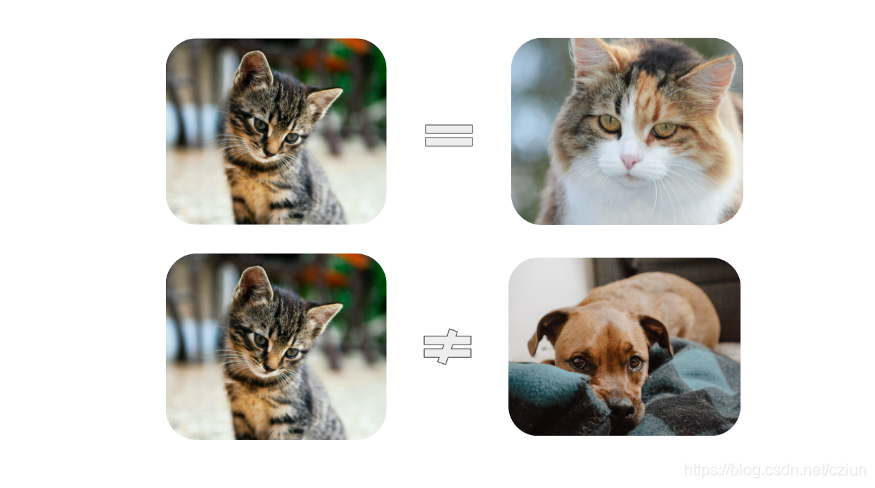
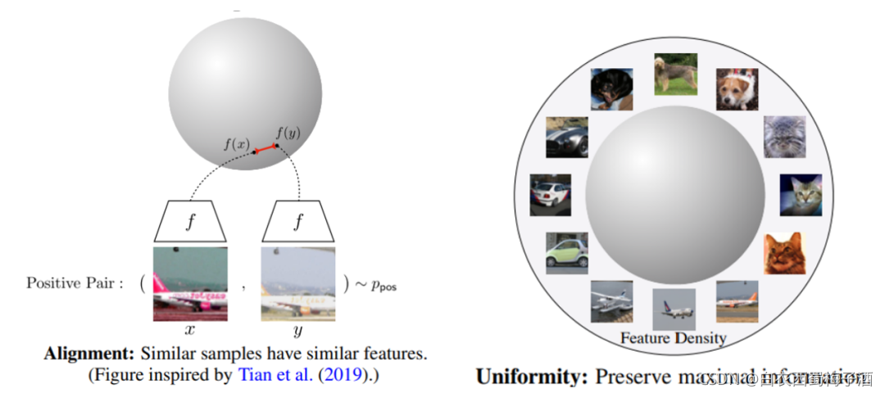
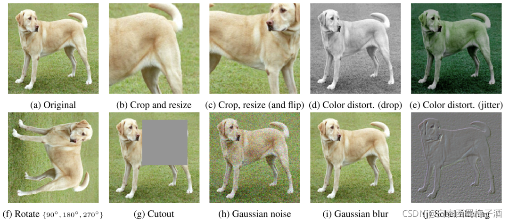
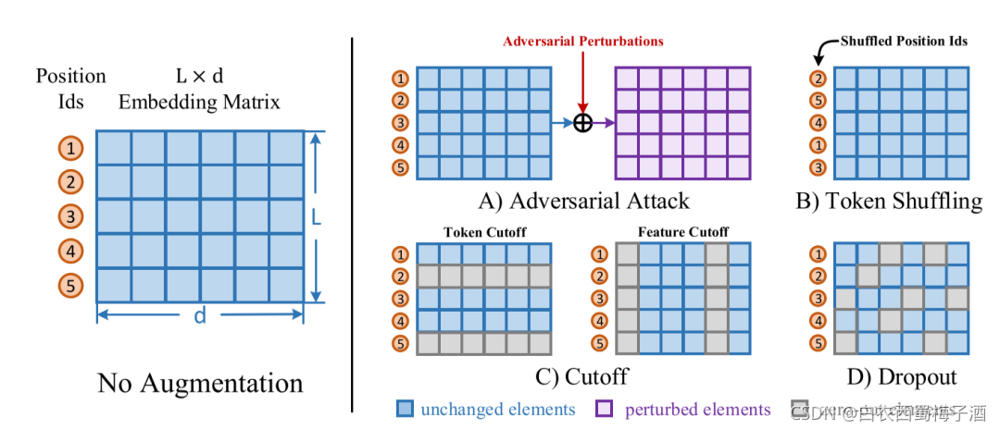
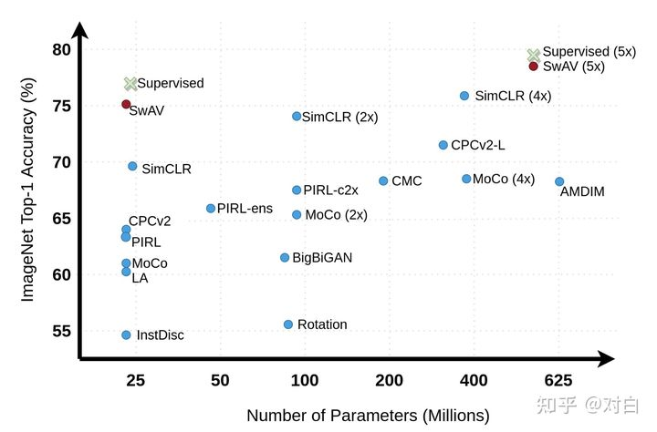
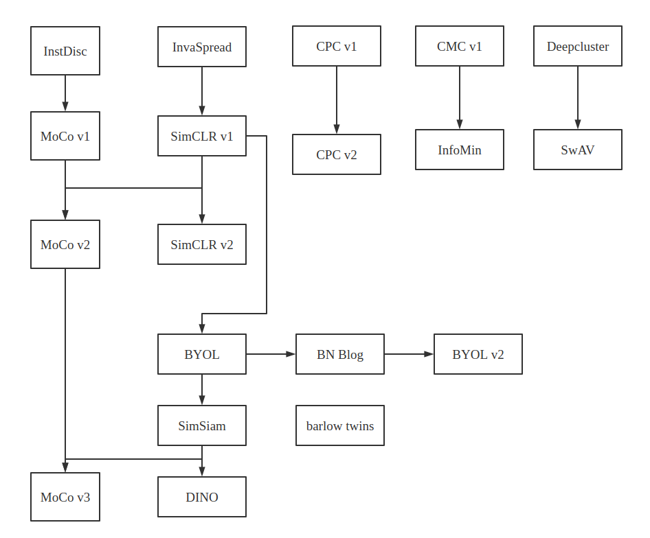

# 对比学习

> 学习视频[https://www.bilibili.com/video/BV19S4y1M7hm](https://www.bilibili.com/video/BV19S4y1M7hm)
>
> 感谢沐神！！！
>
> 感谢朱毅大佬！！

## 1. 简介

### 1.1 什么是对比学习？

对比学习是一种自监督学习方法，用于在没有标签的情况下，通过让模型学习哪些数据点相似或不同来学习数据集的一般特征。

让我们从一个简单的例子开始。想象一下，你是一个试图理解世界的新生婴儿。在家里，假设你有两只猫和一只狗。

即使没有人告诉你它们是“猫”和“狗”，你仍可能会意识到，与狗相比，这两只猫看起来很相似。

仅仅通过识别它们之间的异同，我们的大脑就可以了解我们的世界中物体的高阶特征。

例如，我们可能意识地认识到，两只猫有尖尖的耳朵，而狗有下垂的耳朵。或者我们可以**对比**狗突出的鼻子和猫的扁平脸。

> * 本质上，**对比学习**允许我们的机器学习模型做同样的事情。它会观察哪些数据点对“相似”和“不同”，以便在执行分类或分割等任务之前了解数据更高阶的特征。这是因为我们可以在没有任何注释或标签的情况下，训练模型以学习很多关于我们的数据的知识，因此术语，**自监督学习**。
> * 在大多数实际场景中，我们没有为每张图像设置标签。以医学成像为例，为了创建标签，专业人士必须花费无数个小时查看图像以手动分类、分割等。
> * 通过对比学习，即使只有一小部分数据集被标记，也可以显著提高模型性能。

### 1.2 自监督学习的优势

* 数据本身提供的信息远比稀疏的标签更加丰富，因此使用有监督学习方法训练模型需要大量的标签数据，并且得到的模型有时候是“脆弱”的
* 有监督学习通过标签训练得到的模型往往只能学到一些任务特定的知识，而不能学习到一种通用的知识，因此有监督学习学到的特征表示难以迁移到其他任务

### 1.3 类别

而自监督学习能够很好地避免上面的问题，因为自监督学习直接使用数据本身来提供监督信息来指导学习。

当前自监督学习可以被大致分为两类
>1.Generative Methods（生成式方法）
2.Contrastive Methods（对比式方法）

Generative Methods（生成式方法）这类方法以自编码器为代表，主要关注pixel label的loss。举例来说，在自编码器中对数据样本编码成特征再解码重构，这里认为重构的效果比较好则说明模型学到了比较好的特征表达，而重构的效果通过pixel label的loss来衡量。

Contrastive Methods（对比式方法）这类方法则是通过将数据分别与正例样本和负例样本在特征空间进行对比，来学习样本的特征表示。Contrastive Methods主要的难点在于如何构造正负样本。

> 对比学习是一种基于对比思想的判别式表示学习框架（或方法），主要用来做无监督（自监督）的表示学习(对比学习也可以用于有监督学习，但这不是对比学习的优势所在，故本文不再赘述)。

### 1.4 前期概念准备

#### 1) 对齐性(alignment)和均匀性(uniformity)

由于对比学习的表示一般都会正则化，因而会集中在一个超球面上。对齐性和均匀性指的是好的表示空间应该满足两个条件：一个是相近样例的表示尽量接近，即对齐性；而不相近样例的表示应该均匀的分布在超球面上，即均匀性。满足这样条件的表示空间是线性可分的，即一个线性分类器就足以用来分类

由此，我们可以轻易地发现对比学习有三个重要的组成部分：正负样例、对比损失以及模型结构。

#### 2) 正负样例

如上所述，正样例指的是与给定样例语义相近的样例，而负样例指的是与给定样例语义不相近的样例。对于有监督的数据，正负样例很容易构造，同一标签下的例子互为正样例，不同标签下的例子互为负样例，但对于无标签的数据，我们如何得到正负样例呢？

目前的主流做法是对所有样例增加扰动，产生一些新的样例，同一个样例扰动产生的所有样例之间互为正样例，不同样例扰动产生的样例彼此之间互为负样例。现在的问题就变成了如何可以在保留原样例语义不变的情况下增加扰动，构造新样例。

图像领域中的扰动大致可分为两类：空间/几何扰动和外观/色彩扰动。空间/几何扰动的方式包括但不限于图片翻转（flip）、图片旋转（rotation）、图片挖剪（cutout）、图片剪切并放大（crop and resize）。外观扰动包括但不限于色彩失真、加高斯噪声等

自然语言领域的扰动也大致可分为两类：词级别（token-level）和表示级别（embedding-level）。词级别的扰动大致有句子剪裁（crop）、删除词/词块（span）、换序、同义词替换等。表示级别的扰动包括加高斯噪声、dropout等。

不同于图像领域，对自然语言的扰动很容易改变语义，这就会引入错误正例（False Positive）从而对模型训练产生不好的影响。同时，错误负例（False Negative）也是一个不容忽视的问题，错误负例会对对比学习产生负面影响。（引文 Ching-Yao Chuang, Joshua Robinson, Yen-Chen Lin, Antonio Torralba, and Stefanie Jegelka. Debiased contrastive learning. In Hugo Larochelle, Marc’Aurelio Ranzato, Raia Hadsell, Maria-Florina Balcan, and Hsuan-Tien Lin, editors, Advances in Neural Information Processing Systems 33: Annual Conference on Neural Information Processing Systems 2020, NeurIPS 2020.）

#### 3) 对比损失

**原始对比损失**
$$
L((x_1,x_2),y)=yL_p(D(f_\theta(x_1),f_\theta(x_2))+(1-y)L_n(D(f_\theta(x_1),f_\theta(x_2))))
$$
其中，$D$为距离度量函数，$L_p$为一递增函数，$L_n$为一递减函数。当互为正例时，距离越远损失越高；互为负例时，距离越近损失越高。

补充 几种不同的Lp和Ln函数

> $L_p(x)=\frac{1}{2}x^2$
>
> $L_n(x)=\frac{1}{2}(max\{o,m-x\})^2$
>
> $L_p(x)=x^2$
>
> $L_n(x)=(max\{0,m-x\})^2$

**三元组损失**
$$
L(x,x^+,x^-)=max(0,D(x,x^+)^2-D(x,x^-)^2+m)
$$

其中D为欧几里得距离，m是用来控制正例负例距离间的偏离量，使模型不需要考虑优化过于简单的负例。

该方法在FaceNet中被提出，主要希望通过对比使得锚点与正例的距离更近，与负例更远。

但在实际操作中，我们可能会得到负样例个数远远多于正样例，由此我们引出了对比学习中主流的InfoNCE损失

**InfoNCE损失**

NCE全称是`噪声对比估计`（Noise Contrastive Estimation）,通过引入`一个噪声分布`，解决多`分类问题softmax分母归一化中分母难以求值`的问题。具体做法是把多分类问题通过引入一个噪音分布变成一个二元分类问题，将原来构造的多分类分类器（条件概率）转化为`一个二元分类器`，用于判别给定样例是`来源于原始分布还是噪声分布`，进而更新原来多元分类器的参数。

如果把`噪音分布的样本`想成`负样例`，那这个二元分类问题就可以理解为让模型`对比正负样例作出区分`进而学习到正`样例(原始分布)的分布特征`

而`InfoNCE`, 又称global NCE,继承了NCE的基本思想，从一个新的分布引入负样例，构造了`一个新的多元分类问题`，并且证明了`减小这个损失函数相当于增大互信息(mutual information)的下界`。
$$
L_q(u,v^+,\{v^-\})=-\log \frac{exp(u\cdot v^+/\tau)}{\sum_{v\in\{v^+,v-\}}exp(u\cdot v/\tau)}
$$
其中$u$、$v^+$、$v^-$分别为原样例、正样例、负样例归一化后的表示，为温度超参。

温度超参是softmax中常见的超参，$t$越小，softmax越接近真实的max函数，$t$越大越接近一个均匀分布。因此，当$t$很小时，只有难区分的负样例`才会对`损失函数产生影响`，同时，`对错分的样例`（即与原样例距离比正样例与原样例距离近）有`更大的惩罚`。实验结果表明，对比学习对$t$很敏感。

## 2. 历史阶段

现在我们了解了对比学习是什么，以及它为什么有用，让我们看看对比学习是如何工作。

在2014年生成对抗网络（GAN）推出之后，生成模型得到了很多关注。它之后变成了许多强大的模型的基础，例如 CycleGAN, StyleGAN, PixelRNN, Text2Image, DiscoGAN 等。这些模型启发研究者去研究自监督学习（不需要标签）。他们发现基于GAN的模型很复杂，不容易训练，主要是由于下面原因：

1. 难以收敛
2. 判别器太强大而导致生成器难以生成好的结果
3. 判别器和生成器需要同步

与生成模型不同，对比学习是一种判别模型，它让相似样本变近，不同样本变远（见图一）。

为了达到这一点，一种衡量远近的指标被用来衡量嵌入之间的远近。

如图二所示，对比损失用来训练对比学习模型。一般来说，以图片为例，对比学习把一张图片的增强版本当作一个正例，其余图片当作反例，然后训练一个模型来区分正反例。区分依赖于某种前置任务。

### 2.1 百花齐放

#### Inst Dist

#### CMC

#### CPC

### 2.2 CV 双雄

#### MocoV1

#### SimCLRV1

#### SwAV

#### MocoV2

### 2.3 不用负样本

#### BYOL

#### SimCLRV2

#### SimSiam

### 2.4 Transformer

#### MocoV3

#### DINo

## 3. 总结

* 从最开始的Inst Disc开始，它提出了个体判别的任务，而且它提出用一个 memory bank的外部数据结构去存储负样本，从而能达到一个又大又一致的字典去做对比学习

* 如果不用外部结构的话，另外一条路就是端到端的学习，也就是Inva Spread这篇论文做的，它就只用了一个编码器，从而可以端到端的学习，但因为受限于batch size 太小，所以说它的性能不够好

* CPC v1这篇论文提出了infoNCE这个loss，而且CPC v1是一个预测型的代理任务，不仅可以做图像，还可以去做音频、视频、文字和加强学习，是一个非常全能的结构

* 最后还有CMC这个工作，它就把两个视角的任务扩展到了多个视角，从而给接下来多视角或者多模态的这个对比学习打下了铺垫

* 另外还有一篇论文deep cluster并没有讲，它是基于聚类学习的，当时还没有用对比学习

* 接下来就进入了第二阶段，第二阶段主要是MoCo v1开始，它算是Inst Disc的一个延伸性工作，它把memory bank变成了一个队列，然后把动量更新特征，变成了动量更新编码器，从而能预训练一个很好的模型

* MoCo也是第一个能在很多视觉的下游任务上，让一个无监督预训练的模型比有监督预训练模型表现好的方法，它属于使用外部数据结构的

* 自然端到端的学习肯定也有延伸性的工作，也就是SimCLR v1，SimCLR v1跟Inva Spread方法是很像的，但是它用了很多的技术，比如说加大了batch size，用了更多的数据增强，加了一个projection head，训练的更长时间，总之所有的这些技术堆起来让SimCLR在ImageNet取得了非常好的的结果

* 然后CPC v1把这些技术也全都拿来用了一遍，CPC v2就直接比CPC v1在ImageNet 上高了30多个点

* 最后CMC把这些都分析一下，提出了一个info Min的这个原则，它说两个样本或者两个视角之间的互信息，要不多不少才是最好的

* 然后MoCo的作者看到SimCLR用的这些技术确实都很管用，所以就把这些即插即用的技术拿过来用在MoCo上，就有了MoCo v2，MoCo v2的效果就比MoCo v1和SimCLR v1都要好

* 然后SimCLR的作者也对模型进行了一些改动，得到了SimCLR v2，但SimCLR v2主要是去做半监督学习的

  之前提deep cluster主要就是为了引出SwAV，SwAV就是把聚类学习和对比学习结合起来的一个工作，也取得了不错的结果，但它这个不错的结果主要是来自于它提出的multi crop的技术，如果没有这个技术，它其实跟SimCLR或者MoCo v2的结果都是差不多的

* 第三阶段就来到了BYOL这个方法，因为处理负样本实在是太过麻烦，所以BYOL就说能不能不要负样本，能不能不去跟负样本做对比，结果它们发现还真行，就自己跟自己学，把一个对比任务变成一个预测任务就可以了，而且目标函数也很简单，不再使用info NCE，而是用一个简单的mse loss就可以训练出来
* 但是大家都觉得很不可思议，所以立马就有一篇这个博文出来，它们就假设说BYOL能够工作主要是因为有batch norm，这个batch norm提供了一种隐式的负样本，所以BYOL 能够正常训练而不会模型坍塌
* 但是 BYOL 的作者很快就又发了另外一篇论文叫BYOL v2，通过做了一系列实验以后，最后说batch norm只是帮助了模型的训练，如果能用另外一种方式能提供一个更好的模型初始化，BYOL不需要batch norm提供的那些batch的统计量照样能工作，就把之前博客里提出来假设给打破了，但它们提出的其实也只是另外一个新的假设
* 紧跟着BYOL，SimSiam 就出来了，SimSiam就把之前的工作都总结了一下，因为它觉得之前的这些论文都在一点一点往上堆技术，那如果堆的太多了就不好分析了，这个领域也就不好再推进下去了，所以SimSiam就化繁为简，又提出来一个很简单的孪生网络的学习方法，它既不需要用大的batch size，也不需要用动量编码器，也不需要负样本，然后照样能取得不错的结果，SimSiam提出的假设就是说stop gradient这个操作是至关重要的，因为有这个操作的存在，所以SimSiam可以看成是一种EM算法，通过逐步更新的方式避免模型坍塌
* 另外还有一篇工作叫barlow twins，它主要就是更换了一个目标函数，把之前大家做的这种对比或者预测变成了两个矩阵之间去比相似性，因为它已经是21年3月提出来的，所以很快就淹没在了Vision Transformer这波洪流之中
* 最后第四阶段就来到了Vision Transformer，主要讲的两个工作就是MoCo v3和DINO，其实都是把骨干网络从残差换成了ViT，主要学习的方法其实是没有改变的
* 但是换成Vision Transformer以后，面临的问题都是训练不稳定或者不好训练，所以他们就提出了各自的方法：MoCo v3提出来把patch projection layer冻住，DINO就提出把teacher网络的输出先做一下归一化，做一下centering。这2种方式都能有效的提高模型训练的稳健性，防止模型坍塌，让Vision Transformer用自监督的方式也能训练的很好
* 到此，又把所有的这些工作快速的串了一遍，现在对比学习还是一个很火的方向，虽然说可能没有Vision Transformer那么火，而且尤其是MAE火爆了以后，大家都去尝试掩码学习，而不是去尝试对比学习了，所以说对比学习又从一个火爆发展期变成了一个发展潜伏期
* 但是我对它的前途还是非常看好的，毕竟多模态的对比学习还是一个主流，CLIP的效果就很好，下次也会讲到CLIP这篇工作，而且在多模态里面，图像和文本对之间的对比学习loss还是一个标准的目标函数，基本上所有的工作都有在用，而且对比学习它属于一个想法而不是具体的一个工作，它在几十年之前就已经提出来了，所以接下来我们应该还是会看到很多对比学习的工作的，我很期待对比学习跟其它方法的结合

参考资料

> [对比学习（一）简介_白衣西蜀梅子酒的博客-CSDN博客_对比学习](https://blog.csdn.net/weixin_43869415/article/details/120678146)

