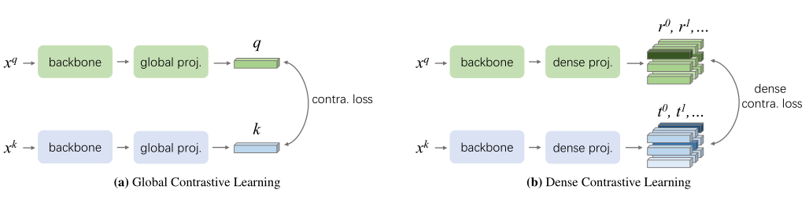
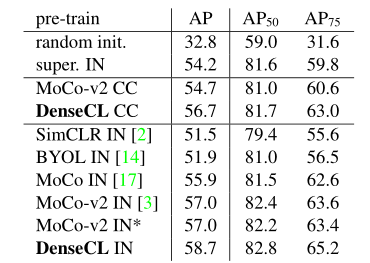
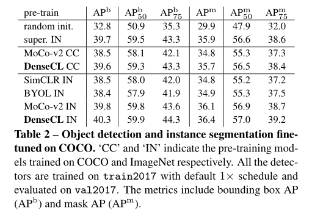
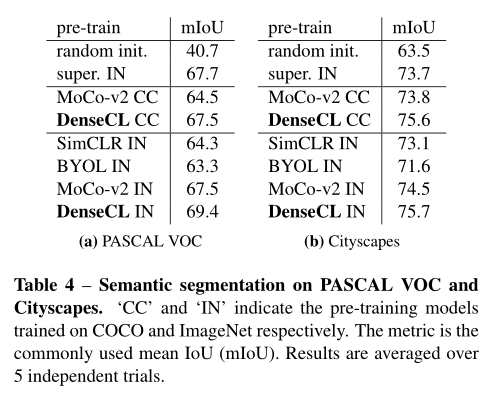

# 2020-DenseCL-CVPR

> 论文题目：Dense Contrastive Learning for Self-Supervised Visual Pre-Training
>
> 中文题目：密集对比学习在自我监督视觉预训练中的应用
>
> 论文链接：[https://arxiv.org/abs/2011.09157](https://arxiv.org/abs/2011.09157)
>
> 论文代码：[https://github.com/WXinlong/DenseCL](https://github.com/WXinlong/DenseCL)
>
> 翻译：[https://www.jianshu.com/p/d031dce5df97](https://www.jianshu.com/p/d031dce5df97)
>
> 发表时间：2020年11月
>
> 团队：澳大利亚阿德莱德大学&同济大学
>
> 引用：Wang X, Zhang R, Shen C, et al. Dense contrastive learning for self-supervised visual pre-training[C]//Proceedings of the IEEE/CVF Conference on Computer Vision and Pattern Recognition. 2021: 3024-3033.
>
> 引用数：291（截止时间：2022年12月26号）

## 1. 简介

### 1.1 摘要

迄今为止，大多数现有的自监督学习方法都是针对图像分类进行设计和优化的。由于图像级预测和像素级预测之间的差异，这些预训练模型对于密集的预测任务可能不是最佳的。为了填补这一空白，我们旨在设计一种有效，密集的自监督学习方法，该方法通过考虑局部特征之间的对应关系，直接在像素（或局部特征）级别上起作用。

动机：

DenseCL发现现有的自监督学习方法都是根据图像分类来设计和优化的，通过这个方法学到的模型，对密集预测任务（分割）来说是次优的

### 1.2 贡献

* 我们提出了一种新的对比学习范式，即密集对比学习，它在像素（或局部特征）水平上进行密集的成对对比学习。
* 通过提出的密集对比学习，我们设计了一种简单有效的针对密集预测任务的自监督学习方法DenseCL，填补了自监督预训练和密集预测任务之间的空白。
* DenseCL在将预训练模型转移到下游密集预测任务（包括目标检测（+2:0%AP）、实例分割（+0:9%AP）和语义分割（+3:0%mIoU））时，显著优于最先进的MoCo-v2[2]，并远远超过有监督的ImageNet预训练。

## 2. 网络

### 2.1 整体网络架构

DenseCL是基于MoCo v2做的，MoCo v2里只有图2中的global proj.，dense proj.

把global pooling layer移除了，然后用1×1卷积代替了MLP，DenseCL里既有global proj，又有dense proj.。让我们把重点放在dense proj.上，它会生成大小为$S\times S(7\times 7)$的feature map，feature map上的每一个点就是一个query，`negative sampes`就是其他图像通过global proj.得到的特征，因为有 global pooling，所以维度是一致的。

那`positive samples`呢？图2中的backbone会得到特征$F_1$和$F_2$，先通过adaptive average pooling将它们下采样为$S\times S$的大小，然后计算它们的相似度矩阵，大小$S^2\times S^2$，把每一行和每一列相似度最大的那个值对应的特征作为正样本对。

Loss函数如下，包括global和pixel level的constrastive loss。

### 2.2 Dense Contrastive Learning

Global 对比学习loss
$$
\mathcal{L}_{q}=-\log \frac{\exp \left(q \cdot k_{+} / \tau\right)}{\exp \left(q \cdot k_{+}\right)+\sum_{k_{-}} \exp \left(q \cdot k_{-} / \tau\right)},
$$

密集对比学习loss

$$
\mathcal{L}_{r}=\frac{1}{S^{2}} \sum_{s}-\log \frac{\exp \left(r^{s} \cdot t_{+}^{s} / \tau\right)}{\exp \left(r^{s} \cdot t_{+}^{s}\right)+\sum_{t_{-}^{s}} \exp \left(r^{s} \cdot t_{-}^{s} / \tau\right)},
$$

整体的loss为包括global和pixel level的constrastive loss。
$$
\mathcal{L}=(1-\lambda) \mathcal{L}_{q}+\lambda \mathcal{L}_{r}
$$

## 3. 实验

**PASCAL VOC目标检测。**  在表1中，我们报告了PASCAL VOC的目标检测结果，并将其与其他最先进的方法进行了比较。在接受COCO预训练时，我们的DenseCL比MoCo-v2基线性能高2%。当在ImageNet上进行预训练时，MoCo-v2基线已经超过了其他最先进的自监督学习方法。DenseCL仍能使AP进一步提高1.7%，有力地证明了我们方法的有效性。这三个指标的收益都是一致的。需要注意的是，与AP50相比，我们在更严格的AP75上实现了更大的改进，这表明DenseCL在很大程度上有助于提高定位精度。与有监督的ImageNet预训练相比，我们获得了显著的4.5%的AP增益。

**COCO目标检测与分割。**  COCO上的目标检测和实例分割结果如表2所示。在目标检测方面，DenseCL在COCO和ImageNet上分别比MoCo-v2提高了1.1%和0.5%的AP。在实例分割上，提升分别为0.9%AP和0.3%AP。请注意，在COCO上预训练，再在COCO上微调并不是个典型的设置。但是还是可以带来提升。

**PASCAL-VOC语义分割。**  我们展示了语义分割的最大改进。如表3a所示，对FCN在COCO上预训练，在VOC上微调时，有3%的mIoU的提升。在COCO上用DenseCL上预训练达到与在ImageNet上用MoCo-v2预训练相同的67.5%mIoU。注意，与200 epoch ImageNet预训练相比，800 epoch COCO预训练仅使用1/10图像和1/3迭代。在ImageNet上进行预训练时，DenseCL始终带来1.9%的mIoU提升。值得注意的是，在ImageNet上预训练时，MoCo-v2预训练与监督学习预训练相比没有迁移的优势（67.5%对67.7%的mIoU）。但DenseCL在很大程度上优于监督学习的预训练，即1.7%的mIoU。

**城市景观语义分割。**  城市景观是一个基准，与上述VOC和COCO有很大不同。它聚焦于城市街景。尽管如此，我们还是为DenseCL提供了同样的性能提升。即使是COCO预训练的DenseCL也能比有监督的ImageNet预训练模型提高1.9%mIoU。

## 4. 代码

参考资料

> [[论文复现赛第6期\] DenseCL论文复现冠军方案 - 飞桨AI Studio (baidu.com)](https://aistudio.baidu.com/aistudio/projectdetail/4225145)
>
> [CVPR2021，两篇自监督学习新作，SCRL和DenseCL的阅读笔记 - 知乎 (zhihu.com)](https://zhuanlan.zhihu.com/p/357152388)